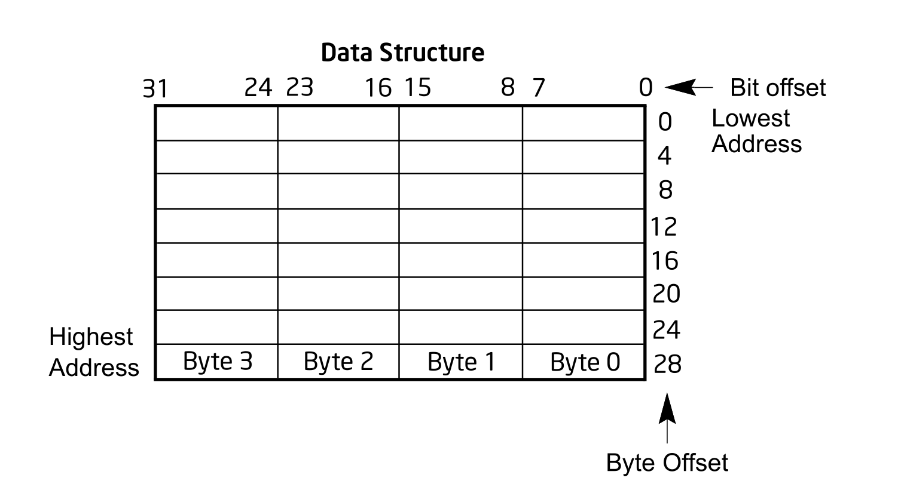
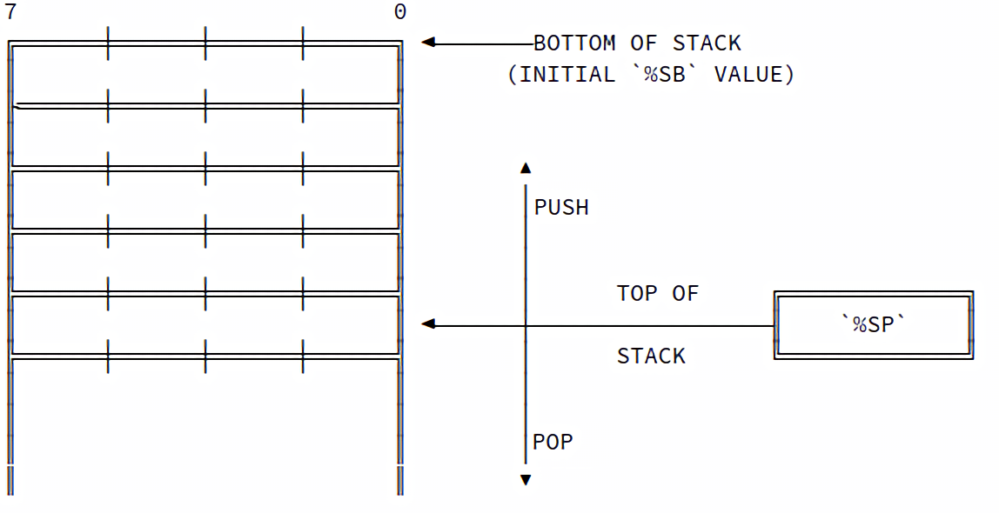
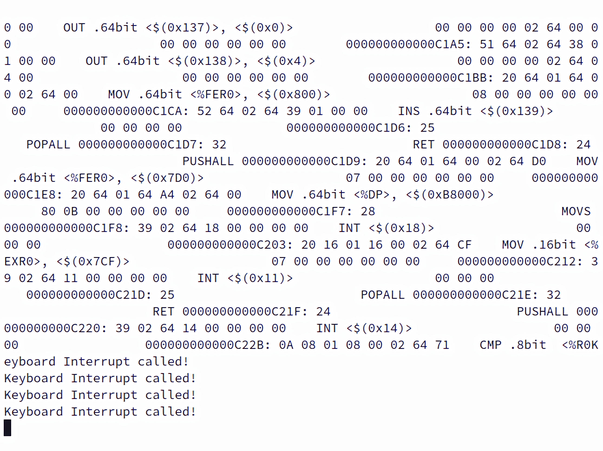
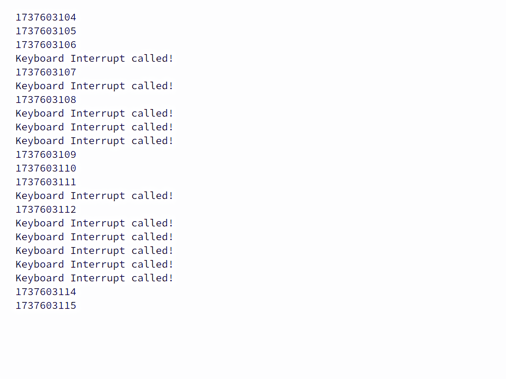

# 

# **Content**

# **Notation Conventions**

This manual uses specific notation for data-structure formats,
for symbolic representation of instructions,
and for hexadecimal and binary numbers.
This notation is described below.

## Bit and Byte Order

In illustrations of data structures in memory,
unlike Intel architecture manuals,
smaller addresses appear toward the *top* of the figure;
addresses increase toward the *bottom*.
Similarly, however,
bit positions are numbered from right to left,
with the leftmost bit being LSB (Least Significant Bit) and the rightmost bit being MSB (Most Significant Bit),
and the numerical value of a set bit is equal to two raised to the power of the bit position,
same ways identical to Intel architectures as well as that of most ARM and RISC.



Exactly identical to Intel 64 and IA-32 processors,
who are "little endian"[^LittleEndian] machines,
that is, the bytes of a word are numbered starting from the least significant byte (byte with the smallest address),
Sysdarft operates in a same way without a complicated protected mode and multitask support.

[^LittleEndian]:
Endianness is the order
in which bytes within a word
(a given computer architecture's native unit of data,
a $64\text{-bit}$ system typically has $64\text{-bit}$ words (8-byte),
which is called the native word size in which a computer executes many operations rather than a byte at a time,
[@Intel64AndIA32ArchitecturesSoftwareDevelopersManualCombinedVolumes]
though not the case for Sysdarft who operates in an $8\text{-bit}$ data stream)
of digital data are transmitted over a data communication medium or addressed in computer memory,
counting only byte significance compared to earliness[@OnHolyWarsAndAPleaForPeace].
Danny Cohen adopted the term endianness from Jonathan Swift's Gulliver's Travels
[@GulliversTravels],
where Swift described a conflict between sects of Lilliputians
divided into those breaking the shell of a boiled egg from the big end or from the little end.
Little-endian system recognizes that the least significant byte is the byte whose address is the smallest in memory,
and data is traversed from the smallest address towards larger ones.

## Hexadecimal and Binary Numbers

Base 16 (hexadecimal) numbers are represented by a string of hexadecimal digits
which are characters from the following set:
`0`, `1`, `2`, `3`, `4`, `5`, `6`, `7`, `8`, `9`, `A`, `B`, `C`, `D`, `E`, `F`,
preceded by `0x` as an indication (for example, `0xFBCA23`).
Base 2 (binary) numbers are represented by a string of `1`s and `0`s, followed by a binary suffix $n_2$
(for example, $1010_2$).
The $n_2$ designation is only used in situations where confusion as to the type of number might arise
[@Intel64AndIA32ArchitecturesSoftwareDevelopersManualCombinedVolumes].

## Processor

Central Processing Unit, or CPU,
is a processor that performs operations on an external data source,
usually memory or some other data stream[@OxfordEnglishDictionary].

## Registers 

*Registers are primitives used in hardware design that
are also visible to the programmer when the computer is completed,
so you can think of registers as the bricks of computer construction.*
[@ComputerOrganizationAndDesign]

CPU relies on registers to perform most of the tasks.
Registers are fix-sized data storages inside the CPU.

## Memory

Memory is accessible space outside the CPU.
The amount of memory a system can access is called *Accessible Memory*.
The maximum memory space a typical $64$-bit system can access is named *Addressable Memory*.
The minimum memory unit is called *byte*.
A typical single byte consists of $8$ binary bits.
Each byte is assigned an address in memory space,
from `0x0000000000000000` to the maximum value `0xFFFFFFFFFFFFFFFF`.

## Exceptions

An exception is an event that typically occurs when an instruction causes an error
[@Intel64AndIA32ArchitecturesSoftwareDevelopersManualCombinedVolumes].
An exception is a specific error type.
For example, an attempt to divide by zero causes an exception.
Reporting an exception is called *throw*,
or *an exception of `DIV/0` (divided by `0`) being thrown*,
which typically aborts any process followed by the position where exception occurs.

# **CPU Registers**

Registers are generally preferred compared to accessing memory directly,
since the average time of reading/writing to registers is much lower than that
of the memory.

For Sysdarft, there are two register types:
**General-Purpose Registers** and **Special-Purpose Registers**.

## General-Purpose Registers

There exist sixteen general-purpose registers.
Each of the sixteen general-purpose registers is $64\text{-bit}$ in width,
meaning each has $64$ binary bits to store data.

### Fully Extended Registers

Fully extended registers (FERs) are the sixteen $64\text{-bit}$ general-purpose registers
mentioned above, named `%FER0`, `%FER1`, ..., `%FER15`.

### Half-Extended Registers

Half-extended registers, or HERs, are $32\text{-bit}$ registers for general purposes.
There are eight HERs, named `HER0`, `HER1`, ..., `HER7`.

The eight $32\text{-bit}$ registers are actually split from the first four $64\text{-bit}$ registers,
specifically `FER0` through `FER3`.
This means that modifying the contents of *either* of the $32\text{-bit}$ or $64\text{-bit}$
versions of these registers affects content of *both* of the $32\text{-bit}$ and $64\text{-bit}$ registers,
as they share the same underlying space.

### Extended Registers

Extended registers[^EXR], or EXRs, are $16\text{-bit}$ registers used for general purposes.
There are 8 EXRs, named `EXR0`, `EXR1`, ..., `EXR7`.
Similar to *Half-Extended Registers*,
these $16\text{-bit}$ registers are split from the first four $32\text{-bit}$ registers,
specifically `HER0` through `HER3`.

[^EXR]:
The reason why $16\text{-bit}$ registers are referred to as *Extended Registers*
while $32\text{-bit}$ registers are *Half-Extended Registers*
is that Extended Registers extend the original $8\text{-bit}$ registers
while the *Half* in Half-Extended Registers is an indication of their sizes being
half the size of *Fully Extended Registers*, which are $64\text{-bit}$ in width.
This naming crisis arises due to the lack of communication during the development,
and the scope of the project has grown so enormous that revising the code base is painful and seemingly unnecessary.

Similarly,
this means that modifying the contents of either type of registers affects content inside
all types of registers.

### Registers

Registers are $8\text{-bit}$ CPU registers used for general purposes.
There are eight Registers, named `R0`, `R1`, ..., `R7`.
These $8\text{-bit}$ registers are derived from the first four $16\text{-bit}$ registers,
specifically `EXR0` through `EXR3`.
And modifying *any* of the $8\text{-bit}$ registers affects *all* types of registers sharing
the same space.

*The reason behind designing different width types of registers sharing the same area is that
it enables splitting data into width-specific pieces through register related operations alone
without relying on complicated bitwise operations or accessing external memory space.*

## Special-Purpose Registers

### Segmentation and Segmented Addressing

*A chunk of memory is known as a segment and hence the phrase
'segmented memory architecture.'
...,
A memory location is identified with a segment and an offset address
and the standard notation is `segment:offset`.*[@SoftwareDevelopmentForEngineers]

*In segmentation, an address consists of two parts: a segment number and a segment offset.
The segment number is mapped to a physical address,
and the offset is added to find the actual physical address.*[@ComputerOrganizationAndDesign]

Segmentation and segmented addressing were firstly used back in the 1970s,
in Intel 8086, the first usable processor at home to avoid installing an electronic giant.
Segmented addressing was used to extend its $16\text{-bit}$ memory bus to $20\text{-bit}$ in width,
with its internal registers remaining at $16\text{-bit}$.
This means the actual physical address is calculated by the following formula:

$\text{Physical Address} = \text{Segment Address} \ll 4 + \text{Segment Offset}$ 

*where*

- *Physical Address* is an address seen by the memory unit[@OperatingSystemConcepts].
- *Segment Address* being the address of the segment, which is its physical address shifting four bits
                    to the right ($\text{Physical Address} \over 2^{4}$)[@INTEL80386PROGRAMMERSREFERENCEMANUAL].
- *Segment Offset* being the length from the current position to the start of the segment.
- *$x \ll n$* being the bit left shifting operation, value $x$ shifting $n$ bits towards the left ($x \times 2^n$).

In Sysdarft, it uses a $64\text{-bit}$ wide memory bus.
A segmented addressing may seem unnecessary,
but there exists at least one use case where segmentation is relevant,
and this is program relocation.

### Program Relocation

Before the discussion of program relocation,
the concepts of *Absolute Code* and *Position-Independent Code* (PIC) need to be established first.

#### Absolute Code
Absolute code, and an absolute object module,
is code that...runs only at a specific location in memory.
The Loader loads an absolute object module only into the specific location
the module must occupy[@iRMX86ApplicationLoaderReferenceManual].

#### Position-Independent Code
Position-independent code (commonly referred to as PIC) differs from
absolute code in that PIC can be loaded into any memory location.
The advantage of PIC over absolute code is that PIC does not require you to
reserve a specific block of memory[@iRMX86ApplicationLoaderReferenceManual].

If the code is PIC, like BIOS, then its position and size in the memory is static and known.
However, As a user program, which would not be able to and should not assume which specific part of memory is free,
as its location in memory is arbitrary and should not be predetermined.
The operating system loads it wherever it deems appropriate.
Using absolute code eliminates the flexibility of user programs;
thus, position-independent code should be employed instead.

Segmentation can easily solve this issue.
While the segment location remains unclear until a loader like DOS loads it into the memory,
the segment offset, the length from a position inside the code to the start,
is known to the programmer.
Each program is a position independent code segment inside the memory,
and is managed using special-purpose registers.

### Code Segment

The code segment is typically managed by the operating system rather than the user.
The pointer for this segment, the instruction pointer (`%IP`), is inaccessible,
even to the operating system.
However, the Code Base (`%CB`) register is accessible and can be used to set up a code segment.

Directly modifying `%CB` would cause the CPU to perform a wild jump,
an unintended or erroneous jump in a program's execution flow
due to attempting to return from a subroutine after the stack pointer or activation record have been corrupted
or incorrect computation of the destination address of a jump or subroutine call
[@ComputerOrganization],
or in this case, altering and possibly damaging the segment address resulting in incorrect computation
of the next instruction location in memory.
Therefore, `%CB` is usually not modified directly but rather changed indirectly through operations
like a long call or long jump.

### Data Segment

There are four registers that can be used together to reference two data segments:
Data Base (`%DB`), Data Pointer (`%DP`), Extended Base (`%EB`), and Extended Pointer (`%EP`).
These registers function in pairs, i.e., `%DB` with `%DP` and `%EB` with `%EP`, to address and access
two data segments simultaneously.

### Stack Management

#### Definition of Stack

Stack is mainly used for storing function return addresses in control flow management, local variables,
temporary data storage and CPU state protection.

Stack operates on a Last-In-First-Out basis,
meaning the last element pushed inside the stack is popped at first,
similar to a gun magazine.

#### Stack Base Register

Stack base, or `%SB`, is a $64\text{-bit}$ register that stores the start point of stack space.

#### Stack Pointer

Stack pointer, or `%SP`, is a $64\text{-bit}$ register that stores the *end* of the *usable* stack space.

The stack grows downwards, meaning data is stored from the end toward the start.
This design simplifies stack allocation:
by setting the pointer to a specific size, the stack is automatically sized accordingly.

The following is a demonstration illustrating how a stack is managed
(Push and Pop Data onto the Stack):



Suppose the stack pointer `%SP` initially points to address `0x1000` and `%SB` points to `0xFFFF`.

When a value is pushed onto the stack, the `%SP` is decreased (since the stack grows downward),
and the value is stored at the new address.

```
   (Stack End)        (Stack Pointer)      (Stack Base)
        [ -- 8 Byte Data -- ][ -- Free Space -- ]
        ^                   ^                   ^
        |                   |                   |
  0xFFFF:0x1000       0xFFFF:0x0FF8       0xFFFF:0x0000
```

When a value is popped from the stack, the `%SP` is increased and the stack grows back up,
freeing the space in the process.

```
   (Stack End)    (Stack Pointer After Pop)                      (Stack Base)
        [ -- 7 Byte Data -- ][ --- --- --- Free Space -- --- --- --- ]
                             [ -- 1 Byte Data -- ]
                                      (Stack Pointer Before Pop)
        [ --- --- ----  8 Byte Data ---- --- --- ][ -- Free Space -- ]
        ^                    ^                   ^                   ^
        |                    |                   |                   |
  0xFFFF:0x1000        0xFFFF:0x0FF9       0xFFFF:0x0FF8       0xFFFF:0x0000
```

#### Stack Overflow

Stack overflow is an overflow of the stack pointer that leads to
losing track of the stack location.

#### Overflow

An overflow occurs when the addition of two numbers results in a number
larger than can be expressed with the available number of bits[@DigitalLogicDesign],
or subtraction resulting in negative numbers smaller than the representable range.
Such overflow triggers a phenomenon called integer wrap-around,
where the result cycles back within the allowable range and represents an unintended value.
This is because signed integers are two's complement binary values
that can be used to represent both positive and negative integer values
[@Intel64AndIA32ArchitecturesSoftwareDevelopersManualCombinedVolumes],
and this behavior is caused by such a representation method.

#### Two's Complement

The two's complement of a number,
or radix complement[^RadixComplement] of a binary number,
is determined by taking the binary representation of its absolute value,
inverting the bits by flipping `0` to `1` and `1` to `0`,
and then adding one to the result.
For example, to find the representation of `-1` in an $8\text{-bit}$ system,
start with the binary representation of `1`, which is `0000 0001`.
Invert the bits to get `1111 1110`, then add one to obtain `1111 1111`.
This final value, `1111 1111`, represents `-1` in an $8\text{-bit}$ two's complement system.

In the two's complement system, signed integers represent both positive and negative values.
For each binary number, the radix complement is called the two’s complement
(since radix is `2` for binary).
The MSB (Most Significant Bit) of a number in this system serves as the sign bit;
a number is negative if and only if its MSB is `1`.
The decimal equivalent for a two’s-complement binary number is computed the same way as for an unsigned number,
except that the weight of the MSB is $-2^(n-1)$, instead of $+2^(n-1)$.
The range of representable numbers is $-2^(n-1)$ through $+2^(n-1)$[@DigitalDesignPrinciplesAndPractices]

[^RadixComplement]:
The base or radix ($r$) is the foundation of a number system.
For instance, in decimal, the base is 10, in binary it is `2`,
and in hexadecimal it is `16`.
For any given number system with base $r$,
two types of complements can be used:
the $r$'s complement and the $(r-1)$'s complement.
The $r$'s complement of a number $N$ is calculated as $r^n - N$,
where $n$ is the number of digits in the number.
The $(r-1)$'s complement is computed as $(r^n - 1) - N$.
This is closely related to the $r$'s complement,
as adding `1` to the $(r-1)$'s complement gives the $r$'s complement.

Now, there exists a situation where an operation attempts to store data that is
larger than the available stack space.
This means `%SP` is attempted to be set to a negative number.
And if `%SP` decreases below zero, the register overflows and wrap-around.

Similar wrap-around happens to `%SP` when `%SP` is set to `-1`, but $64\text{-bit}$ in width.
`%SP` performs a wrap-around to represent `-1`, which is `0xFFFFFFFFFFFFFFFF`,
or `1111111111111111111111111111111111111111111111111111111111111111`,
where every bit in the stack pointer is set to `1` which, when assumed as unsigned,
is the maximum value a $64\text{-bit}$ register can represent ($18446744073709551615_10$).

As a result, the stack pointer points to an address that
even a $64\text{-bit}$ system may not be able to access.
This occurs because the pointer, when combined with its base address,
refers to a location that almost certainly goes beyond the $64\text{-bit}$ addressable space,
let alone when the actual physical memory space is put into consideration,
which would be far less than $2^{64}-1$.

This situation is called a stack overflow.

### Flag Register

Flag register is a user-inaccessible register containing the following flags:

| Flag                     | Explanation                                                                                                           |
|--------------------------|-----------------------------------------------------------------------------------------------------------------------|
| *Carry*, *CF*            | Overflow in unsigned arithmetic operations                                                                            |
| *Overflow*, *OF*         | Overflow in signed arithmetic operations                                                                              |
| *LargerThan*, *BG*       | Set by `CMP`, when $\text{Operand1} > \text{Operand2}$                                                                |
| *LessThan*, *LE*         | Set by `CMP`, when $\text{Operand1} < \text{Operand2}$                                                                |
| *Equal*, *EQ*            | Set by `CMP`, when $\text{Operand1} = \text{Operand2}$                                                                |
| *InterruptionMask*, *IM* | Set and cleared by CPU automatically when an interruption triggered, can manually set by `ALWI` and cleared by `IGNI` |

### Current Procedure Stack Preservation Space

Current procedure stack preservation space is a user-inaccessible register,
preservable only through `PUSHALL`[^PUSHALL] and recoverable by `POPALL`[^POPALL] indirectly,
that is modified by instruction `ENTER`[^Enter] and `LEAVE`[^Leave] to store
current allocated stack space for local variables.

[^PUSHALL]:
Push all preservable registers (registers except  `%CB` and `%IP`) onto the stack in the following order
Refer to *Assembler Syntax* and *Appendix A* for more information.

[^POPALL]:
Pop all preservable registers from stack to CPU corresponding registers.
Refer to *Assembler Syntax* and *Appendix A* for more information.

[^Enter]:
`ENTER [Width] [Number]` preserves a stack space to allocate spaces for local variables.
Procedure of `ENTER` can be described as:
```
    CBS = Number;   // CBS is Current Procedure Stack Preservation Space
    SP = SP - CPS;  // SP is stack pointer
```
Refer to *Assembler Syntax* and *Appendix A* for more information.

[^Leave]:
`LEAVE` tears down a stack space allocated through `ENTER`
Procedure of `LEAVE` can be described as:
```
    SP = SP + CPS;  // SP is stack pointer
    CBS = 0;        // CBS is Current Procedure Stack Preservation Space  
```
Refer to *Assembler Syntax* and *Appendix A* for more information.

# **Assembler Syntax**

An assembler is a compiler that translates human-readable machine instructions into machine-readable binary.

Sysdarft assembler, like many other assemblers, is case-insensitive.

## Preprocessor directives

Preprocessor directives are not program statements but directives for the preprocessor.
The preprocessor examines the code before actual compilation of code begins
and resolves all these directives before any code is actually generated by regular statements[@CPPPrimer].

### Declarative PreProcessor Directives

Declarative PreProcessor Directives are used to manipulate the code assembling process.

#### .org

`.org`, or origin, defines the starting offset for code in memory.
While the default origin is `0x00`, some absolute code (like BIOS) loads at specific addresses such as `0xC1800`.
If the assembler assumed an origin of `0x00`,
all line markers starts at `0x00` and would be inconsistent with the actual location of the code
(like `0xC1800`).
`.org` can manually specify the correct starting address,
ensuring proper offset calculations for absolute code.

#### Syntax and Example

```
    .org [Decimal or Hexadecimal]
    .org 0xC1800
```

#### .equ

In assembly or low-level programming, the `.equ` directive is used to
*replace occurrences of a string* with another, similar to how macros work in C.
It is essentially a way to define *symbolic constants* or *aliases* for values or strings.

- *Regular expression support disabled*

  If the assembler does not enable regular expressions (option `-R, --regular`)
  for the `.equ` directive, it simply performs a literal string replacement.
  In this case, assembler searches for occurrences of a specific string
  (*Search Target*) and replaces them with the *Replacement*
  exactly as they appear, without any special pattern matching or modifications.

- *Regular expression support enabled*

  If the assembler enabled regular expressions,
  the `.equ` directive can behave like a regular expression search-and-replace.
  This means assembler can capture string groups and modify them using regular expression.

#### Syntax and Example

```
    .equ '[Search Target]', '[Replacement]'
    
    ; regular expression not enabled
    .equ 'HDD_IO', '0x1234'
    ; regular expression enabled
    ; this replaces occurrances like ADD(%FER0, %FER1) to ADD .64bit <%FER0>, <%FER1>
    .equ 'ADD\s*\((.*), (.*)\)', 'ADD .64bit <\1>, <\2>'
```

#### .lab (*deprecated*)

Define one or more line markers.
This directive is deprecated.
Line markers can be auto scanned and defined without relying on this directive.
This directive has no effect unless it is meant to serve as a pre-definition
for a cross-referencing symbol for multiple files.

#### Syntax and Example

```
    .lab marker1, [marker2, ...]
    .lab _start, _end
```

> **NOTE**: The preprocessor directives mentioned above, namely *Declarative PreProcessor Directives*,
> can be and can only be processed if they are at the beginning of the file.
> Any occurrences of declarative preprocessor directives within the code region,
> that is, appearing after an instruction or valid line marker,
> the assembler refuses to process these directives
> and an exception (error) will be thrown.

## Content Directives

Content directives are directives can be used to insert data into the code region,
apart from the instruction sets.

#### `@` and `@@`

`@` and `@@` are code offset references.
`@` means the segment offset of the current instruction.
`@@` means the code origin, if `.org` is not specified, its value is `0x00`.
Both `@` and `@@` are constant value, and should be treated as one.

#### Syntax and Example

```
    JMP <%CB>, <$(@)>
```

#### .resvb

`.resvb` is short for `reserve bytes`.
It reserves a fixed size of a data region inside the code area.
This is essential when it comes to size alignment or padding.
It supports mathematical expressions like `+, -, * ,/, %, etc.`.

#### Syntax and Example

```
    .resvb < [Mathematical Expression] >
    .resvb < 16 - ( (@ - @@) % 16 ) > ; ensure 16 byte alignment
```

#### .string

`.string` is an easy way to insert a continuous string of ASCII code.
It is useful if one were to store data in the code area, especially by BIOS code.
`.string` can process the following C style escape sequences[^EscapeSequences]:
`\n`, `\t`, `\r`, `\\`, `\'`, and `\"`.

[^EscapeSequences]:
An escape sequence like `\n` provides a general and extensible mechanism
for representing hard-to-type or invisible characters.
Among the others that C provides are
`\t` for tab,
`\r` for carriage return,
`\'` for the single quote,
`\"` for the double quote,
and `\\` for the backslash itself[@TheCProgrammingLanguage].

#### Syntax and Example

```
    .string < "ASCII String" >
    .string < "Hello World!!\n" > 
```

#### .8bit_data, .16bit_data, .32bit_data, and .64bit_data

`.8bit_data`, `.16bit_data`, `.32bit_data`, and `.64bit_data`
are preprocessor directives used to insert width-specific data into the code region.
Unlike what is shown by the disassembler, where `.[N]bit_data` can accept continuous data expressions,
`.[N]bit_data` can accept one and only one expression for each `.[N]bit_data` preprocessor directive.

`.[N]bit_data` preprocessor directive can accept *line markers* and process them as a constant holding the
value of the segment offset of the corresponding instructions following them.
It also accepts `@` and `@@` directives, as well as normal mathematical expressions.

#### Syntax and Example

```
    .[N]bit_data < Expression >
    .64bit_data < @ - @@ > 
```

### Control Flow Directives

Control flow directives affect how the code assembling process is carried out.

#### %include

`%include` directive will include a file and extract its symbols

## Instruction Statements

Instruction statements are actions performed by processor.

For all instruction statements, this syntax is followed:

```
    Mnemonic [Width] <Operand1> [, <Operand2>]
```

*where*

  - *Mnemonic* is name for the instruction
  - *Width* is data width for *Operand1*, and *Operand2* as well, if *Operand2* is present.
  - *Operand1* and *Operand2* specifies what data is to be manipulated or operated on by instruction,
     while at the same time representing the data itself[@ComputerScienceIlluminated].

Operation width is enforced by many data-modifying instructions.
It refers to the data width of one or both of the instruction's operands.
When two operands are provided, both must have the same data width consistent to the width provided
by instruction statement.

The following is the breakdown of each part of the instruction expression.

#### Mnemonic

Mnemonic is a symbolic name represents each of the machine-language instructions[@ComputerScienceIlluminated]'[^MnemonicTable].

[^MnemonicTable]: Refer to *Appendix A* for the whole instruction mnemonic table.

#### Operation Width

Operation width can be `.8bit`, `.16bit`, `.32bit`, or `.64bit`,
representing $8\text{-bit}$, $16\text{-bit}$, $32\text{-bit}$ and $64\text{-bit}$ data width
for operands respectively.

### Operands

Operands need to be enclosed within `<` and `>`.
There are three possible operand types: registers, constants, or memory references.

#### Register Operands

Register operands are accessible internal CPU registers of general-purpose or special-purpose.

Registers must start with `%`, with no space between `%` and register name.
For example: `%EXR2` is valid, but `"% EXR2"` is not and will not be detected as a valid operand.

#### Constants

A constant is an expression consisting of one or more decimal and/or hexadecimal numbers.

The preprocessor first transforms hexadecimal values into decimals,
then runs the expression through the `bc` calculator.
Valid `bc` expressions are accepted as long as the output is a decimal.

Constant expressions are always enclosed by `$(` and `)`.
Expression, if being a stand-alone operand, is enclosed by `<` and `>`,
resulting in a double enclosure of both signs.
For example, a constant in an instruction expression can look like this:

```
    ADD .64bit <%FER0>, < $( 0xFFFF + 0xBC ) >
```

Constant expressions are always 64 bits wide.
Any value exceeding $64$ bits triggers an overflow report but is not considered an error.
In the event of an overflow, the result is set to `ULLONG_MAX` (`18446744073709551615`).

#### Memory References

Memory references are data stored at a specific memory location.

Memory references are a complicated expression:

```
    *[Ratio]&[Width](Base, Offset1, Offset2)
```

*and*

$\text{Memory Reference Physical Address} = \text{\%DB} + \text{Ratio} \times (\text{Base} + \text{Offset1} + \text{Offset2})$

*where*

- *Ratio* can be `1`, `2`, `4`, `8`, `16`.
- *Base*, *Offset1*, *Offset2* can be and can only be either constant expressions or registers.
- *Width* specifies data width of the memory location, which can be `8`, `16`, `32`, `64`,
              representing $8\text{-bit}$, $16\text{-bit}$, $32\text{-bit}$, and $64\text{-bit}$ data respectively.
- *`%DB`* being Data Segment Base Register.

The following is an example of a memory reference:

```
    *2&64(%FER1, $(0xFC), $(0xBC))
```

This address points to a $64\text{-bit}$ data width space at the address
$(\text{\%FER1} + \text{0xFC} + \text{0xBC}) \times 2 + \text{\%DB}$

#### Line Markers

Line markers are special operands that record the offset of their corresponding code.

For example:

```
    JMP <%CB>, <_start>

    _start:
        XOR .32bit <%HER0>, <%HER0>
```

`_start` is identified as a line marker by its tailing `":."`
Only spaces and tabs may appear after the colon, any other elements like instructions are considered as errors.

If `.org` is not specified, line markers are calculated as offsets from the beginning of the file, starting at `0`.
If `.org` is specified, the offset is calculated from $\text{the offset within the file} + \text{specified origin}$.

# **Memory Layout**

Sysdarft reserves memory from `0xA0000` to `0xFFFFF`.
This part contains the crucial code that ensures the functionality of the system.

#### `0xA0000` - `0xA0FFF`

Memory from `0xA0000` to `0xA0FFF` is *interruption vector*,
or *interruption jump table*[^InterruptionVector].
`0xA0000` to `0xA0FFF` contains `4 KB` memory space,
and one vector entry is 16 bytes (8 byte code segment base and 8 byte code segment offset) in size,
meaning there exists at most 256 different interruptions.
Specifics about interruptions are discussed in the section [**Interruption**](#interruption).

[^InterruptionVector]:
*...A table of pointers to interrupt routines can be used instead to provide the necessary speed.
The interrupt routine is called indirectly through the table, with no intermediate routine needed.
Generally, the table of pointers is stored in low memory (the first hundred or so locations).
These locations hold the addresses of the interrupt service routines for the various devices.
This array, or interrupt vector, of addresses is then indexed by a unique number,
given with the interrupt request, to provide the address of the interrupt service routine for the interrupting device.
Operating systems as different as Windows and UNIX dispatch interrupts in this manner[@OperatingSystemConcepts]*.
Some prefer *interrupt vector*, some prefer *jump table*.
Interrupt is a historical design that can be backtracked to `Whirlwind I`,
which was a Cold War-era vacuum-tube computer
developed by the MIT Servomechanisms Laboratory for the U.S. Navy back in 1951.
Through the years these terms are intertwined and in many cases unused interchangeably.
If there is a requirement to be specific, *interrupt vector* is preferred.
But it is not a strict requirement in most cases,
since *jump table* is very much as self-explanatory, if not more, as *interrupt vector*.

#### `0xB8000` - `0xB87CF`

From `0xB8000` to `0xB87CF` is a `2000` bytes linear memory used as video memory.
Sysdarft offers a `80x25` screen, which can hold up to `2000` characters in total.
Modifying this region directly affects the content on the screen.

#### `0xC1800` - `0xFFFFF`

This `250 KB` region is used to hold system firmware, which is what we know as Basic Input Output System (BIOS).
Modifying this region is always discouraged, since this region contains crucial code for specific use cases.


The lower `640 KB` and any memory goes beyond `1 MB` can be used by the Operating System or user.
In a typical structure, lower `640 KB` is reserved for Operating System,
and beyond `1 MB` boundary is for designed user uses.

# **Interruption**

Interrupt, or interruption, usually caused by some exceptional situations[@TheJargonFile].
An interrupt is simply a signal that the hardware or software can send when it wants the processor's attention
[@LinuxDeviceDriversThirdEdition].
Interruption is a way to inform CPU that a specific request is sent and needs to be processed.

#### Interruption Routine

Before the CPU enters an interruption routine, CPU preserves all registers,
including `%CB` (Code Base) and `%IP` (Instruction Pointer), by pushing them onto the stack.
Following this, the *Interruption Mask* (`IM`) is set to `1`,
indicating that the CPU is currently handling an interruption and will not accept additional interruptions.
Next, the CPU retrieves the new `%CB` and `%IP` values from the *interruption jump table*,
which resides in the memory region `0xA0000` - `0xA0FFF`.
These new values are then assigned to `%CB` and `%IP`,
enabling the CPU to execute code from the specified address in the *interruption jump table*.
This is effectively a `CALL` from CPU interruption handler, and the destination routine,
or function in `C` sense, is an **interruption routine**.

#### Non-maskable Interruptions

Interruptions with its code under or equals to `0x1F`, i.e., `31`, are not maskable,
meaning that CPU will accept interruptions with code under or equals to `0x1F` regardless of the state of `IM`.

The following is a table describing each non-maskable interruption:

| Interruption Code | Interruption Description                                                                                                                                                                                                                                                                                                                                                                                           |
|-------------------|--------------------------------------------------------------------------------------------------------------------------------------------------------------------------------------------------------------------------------------------------------------------------------------------------------------------------------------------------------------------------------------------------------------------|
| `0x00 `           | Fatal Error                                                                                                                                                                                                                                                                                                                                                                                                        |
| `0x01 `           | Divided by `0`                                                                                                                                                                                                                                                                                                                                                                                                     |
| `0x02`            | I/O Error                                                                                                                                                                                                                                                                                                                                                                                                          |
| `0x03`            | debug, indicating breakpoint reached                                                                                                                                                                                                                                                                                                                                                                               |
| `0x04`            | Bad interruption                                                                                                                                                                                                                                                                                                                                                                                                   |
| `0x05`            | Keyboard interruption caused by `Ctrl+C`, usually indicating aborting current program                                                                                                                                                                                                                                                                                                                              |
| `0x06`            | Illegal Instruction                                                                                                                                                                                                                                                                                                                                                                                                |
| `0x07`            | Stack Overflow                                                                                                                                                                                                                                                                                                                                                                                                     |
| `0x10`            | Teletype (show character at cursor position, then move cursor to the position of next character, with `%EXR0` being the ASCII code)                                                                                                                                                                                                                                                                                |
| `0x11`            | Set cursor position, with `%EXR0` being the linear position ($\text{\%EXR0} \in [0, 1999]$, `2000` characters)                                                                                                                                                                                                                                                                                                     | 
| `0x12`            | Set Cursor Visibility, with `%EXR0` $= 1$ means visible and `%EXR0` $= 0$ means invisible                                                                                                                                                                                                                                                                                                                          |
| `0x13`            | New line (Move cursor to the start of the next line, and scroll the content on the screen upwards one line if cursor is already at the bottom                                                                                                                                                                                                                                                                      |
| `0x14`            | Get input. This interruption does not return unless: *a.* A valid user input from keyboard is captured, and `%EXR0` will record the key pressed on keyboard. *b.* System halt captured from keyboard, which is `Ctrl+Z` *c.* Keyboard interruption invoked by `Ctrl+C` *d.* Can be stopped by an interruption sent from an external device, and resumed to waiting for user input when interruption routine ended. |
| `0x15`            | Get current cursor position, with `%EXR0` being cursor's linear offset ($\text{\%EXR0} \in [0, 1999]$)                                                                                                                                                                                                                                                                                                             |
| `0x16`            | Get current physical memory size (`%FER0` being the total memory)                                                                                                                                                                                                                                                                                                                                                  |
| `0x17`            | Ring the bell. There is a bell in Sysdarft and can be ringed by this interruption                                                                                                                                                                                                                                                                                                                                  |
| `0x18`            | Refresh the screen with the video memory. Useful when modifying the video directly without using teletype                                                                                                                                                                                                                                                                                                          |

As is shown above, $\text{interruptions code} \in [\text{0x00}, \text{0x0F}]$ are used to handle system errors,
with `8` major hardware errors and possible `8` unassigned errors for the operating system to use.
$\text{Interruptions code} \in [\text{0x10}, \text{0x1F}]$ are utility interruption used to perform certain actions,
with `9` major hardware functions and possible `7` unassigned ones for the operating system to use as system calls.

#### Maskable Interruptions

For interruptions code larger than `0x1F`, lower than `0xFF`,
they are usually used by users to set up specific interruptions for many use cases.
This type of interruption can be ignored if `IM` is set to `0`.
This is either because currently CPU is in an interruption routine,
which sets `IM` to `1` automatically,
or `IM` is specifically set to `0` using `ALWI` (Allow Interruption) instruction.

# External Devices

## Block Devices

Block devices offer five I/O ports:

- Read-only port, *SIZE*, used to read the available space(sectors) on the block device.
- Write-only port, *START SECTOR*[^SECTOR], used to specify the start sector for an operation.
- Write-only port, *SECTOR COUNT*, used to specify the sector number for an operation.
- Write-only port, *OUTPUT*, perform a write operation using parameters setup by port *START SECTOR* and *SECTOR COUNT*. 
- Read-only port, *INPUT*, perform a read operation using parameters setup by port *START SECTOR* and *SECTOR COUNT*.

[^SECTOR]:
In computer disk storage, a sector is a subdivision of a track on a magnetic disk or optical disc.
For most disks, each sector stores a fixed amount of user-accessible data,
traditionally 512 bytes for hard disk drives (HDDs), and 2048 bytes for CD-ROMs, DVD-ROMs and BD-ROMs
[@RandomAccessMethodOfAccountingAndControl],
[@OPERATINGSYSTEMSDESIGNANDIMPLEMENTATION].

### Hard Disk

| Port    | Explanation            |
|---------|------------------------|
| *0x136* | Disk Sector Count      |
| *0x137* | Start Sector Number    |
| *0x138* | Operation Sector Count |
| *0x139* | Disk Output Port       |
| *0x13A* | Disk Input Port        |


### Floppy Drive `A:`

| Port    | Explanation            |
|---------|------------------------|
| *0x116* | Disk Sector Count      |
| *0x117* | Start Sector Number    |
| *0x118* | Operation Sector Count |
| *0x119* | Disk Output Port       |
| *0x11A* | Disk Input Port        |


### Floppy Drive `B:`

| Port    | Explanation            |
|---------|------------------------|
| *0x126* | Disk Sector Count      |
| *0x127* | Start Sector Number    |
| *0x128* | Operation Sector Count |
| *0x129* | Disk Output Port       |
| *0x12A* | Disk Input Port        |

## Real Time Clock (RTC)

Real Time Clock, or RTC,
is a device powered by a battery on the motherboard
that keeps updating its internal clock to real time,
even when the CPU is not running.

#### *Port `0x70`*

This port is a read/write port.
When reading, it returns a UNIX timestamp representing current time.
When writing, it updates the current time to the provided timestamp.

#### *Port `0x71`*

RTC provides a way to trigger interruption periodically.
RTC updates its internal clock every `50,000ns`,
and if periodical interruption is set up,
RTC can periodically trigger a maskable interruption.

This is a $64$-bit port, and it has the following format:

| [37-8]                                                                                            | `8-0`                                            |
|---------------------------------------------------------------------------------------------------|--------------------------------------------------|
| Periodical Scale, Interruption is triggered every $50000\text{ns} \times \text{Periodical Scale}$ | Interruption Number, must be larger than `0x1F`  |

Interruption number is user defined.

# **Appendix A: Instructions Set**

## Width Encoding

Sysdarft supports four types of data width,
namely $8$-bit, $16$-bit, $32$-bit, and $64$-bit.
All of which are encoded in packed BCD[^BCD] code,
which are `0x08`, `0x16`, `0x32`, `0x64` respectively.

[^BCD]:
Binary Coded Decimal data, or BCD data,
is self-explanatory binary data compared to raw binary numbers.
BCD has two major data types: packed and unpacked.
The term unpacked BCD usually implies a full byte for each digit (often including a sign),
whereas packed BCD typically encodes two digits within a single byte
by taking advantage of the fact that four bits are enough to represent the range 0 to 9
[@Intel64AndIA32ArchitecturesSoftwareDevelopersManualCombinedVolumes].
The precise four-bit encoding, however, may vary for technical reasons.
The BCD code used by Sysdarft is a plain packed BCD code for positive numbers with no signs,
i.e., decimal expressions like `32` or `64` are simply packed as `0x32` and `0x64`
with no additional modifications.

## Operand Encoding

All operands start with an operand prefix that can determine the type of the operand,
following that is operand width, which is a BCD code mentioned above.
After this is operand-specific code area.
Operand has three different types: *Register*, *Constant* and *Memory Reference*.

### Register

Register starts with prefix `0x01`.
Width specification tells the system which register type is being referenced,
which is the BCD code mentioned above.
Following width BCD code is register index, which is a single-byte binary number.
For non-$64$-bit registers, index ranges from `0` to `7`,
representing their corresponding registers.
$64$-bit registers takes index of `0` to `15`,
representing a total `16` registers as designed.

| Byte 0, Register Identification  | Byte 1, Width Specification | Byte 2         |
|----------------------------------|-----------------------------|----------------|
| `0x01`                           | `0x08`/`0x16`/`0x32`/`0x64` | Register Index |

### Constant

Constants are always $64$-bit in width with `0x02` as its indication,
since constant does not enforce a data width in its expression.
However, constants are confined by operation data width still,
and data beyond specified operation data width is capped and discarded.

| Byte 0, Constant Identification | Byte 1, Data Width, Always `64` | Byte 2-9, Binary Number |
|---------------------------------|---------------------------------|-------------------------|
| `0x02`                          | `0x64`                          | Constant Binary Number  |

### Memory Reference

Memory reference is used to point to an address inside the memory.
Memory reference is identified with prefix `0x03`.
Encoding of memory reference is complicated and is encoded from

*Memory Reference Syntax*

```
    *[Ratio]&[Width](Base, Offset1, Offset2)
```

to its

*Encoded Format*

| Byte 0, Memory Identification | Byte 1, Width Specification  | *Base*, *Offset1*, *Offset2* | Single-Byte Suffix |
|-------------------------------|------------------------------|------------------------------|--------------------|
| `0x03`                        | `0x08`/`0x16`/`0x32`/`0x64`  | Encoded Binary Code          | Ratio BCD Code     |

*where*

- *Base*, *Offset1*, and *Offset2* can be either constants or registers of different types.
- *Single-Byte Ratio Suffix* is a BCD code which can be `0x01`, `0x02`, `0x04`, `0x08`, and `0x16`,
corresponding to the memory reference ratio syntax mentioned earlier.


## Instruction Encoding

Instruction is an $8$-bit wide byte code.
There are far less than $256$ instructions in Sysdarft CPU, so a single byte is sufficient.
Instruction is encoded as the following format:

| Byte 0, Instruction Opcode | Operands (If Implied by Instruction)                                                            | 
|----------------------------|-------------------------------------------------------------------------------------------------|
| Opcode                     | Acceptable operands implied by Instruction Opcode. $0$, $1$ or $2$ operands are all acceptable. | 


## Instruction Set

### Miscellaneous

#### **NOP**

| Opcode    | Instruction | Acceptable Type for First Operand  | Acceptable Type for First Operand | Operation Width Enforcement |
|-----------|-------------|------------------------------------|-----------------------------------|-----------------------------|
| `0x00`    | `NOP`       | None                               | None                              | No                          |


The opcode[^opcode] for `NOP` is `0x00`,
which is the default value when memory initialized
and the default value used for peddling[^peddling].
This is the reason why there is an instruction `NOP` with its opcode being the default value.
Should CPU mistakenly execute an uninitialized area, there would not be serious consequences.

[^opcode]: opcode: The field that denotes the operation and format of an instruction [@ComputerOrganizationAndDesign].

[^peddling]: When a field following another field does not fit into a partially filled storage unit,
it may be split between units, or the unit may be padded.
An unnamed field with width 0 forces this padding,
so that the next field begins at the edge of the next allocation unit.
[@TheCProgrammingLanguage]

#### **HLT**

Halt the CPU, then *shutdown*.

| Opcode    | Instruction | Acceptable Type for First Operand  | Acceptable Type for First Operand | Operation Width Enforcement |
|-----------|-------------|------------------------------------|-----------------------------------|-----------------------------|
| `0x40`    | `HLT`       | None                               | None                              | No                          |


`HLT` is different from almost any other CPUs where `hlt` enters a power-saving state
until an external interrupt wakes itself.

#### **IGNI** 

Set IM (Interruption Mask) to `1`.

| Opcode    | Instruction | Acceptable Type for First Operand  | Acceptable Type for First Operand | Operation Width Enforcement |
|-----------|-------------|------------------------------------|-----------------------------------|-----------------------------|
| `0x41`    | `IGNI`      | None                               | None                              | No                          |


`IGNI` masks all maskable interruptions.

#### **ALWI**

Set IM (Interruption Mask) to `0`.

| Opcode    | Instruction | Acceptable Type for First Operand  | Acceptable Type for First Operand | Operation Width Enforcement |
|-----------|-------------|------------------------------------|-----------------------------------|-----------------------------|
| `0x42`    | `ALWI`      | None                               | None                              | No                          |


`ALWI` enables interruption response from all interruption types,
either from maskable or un-maskable interruptions.

## Arithmetic

#### **ADD**

Add two numbers and store the result to the first operand.
(`Operand1 = Operand1 + Operand2`)

| Opcode    | Instruction | Acceptable Type for First Operand | Acceptable Type for First Operand       | Operation Width Enforcement |
|-----------|-------------|-----------------------------------|-----------------------------------------|-----------------------------|
| `0x01`    | `ADD`       | Register, Memory Reference        | Register, Constant, or Memory Reference | Yes                         |


`ADD` adds two numbers and store the result to the first operand.
`ADD` assumes unsigned operands, and when overflowing,
`CF` (Carry Flag) will be set to `1`.


#### **ADC**

Add two numbers and `CF`, then store the result to the first operand.
(`Operand1 = Operand1 + Operand2 + CF`)

| Opcode | Instruction | Acceptable Type for First Operand | Acceptable Type for First Operand       | Operation Width Enforcement |
|--------|-------------|-----------------------------------|-----------------------------------------|-----------------------------|
| `0x02` | `ADC`       | Register, Memory Reference        | Register, Constant, or Memory Reference | Yes                         |


`ADD` adds two numbers and `CF`, then store the result to the first operand.
`ADD` assumes unsigned operands, and when overflowing,
`CF` (Carry Flag) will be set to `1`.

`ADC` is crucial when calculating numbers beyond register capability.

#### Usage Example

```
    ; first number 0xA0FF
    MOV .8bit <%R0>, <$(0xFF)>
    MOV .8bit <%R1>, <$(0xA0)>

    ; second number 0xD3AC
    MOV .8bit <%R2>, <$(0xAC)>
    MOV .8bit <%R3>, <$(0xD3)>

    ; calculate the addition of the given two numbers
    ; higher 8 bits are stored in %R1
    ; lower 8 bits are stored in %R0
    ADD .8bit <%R0>, <%R2>
    ADC .8bit <%R1>, <%R3>
```


#### **SUB**

Subtract two numbers and store the result to the first operand.
(`Operand1 = Operand1 - Operand2`)

| Opcode    | Instruction | Acceptable Type for First Operand | Acceptable Type for First Operand       | Operation Width Enforcement |
|-----------|-------------|-----------------------------------|-----------------------------------------|-----------------------------|
| `0x03`    | `SUB`       | Register, Memory Reference        | Register, Constant, or Memory Reference | Yes                         |


`SUB` subtracts two numbers and store the result to the first operand.
`SUB` assumes unsigned operands, and when overflowing,
`CF` (Carry Flag) will be set to `1`.


#### **SBB**

Subtract two numbers and `CF`, then store the result to the first operand.
(`Operand1 = Operand1 - Operand2 - CF`)

| Opcode | Instruction | Acceptable Type for First Operand | Acceptable Type for First Operand       | Operation Width Enforcement |
|--------|-------------|-----------------------------------|-----------------------------------------|-----------------------------|
| `0x04` | `SBB`       | Register, Memory Reference        | Register, Constant, or Memory Reference | Yes                         |


`SBB` subtracts two numbers and `CF`, then store the result to the first operand.
`SBB` assumes unsigned operands, and when overflowing,
`CF` (Carry Flag) will be set to `1`.

`SBB` is crucial when calculating numbers beyond register capability.

#### Usage Example

```
    ; first number 0xA0FF
    MOV .8bit <%R0>, <$(0xFF)>
    MOV .8bit <%R1>, <$(0xA0)>

    ; second number 0xD3AC
    MOV .8bit <%R2>, <$(0xAC)>
    MOV .8bit <%R3>, <$(0xD3)>

    ; calculate the subtraction of the given two numbers
    ; higher 8 bits are stored in %R1
    ; lower 8 bits are stored in %R0
    SUB .8bit <%R0>, <%R2>
    SBB .8bit <%R1>, <%R3>
```

#### **IMUL**

Signed multiplication of first referenced register[^FRR] and `Operand1`,
then store the result to first referenced register.
(`R/EXR/HER/FER0` $=$ `R/EXR/HER/FER0` $\times$ (Assume Signed) `Operand1`)
`OF` will be set to `1` when an overflow is detected.

[^FRR]:
`Nth`-Referenced Register is the register with index being `N`
and its width being any valid width.


| Opcode | Instruction | Acceptable Type for First Operand       | Acceptable Type for First Operand | Operation Width Enforcement |
|--------|-------------|-----------------------------------------|-----------------------------------|-----------------------------|
| `0x05` | `IMUL`      | Register, Constant, or Memory Reference | None                              | Yes                         |


#### **MUL**

Unsigned multiplication of first referenced register and `Operand1`,
then store the result to first referenced register.
(`R/EXR/HER/FER0` $=$ `R/EXR/HER/FER0` $\times$ (Assume Unsigned) `Operand1`)


| Opcode | Instruction | Acceptable Type for First Operand       | Acceptable Type for First Operand | Operation Width Enforcement |
|--------|-------------|-----------------------------------------|-----------------------------------|-----------------------------|
| `0x06` | `MUL`       | Register, Constant, or Memory Reference | None                              | Yes                         |


#### **IDIV**

Signed division of first referenced register and `Operand1`,
then store the *quotient* to first referenced register,
and the *remainder* to the second referenced register.
(`R/EXR/HER/FER0` $=$ `R/EXR/HER/FER0` $/$ (Assume Signed) `Operand1`,
`R/EXR/HER/FER0` $=$ `R/EXR/HER/FER0` $\%$ (Assume Signed) `Operand1`)
`OF` will be set to `1` when an overflow is detected.


| Opcode | Instruction | Acceptable Type for First Operand       | Acceptable Type for First Operand | Operation Width Enforcement |
|--------|-------------|-----------------------------------------|-----------------------------------|-----------------------------|
| `0x07` | `IDIV`      | Register, Constant, or Memory Reference | None                              | Yes                         |


#### **DIV**

Unsigned division of first referenced register and `Operand1`,
then store the *quotient* to first referenced register,
and the *remainder* to the second referenced register.
(`R/EXR/HER/FER0` $=$ `R/EXR/HER/FER0` $/$ (Assume Unsigned) `Operand1`,
`R/EXR/HER/FER0` $=$ `R/EXR/HER/FER0` $\%$ (Assume Unsigned) `Operand1`)


| Opcode | Instruction | Acceptable Type for First Operand       | Acceptable Type for First Operand | Operation Width Enforcement |
|--------|-------------|-----------------------------------------|-----------------------------------|-----------------------------|
| `0x08` | `DIV`       | Register, Constant, or Memory Reference | None                              | Yes                         |


#### **NEG**

Negation of `Operand1`, and store the result to `Operand1`.
(`Operand1 = -Operand1`)


| Opcode | Instruction | Acceptable Type for First Operand | Acceptable Type for First Operand | Operation Width Enforcement |
|--------|-------------|-----------------------------------|-----------------------------------|-----------------------------|
| `0x09` | `NEG`       | Register, Memory Reference        | None                              | Yes                         |


#### **CMP**

Compare `Operand1` to `Operand2`, and set corresponding flags.

| Opcode | Instruction | Acceptable Type for First Operand       | Acceptable Type for First Operand        | Operation Width Enforcement |
|--------|-------------|-----------------------------------------|------------------------------------------|-----------------------------|
| `0x0A` | `CMP`       | Register, Constant, or Memory Reference | Register, Constant, or Memory Reference  | Yes                         |


| Flag               | Condition                           |
|--------------------|-------------------------------------|
| *LargerThan*, *BG* | $\text{Operand1} > \text{Operand2}$ |
| *LessThan*, *LE*   | $\text{Operand1} < \text{Operand2}$ |
| *Equal*, *EQ*      | $\text{Operand1} = \text{Operand2}$ |


#### **INC**

Increase the value in `Operand1` by `1`.

| Opcode | Instruction | Acceptable Type for First Operand | Acceptable Type for First Operand | Operation Width Enforcement |
|--------|-------------|-----------------------------------|-----------------------------------|-----------------------------|
| `0x0B` | `INC`       | Register, Memory Reference        | None                              | Yes                         |


#### **DEC**

Decrease the value in `Operand1` by `1`.

| Opcode | Instruction | Acceptable Type for First Operand | Acceptable Type for First Operand | Operation Width Enforcement |
|--------|-------------|-----------------------------------|-----------------------------------|-----------------------------|
| `0x0C` | `DEC`       | Register, Memory Reference        | None                              | Yes                         |

## Logic and Bitwise

#### **AND**

Perform bitwise `AND` for `Operand1` and `Operand2`,
and store the result in `Operand1`.
(`Operand1 = Operand1 & Operand2`)


| Opcode | Instruction | Acceptable Type for First Operand | Acceptable Type for First Operand       | Operation Width Enforcement |
|--------|-------------|-----------------------------------|-----------------------------------------|-----------------------------|
| `0x10` | `AND`       | Register, Memory Reference        | Register, Constant, or Memory Reference | Yes                         |


#### **OR**

Perform bitwise `OR` for `Operand1` and `Operand2`,
and store the result in `Operand1`.
(`Operand1 = Operand1 | Operand2`)


| Opcode | Instruction | Acceptable Type for First Operand | Acceptable Type for First Operand       | Operation Width Enforcement |
|--------|-------------|-----------------------------------|-----------------------------------------|-----------------------------|
| `0x11` | `OR`        | Register, Memory Reference        | Register, Constant, or Memory Reference | Yes                         |


#### **XOR**

Perform bitwise `XOR` (Exclusive OR) for `Operand1` and `Operand2`,
and store the result in `Operand1`.
(`Operand1 = Operand1 ^ Operand2`)


| Opcode | Instruction | Acceptable Type for First Operand | Acceptable Type for First Operand       | Operation Width Enforcement |
|--------|-------------|-----------------------------------|-----------------------------------------|-----------------------------|
| `0x12` | `XOR`       | Register, Memory Reference        | Register, Constant, or Memory Reference | Yes                         |


#### **NOT**

Perform bitwise `NOT` for `Operand1`,
and store the result in `Operand1`.
(`Operand1 = ~Operand1`)


| Opcode | Instruction | Acceptable Type for First Operand | Acceptable Type for First Operand | Operation Width Enforcement |
|--------|-------------|-----------------------------------|-----------------------------------|-----------------------------|
| `0x13` | `NOT`       | Register, Memory Reference        | None                              | Yes                         |


#### **SHL**

Shift bits in `Operand1` towards the left by `Operand2`,
and store the result in `Operand1`.
(`Operand1 = Operand1 << Operand2`)


| Opcode | Instruction | Acceptable Type for First Operand | Acceptable Type for First Operand       | Operation Width Enforcement |
|--------|-------------|-----------------------------------|-----------------------------------------|-----------------------------|
| `0x14` | `SHL`       | Register, Memory Reference        | Register, Constant, or Memory Reference | Yes                         |


#### **SHR**

Shift bits in `Operand1` towards the right by `Operand2`,
and store the result in `Operand1`.
(`Operand1 = Operand1 >> Operand2`)


| Opcode | Instruction | Acceptable Type for First Operand | Acceptable Type for First Operand       | Operation Width Enforcement |
|--------|-------------|-----------------------------------|-----------------------------------------|-----------------------------|
| `0x15` | `SHR`       | Register, Memory Reference        | Register, Constant, or Memory Reference | Yes                         |


#### **ROL**

Rotate bits in `Operand1` towards the left by `Operand2`,
and store the result in `Operand1`.


| Opcode | Instruction | Acceptable Type for First Operand | Acceptable Type for First Operand       | Operation Width Enforcement |
|--------|-------------|-----------------------------------|-----------------------------------------|-----------------------------|
| `0x16` | `ROL`       | Register, Memory Reference        | Register, Constant, or Memory Reference | Yes                         |


#### **ROR**

Rotate bits in `Operand1` towards the right by `Operand2`,
and store the result in `Operand1`.


| Opcode | Instruction | Acceptable Type for First Operand | Acceptable Type for First Operand       | Operation Width Enforcement |
|--------|-------------|-----------------------------------|-----------------------------------------|-----------------------------|
| `0x17` | `ROR`       | Register, Memory Reference        | Register, Constant, or Memory Reference | Yes                         |


#### **RCL**

Rotate bits in `Operand1` towards the left through `CF` by `Operand2`,
and store the result in `Operand1`.


| Opcode | Instruction | Acceptable Type for First Operand | Acceptable Type for First Operand       | Operation Width Enforcement |
|--------|-------------|-----------------------------------|-----------------------------------------|-----------------------------|
| `0x18` | `RCL`       | Register, Memory Reference        | Register, Constant, or Memory Reference | Yes                         |


#### **RCR**

Rotate bits in `Operand1` towards the right through `CF` by `Operand2`,
and store the result in `Operand1`.


| Opcode | Instruction | Acceptable Type for First Operand | Acceptable Type for First Operand       | Operation Width Enforcement |
|--------|-------------|-----------------------------------|-----------------------------------------|-----------------------------|
| `0x19` | `RCR`       | Register, Memory Reference        | Register, Constant, or Memory Reference | Yes                         |

## Data Transfer

#### **MOV**

Copy value in `Operand2` to `Operand1`.


| Opcode | Instruction | Acceptable Type for First Operand | Acceptable Type for First Operand        | Operation Width Enforcement |
|--------|-------------|-----------------------------------|------------------------------------------|-----------------------------|
| `0x20` | `MOV`       | Register, Memory Reference        | Register, Constant, or Memory Reference  | Yes                         |

#### **XCHG**

Exchange values in `Operand1` and `Operand2`.


| Opcode | Instruction | Acceptable Type for First Operand | Acceptable Type for First Operand | Operation Width Enforcement |
|--------|-------------|-----------------------------------|-----------------------------------|-----------------------------|
| `0x21` | `XCHG`      | Register, Memory Reference        | Register, Memory Reference        | Yes                         |


#### **PUSH**

Push `Operand1` onto the stack.

| Opcode | Instruction | Acceptable Type for First Operand       | Acceptable Type for First Operand | Operation Width Enforcement |
|--------|-------------|-----------------------------------------|-----------------------------------|-----------------------------|
| `0x22` | `PUSH`      | Register, Constant, or Memory Reference | None                              | Yes                         |


#### **POP**

Pop a value the same size as `Operand1` from the stack into `Operand1`.

| Opcode | Instruction | Acceptable Type for First Operand | Acceptable Type for First Operand | Operation Width Enforcement |
|--------|-------------|-----------------------------------|-----------------------------------|-----------------------------|
| `0x23` | `POP`       | Register, Memory Reference        | None                              | Yes                         |


#### **PUSHALL**

Push all registers except `%CB` and `%IP` on to the stack in the following order
(`%FER0` being the first to be pushed):

`FER0`, `FER1`, `FER2`, `FER3`, `FER4`, `FER5`, `FER6`, `FER7`,
`FER8`, `FER9`, `FER10`, `FER11`, `FER12`, `FER13`, `FER14`, `FER15`,
`FG`, `SB`, `SP`, `DB`, `DP`, `EB`, `EP`, `CPS`.

| Opcode | Instruction | Acceptable Type for First Operand | Acceptable Type for First Operand | Operation Width Enforcement |
|--------|-------------|-----------------------------------|-----------------------------------|-----------------------------|
| `0x24` | `PUSHALL`   | None                              | None                              | No                          |

#### **POPALL**

Pop all registers except `%CB` and `%IP` from the stack to the corresponding registers
in the order consistent to `PUSHALL`.

| Opcode | Instruction | Acceptable Type for First Operand | Acceptable Type for First Operand | Operation Width Enforcement |
|--------|-------------|-----------------------------------|-----------------------------------|-----------------------------|
| `0x25` | `POPALL`    | None                              | None                              | No                          |


#### **ENTER**

Reserve a stack space.

```
    %SP = %SP - Operand1
    %CPS = Operand1
```

| Opcode | Instruction | Acceptable Type for First Operand       | Acceptable Type for First Operand | Operation Width Enforcement |
|--------|-------------|-----------------------------------------|-----------------------------------|-----------------------------|
| `0x26` | `ENTER`     | Register, Constant, or Memory Reference | None                              | Yes                         |


#### **LEAVE**

Reserve a stack space.

```
    %SP = %SP + %CPS
    %CPS = 0
```

| Opcode | Instruction | Acceptable Type for First Operand | Acceptable Type for First Operand | Operation Width Enforcement |
|--------|-------------|-----------------------------------|-----------------------------------|-----------------------------|
| `0x27` | `LEAVE`     | None                              | None                              | No                          |


#### **MOVS**

Move `%FER0` bytes from `%EB:%EP` to `%DB:DP`.


| Opcode | Instruction | Acceptable Type for First Operand | Acceptable Type for First Operand | Operation Width Enforcement |
|--------|-------------|-----------------------------------|-----------------------------------|-----------------------------|
| `0x28` | `MOVS`      | None                              | None                              | No                          |


#### **LEA**

Load effective address[^EA] from the Memory Reference.

[^EA]: The Effective Address (EA) refers to the final memory address computed
by the processor to access a memory reference[@Intel64AndIA32ArchitecturesSoftwareDevelopersManualCombinedVolumes].

| Opcode | Instruction | Acceptable Type for First Operand | Acceptable Type for First Operand | Operation Width Enforcement           |
|--------|-------------|-----------------------------------|-----------------------------------|---------------------------------------|
| `0x29` | `LEA`       | Register, Memory Reference        | Memory Reference                  | No, but `Operand1` must be 64bit wide |


## Control Flow

#### **JMP**

Jump to a specific code location.

| Opcode | Instruction | Acceptable Type for First Operand       | Acceptable Type for First Operand        | Operation Width Enforcement              |
|--------|-------------|-----------------------------------------|------------------------------------------|------------------------------------------|
| `0x30` | `JMP`       | Register, Constant, or Memory Reference | Register, Constant, or Memory Reference  | No, but both operands must be 64bit wide |

The first operand is served as code segment address, which is usually `%CB`.
The second is segment offset.
Code linear address[^LinearAddress] is calculated by the following formula:

$\text{Linear Address} = \text{Segment Address} + \text{Segment Offset}$

[^LinearAddress]: Linear Address, or LA, is the address without segmentation and segmented addressing.

#### **CALL**

Call a subroutine (function).

| Opcode | Instruction | Acceptable Type for First Operand       | Acceptable Type for First Operand        | Operation Width Enforcement              |
|--------|-------------|-----------------------------------------|------------------------------------------|------------------------------------------|
| `0x31` | `CALL`      | Register, Constant, or Memory Reference | Register, Constant, or Memory Reference  | No, but both operands must be 64bit wide |

`CALL` pushes `%CB` and `%IP` of next instruction onto the stack,
then performs a jump to the target location.


#### **RET**

Return from a subroutine (function).

| Opcode | Instruction | Acceptable Type for First Operand | Acceptable Type for First Operand | Operation Width Enforcement |
|--------|-------------|-----------------------------------|-----------------------------------|-----------------------------|
| `0x32` | `RET`       | None                              | None                              | No                          |

`RET` popes `%CB` and `%IP` from the stack stored by `CALL`.
This will automatically jump back from the subroutine.


#### **JE**

Jump if equal.

Jump to a specific code location if the flag `EQ` is `1`.

| Opcode | Instruction | Acceptable Type for First Operand       | Acceptable Type for First Operand        | Operation Width Enforcement              |
|--------|-------------|-----------------------------------------|------------------------------------------|------------------------------------------|
| `0x33` | `JE`        | Register, Constant, or Memory Reference | Register, Constant, or Memory Reference  | No, but both operands must be 64bit wide |

The first operand is served as code segment address, which is usually `%CB`.
The second is segment offset.


#### **JNE**

Jump if not equal.

Jump to a specific code location if the flag `EQ` is `0`.

| Opcode | Instruction | Acceptable Type for First Operand       | Acceptable Type for First Operand        | Operation Width Enforcement               |
|--------|-------------|-----------------------------------------|------------------------------------------|-------------------------------------------|
| `0x34` | `JNE`       | Register, Constant, or Memory Reference | Register, Constant, or Memory Reference  | No, but both operands must be 64bit wide  |

The first operand is served as code segment address, which is usually `%CB`.
The second is segment offset.

#### **JB**

Jump if larger.

Jump to a specific code location if the flag `BG` is `1`.

| Opcode | Instruction | Acceptable Type for First Operand       | Acceptable Type for First Operand        | Operation Width Enforcement               |
|--------|-------------|-----------------------------------------|------------------------------------------|-------------------------------------------|
| `0x35` | `JB`        | Register, Constant, or Memory Reference | Register, Constant, or Memory Reference  | No, but both operands must be 64bit wide  |

The first operand is served as code segment address, which is usually `%CB`.
The second is segment offset.


#### **JL**

Jump if less.

Jump to a specific code location if the flag `LE` is `1`.

| Opcode | Instruction | Acceptable Type for First Operand       | Acceptable Type for First Operand        | Operation Width Enforcement               |
|--------|-------------|-----------------------------------------|------------------------------------------|-------------------------------------------|
| `0x36` | `JL`        | Register, Constant, or Memory Reference | Register, Constant, or Memory Reference  | No, but both operands must be 64bit wide  |

The first operand is served as code segment address, which is usually `%CB`.
The second is segment offset.


#### **JBE**

Jump if larger or equal.

Jump to a specific code location if the flag `EQ` or `BG` is `1`.

| Opcode | Instruction | Acceptable Type for First Operand       | Acceptable Type for First Operand        | Operation Width Enforcement               |
|--------|-------------|-----------------------------------------|------------------------------------------|-------------------------------------------|
| `0x37` | `JBE`       | Register, Constant, or Memory Reference | Register, Constant, or Memory Reference  | No, but both operands must be 64bit wide  |

The first operand is served as code segment address, which is usually `%CB`.
The second is segment offset.


#### **JLE**

Jump if less or equal.

Jump to a specific code location if the flag `EQ` or `BG` is `1`.

| Opcode | Instruction | Acceptable Type for First Operand       | Acceptable Type for First Operand        | Operation Width Enforcement               |
|--------|-------------|-----------------------------------------|------------------------------------------|-------------------------------------------|
| `0x38` | `JLE`       | Register, Constant, or Memory Reference | Register, Constant, or Memory Reference  | No, but both operands must be 64bit wide  |

The first operand is served as code segment address, which is usually `%CB`.
The second is segment offset.


#### **JC**

Jump to a specific code location if the flag `CF` is `1`.

| Opcode | Instruction | Acceptable Type for First Operand       | Acceptable Type for First Operand        | Operation Width Enforcement               |
|--------|-------------|-----------------------------------------|------------------------------------------|-------------------------------------------|
| `0x3C` | `JC`        | Register, Constant, or Memory Reference | Register, Constant, or Memory Reference  | No, but both operands must be 64bit wide  |

The first operand is served as code segment address, which is usually `%CB`.
The second is segment offset.


#### **JNC**

Jump to a specific code location if the flag `CF` is `0`.

| Opcode | Instruction | Acceptable Type for First Operand       | Acceptable Type for First Operand        | Operation Width Enforcement               |
|--------|-------------|-----------------------------------------|------------------------------------------|-------------------------------------------|
| `0x3D` | `JNC`       | Register, Constant, or Memory Reference | Register, Constant, or Memory Reference  | No, but both operands must be 64bit wide  |

The first operand is served as code segment address, which is usually `%CB`.
The second is segment offset.


#### **JO**

Jump to a specific code location if the flag `OF` is `1`.

| Opcode | Instruction | Acceptable Type for First Operand       | Acceptable Type for First Operand        | Operation Width Enforcement               |
|--------|-------------|-----------------------------------------|------------------------------------------|-------------------------------------------|
| `0x3E` | `JO`        | Register, Constant, or Memory Reference | Register, Constant, or Memory Reference  | No, but both operands must be 64bit wide  |

The first operand is served as code segment address, which is usually `%CB`.
The second is segment offset.


#### **JNO**

Jump to a specific code location if the flag `OF` is `0`.

| Opcode | Instruction | Acceptable Type for First Operand       | Acceptable Type for First Operand        | Operation Width Enforcement               |
|--------|-------------|-----------------------------------------|------------------------------------------|-------------------------------------------|
| `0x3F` | `JNO`       | Register, Constant, or Memory Reference | Register, Constant, or Memory Reference  | No, but both operands must be 64bit wide  |

The first operand is served as code segment address, which is usually `%CB`.
The second is segment offset.


#### **LOOP**

Jump to a specific code location when `%FER3` is not `0`.
When performing a jump, `%FER3` is decreased by `1`.

| Opcode | Instruction | Acceptable Type for First Operand       | Acceptable Type for First Operand        | Operation Width Enforcement               |
|--------|-------------|-----------------------------------------|------------------------------------------|-------------------------------------------|
| `0x60` | `LOOP`      | Register, Constant, or Memory Reference | Register, Constant, or Memory Reference  | No, but both operands must be 64bit wide  |

The first operand is served as code segment address, which is usually `%CB`.
The second is segment offset.


#### **INT**

Software interruption, with
interruption code being `Operand1`.

| Opcode | Instruction | Acceptable Type for First Operand       | Acceptable Type for First Operand | Operation Width Enforcement                     |
|--------|-------------|-----------------------------------------|-----------------------------------|-------------------------------------------------|
| `0x39` | `INT`       | Register, Constant, or Memory Reference | None                              | No, but $\text{interruption code} \in [0, 255]$ |


Performing interruption will push *ALL* registers,
including `%CB` and `%IP`, onto the stack.


#### **INT3**

Software interruption code `3`.
This is served as a breakpoint.

| Opcode | Instruction | Acceptable Type for First Operand | Acceptable Type for First Operand | Operation Width Enforcement |
|--------|-------------|-----------------------------------|-----------------------------------|-----------------------------|
| `0x3A` | `INT3`      | None                              | None                              | No                          |

This instruction is no different from `INT <$(0x03)>`,
except from the fact that `INT3` occupies one byte only in binary,
and has fewer letters to type than `INT <$(0x03)>`,
and can easily be setup at runtime.


## Input/Output

#### **IN**

Read from a port whose number is specified by `Operand1` and store it to `Operand2`.

| Opcode | Instruction | Acceptable Type for First Operand       | Acceptable Type for First Operand | Operation Width Enforcement                            |
|--------|-------------|-----------------------------------------|-----------------------------------|--------------------------------------------------------|
| `0x50` | `IN`        | Register, Constant, or Memory Reference | Register, Memory Reference        | Yes, and data width must be consistent with port width |

If the device provides data less than requested data space,
which it shouldn't for a single port,
exception `I/O ERROR` will be triggered.

#### **OUT**

Write the value in `Operand2` to a port whose number is specified by `Operand1`.

| Opcode | Instruction | Acceptable Type for First Operand       | Acceptable Type for First Operand       | Operation Width Enforcement                            |
|--------|-------------|-----------------------------------------|-----------------------------------------|--------------------------------------------------------|
| `0x51` | `OUT`       | Register, Constant, or Memory Reference | Register, Constant, or Memory Reference | Yes, and data width must be consistent with port width |


#### **INS**

Read `%FER3` length of bytes from a port whose number is specified by `Operand1` and store it to `%DB:%DP`.

| Opcode | Instruction | Acceptable Type for First Operand       | Acceptable Type for First Operand | Operation Width Enforcement |
|--------|-------------|-----------------------------------------|-----------------------------------|-----------------------------|
| `0x52` | `INS`       | Register, Constant, or Memory Reference | None                              | Yes                         |

If the device provides data buffer not equal to the provided data space,
which is specified through register `%FER3`,
exception `I/O ERROR` will be triggered.

#### **OUTS**

Write `%FER3` length of bytes from `%DB:%DP` to a port whose number is specified by `Operand1`.

| Opcode | Instruction | Acceptable Type for First Operand       | Acceptable Type for First Operand | Operation Width Enforcement |
|--------|-------------|-----------------------------------------|-----------------------------------|-----------------------------|
| `0x53` | `OUTS`      | Register, Constant, or Memory Reference | None                              | Yes                         |

If the device provides data buffer not equal to the provided data space,
which is specified through register `%FER3`,
exception `I/O ERROR` will be triggered.

# **Appendix B: Examples**

## **Example A, Disk I/O**

```
Example A.sys        FORMAT    SYS

SYMBOL TABLE - SIZE 12:
00000000000C180E                             reads
00000000000C1858                             puts
00000000000C189F                             gets
00000000000C18A0                             _loop2
00000000000C18E1                             _end
00000000000C18E3                             _start
00000000000C1986                             _int3
00000000000C1987                             _int_kb_abort
00000000000C19A6                             _loop_message
00000000000C1A03                             _loop_msg_end
00000000000C1A1A                             _message
00000000000C1A35                             _stack_frame


00000000000C1800: 30 01 64 A2 02 64 E3 18     JMP <%CB>, <$(0xC18E3)>
                  0C 00 00 00 00 00 


<reads> :
00000000000C180E: 24                          PUSHALL
00000000000C180F: 51 64 02 64 37 01 00 00     OUT .64bit <$(0x137)>, <$(0x0)>
                  00 00 00 00 02 64 00 00 
                  00 00 00 00 00 00 
00000000000C1825: 51 64 02 64 38 01 00 00     OUT .64bit <$(0x138)>, <$(0x4)>
                  00 00 00 00 02 64 04 00 
                  00 00 00 00 00 00 
00000000000C183B: 20 64 01 64 03 02 64 00     MOV .64bit <%FER3>, <$(0x800)>
                  08 00 00 00 00 00 00 
00000000000C184A: 52 64 02 64 39 01 00 00     INS .64bit <$(0x139)>
                  00 00 00 00 
00000000000C1856: 25                          POPALL
00000000000C1857: 32                          RET


<puts> :
00000000000C1858: 24                          PUSHALL
00000000000C1859: 20 64 01 64 00 02 64 D0     MOV .64bit <%FER0>, <$(0x7D0)>
                  07 00 00 00 00 00 00 
00000000000C1868: 20 64 01 64 A4 02 64 00     MOV .64bit <%DP>, <$(0xB8000)>
                  80 0B 00 00 00 00 00 
00000000000C1877: 28                          MOVS
00000000000C1878: 39 02 64 18 00 00 00 00     INT <$(0x18)>
                  00 00 00 
00000000000C1883: 20 16 01 16 00 02 64 CF     MOV .16bit <%EXR0>, <$(0x7CF)>
                  07 00 00 00 00 00 00 
00000000000C1892: 39 02 64 11 00 00 00 00     INT <$(0x11)>
                  00 00 00 
00000000000C189D: 25                          POPALL
00000000000C189E: 32                          RET


<gets> :
00000000000C189F: 24                          PUSHALL


<_loop2> :
00000000000C18A0: 39 02 64 14 00 00 00 00     INT <$(0x14)>
                  00 00 00 
00000000000C18AB: 0A 08 01 08 00 02 64 71     CMP .8bit  <%R0>, <$(0x71)>
                  00 00 00 00 00 00 00 
00000000000C18BA: 33 01 64 A2 02 64 E1 18     JE <%CB>, <$(0xC18E1)>
                  0C 00 00 00 00 00 
00000000000C18C8: 39 02 64 10 00 00 00 00     INT <$(0x10)>
                  00 00 00 
00000000000C18D3: 30 01 64 A2 02 64 A0 18     JMP <%CB>, <$(0xC18A0)>
                  0C 00 00 00 00 00 


<_end> :
00000000000C18E1: 25                          POPALL
00000000000C18E2: 32                          RET


<_start> :
00000000000C18E3: 20 64 01 64 A1 02 64 FF     MOV .64bit <%SP>, <$(0xFFF)>
                  0F 00 00 00 00 00 00 
00000000000C18F2: 20 64 01 64 A0 02 64 35     MOV .64bit <%SB>, <$(0xC1A35)>
                  1A 0C 00 00 00 00 00 
00000000000C1901: 20 64 03 64 02 64 00 00     MOV .64bit <*1&64($(0xA0000), $(0x30), $(0x8))>, <$(0xC1986)>
                  0A 00 00 00 00 00 02 64 
                  30 00 00 00 00 00 00 00 
                  02 64 08 00 00 00 00 00 
                  00 00 01 02 64 86 19 0C 
                  00 00 00 00 00 
00000000000C192E: 20 64 03 64 02 64 00 00     MOV .64bit <*1&64($(0xA0000), $(0x50), $(0x8))>, <$(0xC1987)>
                  0A 00 00 00 00 00 02 64 
                  50 00 00 00 00 00 00 00 
                  02 64 08 00 00 00 00 00 
                  00 00 01 02 64 87 19 0C 
                  00 00 00 00 00 
00000000000C195B: 31 01 64 A2 02 64 0E 18     CALL <%CB>, <$(0xC180E)>
                  0C 00 00 00 00 00 
00000000000C1969: 31 01 64 A2 02 64 58 18     CALL <%CB>, <$(0xC1858)>
                  0C 00 00 00 00 00 
00000000000C1977: 31 01 64 A2 02 64 9F 18     CALL <%CB>, <$(0xC189F)>
                  0C 00 00 00 00 00 
00000000000C1985: 40                          HLT


<_int3> :
00000000000C1986: 3B                          IRET


<_int_kb_abort> :
00000000000C1987: 12 64 01 64 02 01 64 02     XOR .64bit <%FER2>, <%FER2>
00000000000C198F: 12 64 01 64 00 01 64 00     XOR .64bit <%FER0>, <%FER0>
00000000000C1997: 20 64 01 64 01 02 64 1A     MOV .64bit <%FER1>, <$(0xC1A1A)>
                  1A 0C 00 00 00 00 00 


<_loop_message> :
00000000000C19A6: 20 08 01 08 00 03 08 01     MOV .8bit  <%R0>, <*1&8(%FER1, %FER2, $(0x0))>
                  64 01 01 64 02 02 64 00 
                  00 00 00 00 00 00 00 01 
00000000000C19BE: 01 64 01 64 02 02 64 01     ADD .64bit <%FER2>, <$(0x1)>
                  00 00 00 00 00 00 00 
00000000000C19CD: 0A 08 01 08 00 02 64 00     CMP .8bit  <%R0>, <$(0x0)>
                  00 00 00 00 00 00 00 
00000000000C19DC: 33 01 64 A2 02 64 03 1A     JE <%CB>, <$(0xC1A03)>
                  0C 00 00 00 00 00 
00000000000C19EA: 39 02 64 10 00 00 00 00     INT <$(0x10)>
                  00 00 00 
00000000000C19F5: 30 01 64 A2 02 64 A6 19     JMP <%CB>, <$(0xC19A6)>
                  0C 00 00 00 00 00 


<_loop_msg_end> :
00000000000C1A03: 39 02 64 13 00 00 00 00     INT <$(0x13)>
                  00 00 00 
00000000000C1A0E: 39 02 64 17 00 00 00 00     INT <$(0x17)>
                  00 00 00 
00000000000C1A19: 3B                          IRET


<_message> :
00000000000C1A1A: 4B65 7962 6F61 7264 2049 6E74 6572 7275    Keyboard Interru
00000000000C1A2A: 7074 2063 616C 6C65 6421 00                pt called!.


<_stack_frame> :
00000000000C1A35: 00                          NOP
00000000000C1A36: 00                          NOP
00000000000C1A37: 00                          NOP
00000000000C1A38: 00                          NOP
00000000000C1A39: 00                          NOP
00000000000C1A3A: 00                          NOP
00000000000C1A3B: 00                          NOP
00000000000C1A3C: 00                          NOP
00000000000C1A3D: 00                          NOP
00000000000C1A3E: 00                          NOP
00000000000C1A3F: 00                          NOP
```

# Result of Example A



# Example B, Real Time Clock

```
rtc.sys        FORMAT    SYS

SYMBOL TABLE - SIZE 10:
00000000000C1800                             _start
00000000000C18A4                             _inf_loop
00000000000C18CD                             _int_kb_abort
00000000000C18EC                             _int_kb_abort_loop_message
00000000000C193F                             _int_kb_abort_loop_msg_end
00000000000C1956                             _int_rtc
00000000000C1974                             _int_rtc_loop_rtc_start
00000000000C19EE                             _int_rtc_loop_print
00000000000C1A18                             _message
00000000000C1A33                             _stack_frame


<_start> :
00000000000C1800: 20 64 01 64 A1 02 64 FF     MOV .64bit <%SP>, <$(0xFFF)>
                  0F 00 00 00 00 00 00 
00000000000C180F: 20 64 01 64 A0 02 64 33     MOV .64bit <%SB>, <$(0xC1A33)>
                  1A 0C 00 00 00 00 00 
00000000000C181E: 20 64 03 64 02 64 00 00     MOV .64bit <*1&64($(0xA0000), $(0x800), $(0x8))>, <$(0xC1956)>
                  0A 00 00 00 00 00 02 64 
                  00 08 00 00 00 00 00 00 
                  02 64 08 00 00 00 00 00 
                  00 00 01 02 64 56 19 0C 
                  00 00 00 00 00 
00000000000C184B: 20 64 03 64 02 64 00 00     MOV .64bit <*1&64($(0xA0000), $(0x50), $(0x8))>, <$(0xC18CD)>
                  0A 00 00 00 00 00 02 64 
                  50 00 00 00 00 00 00 00 
                  02 64 08 00 00 00 00 00 
                  00 00 01 02 64 CD 18 0C 
                  00 00 00 00 00 
00000000000C1878: 51 64 02 64 70 00 00 00     OUT .64bit <$(0x70)>, <$(0x0)>
                  00 00 00 00 02 64 00 00 
                  00 00 00 00 00 00 
00000000000C188E: 51 64 02 64 71 00 00 00     OUT .64bit <$(0x71)>, <$(0x4E2080)>
                  00 00 00 00 02 64 80 20 
                  4E 00 00 00 00 00 


<_inf_loop> :
00000000000C18A4: 39 02 64 14 00 00 00 00     INT <$(0x14)>
                  00 00 00 
00000000000C18AF: 0A 08 01 08 00 02 64 71     CMP .8bit  <%R0>, <$(0x71)>
                  00 00 00 00 00 00 00 
00000000000C18BE: 34 01 64 A2 02 64 A4 18     JNE <%CB>, <$(0xC18A4)>
                  0C 00 00 00 00 00 
00000000000C18CC: 40                          HLT


<_int_kb_abort> :
00000000000C18CD: 12 64 01 64 02 01 64 02     XOR .64bit <%FER2>, <%FER2>
00000000000C18D5: 12 64 01 64 00 01 64 00     XOR .64bit <%FER0>, <%FER0>
00000000000C18DD: 20 64 01 64 01 02 64 18     MOV .64bit <%FER1>, <$(0xC1A18)>
                  1A 0C 00 00 00 00 00 


<_int_kb_abort_loop_message> :
00000000000C18EC: 20 08 01 08 00 03 08 01     MOV .8bit  <%R0>, <*1&8(%FER1, %FER2, $(0x0))>
                  64 01 01 64 02 02 64 00 
                  00 00 00 00 00 00 00 01 
00000000000C1904: 0B 64 01 64 02              INC .64bit <%FER2>
00000000000C1909: 0A 08 01 08 00 02 64 00     CMP .8bit  <%R0>, <$(0x0)>
                  00 00 00 00 00 00 00 
00000000000C1918: 33 01 64 A2 02 64 3F 19     JE <%CB>, <$(0xC193F)>
                  0C 00 00 00 00 00 
00000000000C1926: 39 02 64 10 00 00 00 00     INT <$(0x10)>
                  00 00 00 
00000000000C1931: 30 01 64 A2 02 64 EC 18     JMP <%CB>, <$(0xC18EC)>
                  0C 00 00 00 00 00 


<_int_kb_abort_loop_msg_end> :
00000000000C193F: 39 02 64 13 00 00 00 00     INT <$(0x13)>
                  00 00 00 
00000000000C194A: 39 02 64 17 00 00 00 00     INT <$(0x17)>
                  00 00 00 
00000000000C1955: 3B                          IRET


<_int_rtc> :
00000000000C1956: 50 64 02 64 70 00 00 00     IN .64bit <$(0x70)>, <%FER0>
                  00 00 00 00 01 64 00 
00000000000C1965: 20 64 01 64 02 02 64 00     MOV .64bit <%FER2>, <$(0x0)>
                  00 00 00 00 00 00 00 


<_int_rtc_loop_rtc_start> :
00000000000C1974: 20 64 01 64 01 02 64 0A     MOV .64bit <%FER1>, <$(0xA)>
                  00 00 00 00 00 00 00 
00000000000C1983: 08 64 01 64 01              DIV .64bit <%FER1>
00000000000C1988: 20 64 01 64 03 01 64 00     MOV .64bit <%FER3>, <%FER0>
00000000000C1990: 20 64 01 64 04 01 64 01     MOV .64bit <%FER4>, <%FER1>
00000000000C1998: 20 64 01 64 00 01 64 01     MOV .64bit <%FER0>, <%FER1>
00000000000C19A0: 01 64 01 64 00 02 64 30     ADD .64bit <%FER0>, <$(0x30)>
                  00 00 00 00 00 00 00 
00000000000C19AF: 22 64 01 64 00              PUSH .64bit <%FER0>
00000000000C19B4: 0B 64 01 64 02              INC .64bit <%FER2>
00000000000C19B9: 20 64 01 64 01 01 64 04     MOV .64bit <%FER1>, <%FER4>
00000000000C19C1: 20 64 01 64 00 01 64 03     MOV .64bit <%FER0>, <%FER3>
00000000000C19C9: 0A 64 01 64 00 02 64 00     CMP .64bit <%FER0>, <$(0x0)>
                  00 00 00 00 00 00 00 
00000000000C19D8: 34 01 64 A2 02 64 74 19     JNE <%CB>, <$(0xC1974)>
                  0C 00 00 00 00 00 
00000000000C19E6: 20 64 01 64 03 01 64 02     MOV .64bit <%FER3>, <%FER2>


<_int_rtc_loop_print> :
00000000000C19EE: 23 64 01 64 00              POP .64bit <%FER0>
00000000000C19F3: 39 02 64 10 00 00 00 00     INT <$(0x10)>
                  00 00 00 
00000000000C19FE: 60 01 64 A2 02 64 EE 19     LOOP <%CB>, <$(0xC19EE)>
                  0C 00 00 00 00 00 
00000000000C1A0C: 39 02 64 13 00 00 00 00     INT <$(0x13)>
                  00 00 00 
00000000000C1A17: 3B                          IRET


<_message> :
00000000000C1A18: 4B65 7962 6F61 7264 2049 6E74 6572 7275    Keyboard Interru
00000000000C1A28: 7074 2063 616C 6C65 6421 00                pt called!.


<_stack_frame> :
00000000000C1A33: 00                          NOP
00000000000C1A34: 00                          NOP
00000000000C1A35: 00                          NOP
00000000000C1A36: 00                          NOP
00000000000C1A37: 00                          NOP
00000000000C1A38: 00                          NOP
00000000000C1A39: 00                          NOP
00000000000C1A3A: 00                          NOP
00000000000C1A3B: 00                          NOP
00000000000C1A3C: 00                          NOP
00000000000C1A3D: 00                          NOP
00000000000C1A3E: 00                          NOP
00000000000C1A3F: 00                          NOP
```

# Result of Example B



# References
