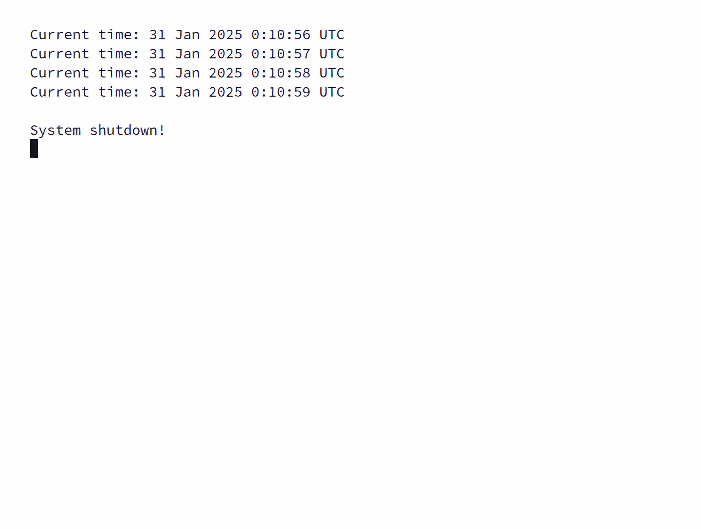
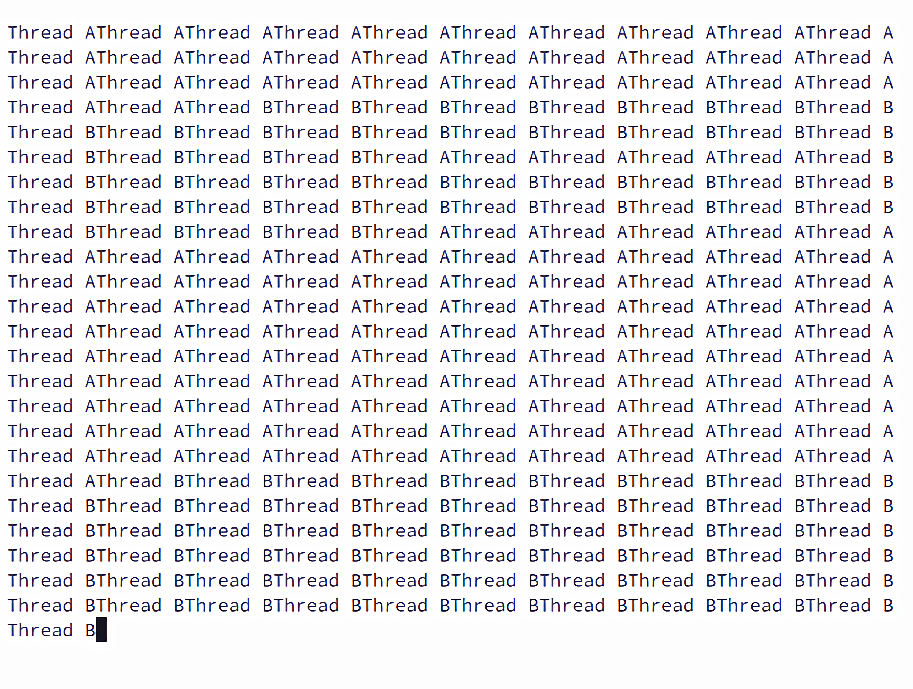

<!--
    Sysdarft.md
    
    Copyright 2025 Anivice Ives
    
    This program is free software: you can redistribute it and/or modify
    it under the terms of the GNU General Public License as published by
    the Free Software Foundation, either version 3 of the License, or
    (at your option) any later version.
    
    This program is distributed in the hope that it will be useful,
    but WITHOUT ANY WARRANTY; without even the implied warranty of
    MERCHANTABILITY or FITNESS FOR A PARTICULAR PURPOSE.  See the
    GNU General Public License for more details.
    
    You should have received a copy of the GNU General Public License
    along with this program.  If not, see <https://www.gnu.org/licenses/>.
    
    SPDX-License-Identifier: GPL-3.0-or-later
-->

# 

\thispagestyle{empty}

\begin{center}
SYSDARFT SOFTWARE DEVELOPMENT REFERENCE MANUAL

VERSION 0.0.1-Alpha

    Anivice Ives
\end{center}
\vspace{\fill}


\newpage
\thispagestyle{empty}

\vspace*{\fill}
\begin{center}
Permission is granted to copy,
distribute and/or modify this document under the terms of the GNU Free Documentation License,
Version 1.3 or any later version published by the Free Software Foundation;
with no Invariant Sections, no Front-Cover Texts, and no Back-Cover Texts.
A copy of the license is included in the section entitled "GNU Free Documentation License."
in Appendix C.
\end{center}
\vspace{\fill}

\newpage

# **Content**

- Notation Conventions
- CPU Registers
  - General-Purpose Registers
  - Special-Purpose Registers
    - Flag Register
    - Current Procedure Stack Preservation Space, `CPS`

- Assembler Syntax
  - Preprocessor directives
    - Declarative PreProcessor Directives
    - Content Directives
    - Assembling Control Flow and Conditional Compilation Directives
    - Assembler Instruction Statements
- Memory Layout
- Interruption
- External Devices
  - Block Devices
  - Real Time Clock (RTC)
- Appendix A: Instructions Set
  - Width Encoding
  - Operand Encoding
  - Instruction Encoding
  - Instruction Set
    - Miscellaneous
    - Arithmetic
    - Logic and Bitwise
    - Data Transfer
    - Control Flow
    - Input/Output
- Appendix B: Examples
  - Example A, Disk I/O
  - Example B, Real Time Clock
- Appendix C: GNU Free Documentation License

- References

# **Notation Conventions**

This manual employs specialized notational conventions to delineate data structure formats,
symbolically represent instructions,
and articulate hexadecimal and binary numerical systems.
A comprehensive exposition of these notational frameworks is provided in the sections that follow.

## Bit and Byte Order

In the representation of data structures within memory,
this manual diverges from the conventions typically found in Intel architecture documentation.
Specifically, lower memory addresses are depicted at the **top** of the illustration,
with addresses incrementing progressively toward the **bottom**.

Furthermore, bit positions are systematically numbered from right to left,
designating the leftmost bit as the **Least Significant Bit (LSB)**
and the rightmost bit as the **Most Significant Bit (MSB)**.
The numerical value associated with an active bit is determined
by two raised to the power of its respective bit position.
This methodology aligns consistently with the standards employed in Intel architectures,
as well as those prevalent in most ARM and RISC architectures.


The architecture of Sysdarft is meticulously congruent with that of Intel 64 and IA-32 processors,
which are characterized as **little endian**[^LittleEndian] systems.
In this context, the byte ordering within a word commences with the least significant byte,
corresponding to the smallest memory address, and progresses sequentially to the most significant byte.
Furthermore, Sysdarft operates in an analogous manner,
eschewing the complexities associated with protected modes and foregoing support for multitasking functionalities.

[^LittleEndian]:
Endianness refers to the sequence in which bytes within a word - defined as the native unit of data
for a given computer architecture - are arranged and transmitted over a data communication medium
or addressed in computer memory.
In a 64-bit system, for example, words typically consist of 64 bits (8 bytes),
representing the native word size through which a computer performs multiple operations simultaneously,
as opposed to processing data one byte at a time
[@Intel64AndIA32ArchitecturesSoftwareDevelopersManualCombinedVolumes].
However, this does not apply to Sysdarft, which operates using an 8-bit data stream.    
The term "endianness" was coined by Danny Cohen,
drawing inspiration from *Gulliver's Travels* [@GulliversTravels],
wherein Swift depicted a conflict among the Lilliputians
over whether to crack eggshells from the big end or the little end.
In a little-endian system, the least significant byte occupies the smallest memory address,
and data is processed sequentially from the smallest address to larger ones
[@OnHolyWarsAndAPleaForPeace].

## Hexadecimal and Binary Numbers

Base 16 (hexadecimal) numbers are represented by a string of hexadecimal digits
which are characters from the following set:
`0`, `1`, `2`, `3`, `4`, `5`, `6`, `7`, `8`, `9`, `A`, `B`, `C`, `D`, `E`, `F`,
preceded by `0x` as an indication (for example, `0xFBCA23`).
Base 2 (binary) numbers are represented by a string of `1`s and `0`s, followed by a binary suffix $n_2$
(for example, $1010_2$).
The $n_2$ designation is only used in situations where confusion as to the type of number might arise
[@Intel64AndIA32ArchitecturesSoftwareDevelopersManualCombinedVolumes].

## Processor

Central Processing Unit, or CPU,
is a processor that performs operations on an external data source,
usually memory or some other data stream[@OxfordEnglishDictionary].

## Registers 

Registers are fundamental primitives utilized in hardware design
and are accessible to programmers upon the completion of the computer system,
thereby serving as the foundational elements of computer construction [^Registers].

The CPU relies on registers to execute the majority of its operations,
with registers functioning as fixed-size data storage units within the CPU.

[^Registers]:
Registers are primitives used in hardware design that
are also visible to the programmer when the computer is completed,
so you can think of registers as the bricks of computer construction.
[@ComputerOrganizationAndDesign]

## Memory

Memory constitutes the accessible storage space external to the Central Processing Unit (CPU).
The total volume of memory that a system can access is designated as *Accessible Memory*.
In contrast,
the maximum memory capacity that a standard 64-bit system can address is referred to as *Addressable Memory*.
The smallest unit of memory is known as a *byte*, typically comprising eight binary bits.
Each byte within the memory space is assigned a unique address,
ranging from `0x0000000000000000` to the maximum value of `0xFFFFFFFFFFFFFFFF`.

## Exceptions

An exception is an event that typically occurs when an instruction causes an error
[@Intel64AndIA32ArchitecturesSoftwareDevelopersManualCombinedVolumes].
It represents a specific type of error.
For example, an attempt to divide by zero results in an exception.
Reporting an exception is referred to as *throwing* an exception,
such as *a `DIV/0` (division by zero) exception being thrown*,
which typically aborts the procedure following the location where the exception occurred.

# **CPU Registers**

Registers are preferentially utilized over direct memory access
due to their substantially lower latency in read and write operations compared to memory.
Within the Sysdarft architecture, registers are systematically categorized into two distinct types:
**General-Purpose Registers** and **Special-Purpose Registers**.

## General-Purpose Registers

The Sysdarft architecture comprises sixteen general-purpose registers,
each configured with a width of 64 bits.

### Fully Extended Registers

Fully Extended Registers (FERs) constitute the sixteen 64-bit general-purpose registers previously delineated,
each uniquely designated as `%FER0`, `%FER1`, ..., `%FER15`.

### Half-Extended Registers

**Half-Extended Registers (HERs)** are 32-bit general-purpose registers within the Sysdarft architecture,
encompassing eight distinct entities designated as `HER0`, `HER1`, ..., `HER7`.

These eight 32-bit registers are derived by bifurcating the initial four 64-bit Fully Extended Registers (FERs),
specifically `FER0` through `FER3`.
Consequently,
any modification to the contents of either the 32-bit HERs or their corresponding 64-bit FERs
concurrently affects both versions,
as they occupy the same underlying storage space.

### Extended Registers

**Extended Registers (EXRs[^EXR])** are 16-bit general-purpose registers within the Sysdarft architecture,
comprising eight distinct entities designated as `EXR0`, `EXR1`, ..., `EXR7`.
Analogous to *Half-Extended Registers*,
these 16-bit registers are derived by partitioning the first four 32-bit registers,
specifically `HER0` through `HER3`.

[^EXR]:
The designation of the 16-bit registers as *Extended Registers*
and the 32-bit registers as *Half-Extended Registers* originates
from their hierarchical relationship to the original 8-bit and Fully Extended 64-bit registers, respectively.
Specifically, the *Extended Registers* serve as extensions of the initial 8-bit registers,
thereby expanding their functionality and capacity.
Conversely,
the prefix *Half* in *Half-Extended Registers* signifies
that these 32-bit registers are precisely half the size of the *Fully Extended Registers*,
which are 64 bits in width.

Similarly, this implies that altering the contents of any register type affects the contents of all register types.

### Registers

**Registers** constitute 8-bit general-purpose registers within the Sysdarft architecture,
encompassing eight distinct entities designated as `R0`, `R1`, ..., `R7`.
These 8-bit registers are derived from the initial four 16-bit Extended Registers (EXRs),
specifically `EXR0` through `EXR3`.
Consequently,
any modification to the contents of an 8-bit register concurrently impacts all associated register types
that share the same underlying memory space.

The rationale for designing registers of varying widths that occupy the same physical space is
to facilitate the partitioning of data into width-specific segments exclusively through register-related operations.
This approach obviates the necessity for complex bitwise manipulations or the need to access external memory spaces,
thereby streamlining data handling within the CPU architecture.

## Special-Purpose Registers

### Segmentation and Segmented Addressing

Segmentation and segmented addressing were initially implemented in the 1970s with the introduction of the Intel 8086,
the first widely accessible processor for practical use case
without the necessity for deploying extensive electronic infrastructure,
therefore, popularly deployed in personal use.
Segmented addressing was employed to extend the processor's 16-bit memory bus to a 20-bit width,
while maintaining the internal registers at 16 bits to minimize the manufactory cost.
Consequently, the actual physical address, the linear address not segmentally referenced in memory,
is computed using the following formula:

$\text{Physical Address} = (\text{Segment Address} \ll 4) + \text{Segment Offset}$

**Where:**

- **Physical Address** refers to the address as recognized by the memory unit [@OperatingSystemConcepts].
- **Segment Address** denotes the address of the segment, which is derived by shifting the physical address four bits to the right, effectively calculating $\text{Physical Address} \div 2^{4}$ [@INTEL80386PROGRAMMERSREFERENCEMANUAL].
- **Segment Offset** represents the displacement from the current position to the beginning of the segment.
- **$x \ll n$** signifies the bitwise left shift operation, wherein the value $x$ is shifted $n$ bits to the left, equivalent to multiplying $x$ by $2^n$.

Usually, segmented address is denoted by `[Segmnet Address]:[Segment Offset]`[^SegmentNotation]

[^SegmentDenoting]
*A chunk of memory is known as a segment and hence the phrase
'segmented memory architecture.'
...,
A memory location is identified with a segment and an offset address
and the standard notation is `segment:offset`.*[@SoftwareDevelopmentForEngineers]

In the context of Sysdarft, a 64-bit wide memory bus is utilized,
the segment is no longer shifted four bits toward the left, and is instead added by offset directly
to compute the physical address, identical to later Intel IA-32 architectures[^IA32Segmentation]:

$\text{Physical Address} = \text{Segment Address} + \text{Segment Offset}$


Although segmented addressing may appear superfluous given the expansive width of the memory bus,
there exists at least one pertinent application for segmentation: program relocation.
This functionality underscores the continued relevance of segmented addressing within the Sysdarft architecture,
facilitating the dynamic movement and management of program segments
without necessitating complex memory manipulation techniques.

[^IA32Segmentation]:
*In segmentation, an address consists of two parts: a segment number and a segment offset.
The segment number is mapped to a physical address,
and the offset is added to find the actual physical address.*[@ComputerOrganizationAndDesign]

### Program Relocation

Before the discussion of program relocation,
the concepts of *Absolute Code* and *Position-Independent Code* (PIC) need to be established first.

#### Absolute Code
Absolute code, and an absolute object module,
is code that...runs only at a specific location in memory.
The Loader loads an absolute object module only into the specific location
the module must occupy[@iRMX86ApplicationLoaderReferenceManual].

#### Position-Independent Code
Position-independent code (commonly referred to as PIC) differs from
absolute code in that PIC can be loaded into any memory location.
The advantage of PIC over absolute code is that PIC does not require you to
reserve a specific block of memory[@iRMX86ApplicationLoaderReferenceManual].

If the position of the code is absolute, like BIOS, then its position and size in the memory is static and known.
However, as a user program, which would not be able to and should not assume which specific part of memory is free,
as its location in memory is arbitrary and should not be predetermined.
The operating system loads it wherever it deems appropriate.
Using absolute code eliminates the flexibility of user programs;
thus, position-independent code should be employed instead.

Segmentation effectively addresses the aforementioned issue.
Specifically, while the exact **segment location** remains undetermined until a loader,
such as DOS, allocates it within memory,
the **segment offset** - defined as the displacement from a specific position
within the code to the segment's commencement - is predetermined and known to the programmer.

Each program operates as a **position-independent code segment** within the memory space.
This design ensures that the program's functionality is not tied to a fixed memory address,
thereby enhancing flexibility and portability.
The management of these position-independent code segments is facilitated
through the use of **special-purpose registers**,
which oversee the dynamic allocation and referencing of memory segments during program execution.

### Code Segment

The code segment is typically managed by the operating system rather than the user.
The offset for this segment, the instruction pointer (`%IP`), is inaccessible,
even to the operating system.
However, the Code Base (`%CB`) register is accessible and can be used to set up a code segment.

Directly modifying `%CB` would cause the CPU to perform a wild jump,
an unintended or erroneous jump in a program's execution flow
due to attempting to return from a subroutine after the stack pointer or activation record have been corrupted
or incorrect computation of the destination address of a jump or subroutine call
[@ComputerOrganization],
or in this case, altering and possibly damaging the segment address resulting in incorrect computation
of the next instruction location in memory.
Therefore, `%CB` is usually not modified directly but rather changed indirectly through operations
like a long call or long jump.

### Data Segment

There are four registers that can be used together to reference two data segments:
Data Base (`%DB`), Data Pointer (`%DP`), Extended Base (`%EB`), and Extended Pointer (`%EP`).
These registers function in pairs, i.e., `%DB` with `%DP` and `%EB` with `%EP`, to address and access
two data segments simultaneously, though general-purpose registers can be used to perform the function.

### Stack Management

#### Definition of Stack

Stack is mainly used for storing function return addresses in control flow management, local variables,
temporary data storage and CPU state protection.

Stack operates on a Last-In-First-Out basis,
meaning the last element pushed inside the stack is popped at first,
similar to a gun magazine.

#### Stack Base Register

Stack base, or `%SB`, is a $64\text{-bit}$ register that stores the start point of stack space.

#### Stack Pointer

Stack pointer, or `%SP`, is a $64\text{-bit}$ register that stores the *end* of the *usable* stack space.

The stack grows upwards, meaning data is stored from the end toward the start.
This design simplifies stack allocation:
by setting the pointer to a specific size, the stack is automatically sized accordingly.


$\pagebreak[4]$

The following is a demonstration illustrating how a stack is managed
(Push and Pop Data onto the Stack):

Suppose the stack pointer `%SP` initially points to address `0x1000` and `%SB` points to `0xFFFF`.

```
   (Stack End)        (Stack Pointer)      (Stack Base)
        [ -- 8 Byte Data -- ][ -- Free Space -- ]
        ^                   ^                   ^
        |                   |                   |
  0xFFFF:0x1000       0xFFFF:0x0FF8       0xFFFF:0x0000
```

When a value is pushed onto the stack, `%SP` is decreased (since the stack grows upward),
and the value is stored at the new address.

```
   (Stack End)    (Stack Pointer After Pop)                      (Stack Base)
        [ -- 7 Byte Data -- ][ --- --- --- Free Space -- --- --- --- ]
                             [ -- 1 Byte Data -- ]
                                      (Stack Pointer Before Pop)
        [ --- --- ----  8 Byte Data ---- --- --- ][ -- Free Space -- ]
        ^                    ^                   ^                   ^
        |                    |                   |                   |
  0xFFFF:0x1000        0xFFFF:0x0FF9       0xFFFF:0x0FF8       0xFFFF:0x0000
```

When a value is popped from the stack, `%SP` is increased and the stack grows back down,
freeing the space in the process.

#### Stack Overflow

Stack overflow is an overflow of the stack pointer that leads to
losing track of the stack location.

#### Overflow

An overflow occurs when the addition of two numbers results in a number
larger than can be expressed with the available number of bits[@DigitalLogicDesign],
or subtraction resulting in negative numbers smaller than the representable range.
Such overflow triggers a phenomenon called integer wrap-around,
where the result cycles back within the allowable range and represents an unintended value.
This is because signed integers are two's complement binary values
that can be used to represent both positive and negative integer values
[@Intel64AndIA32ArchitecturesSoftwareDevelopersManualCombinedVolumes],
and this behavior is caused by such a representation method.

#### Two's Complement

The two's complement of a number,
or radix complement[^RadixComplement] of a binary number,
is determined by taking the binary representation of its absolute value,
inverting the bits by flipping `0` to `1` and `1` to `0`,
and then adding one to the result.
For example, to find the representation of `-1` in an $8\text{-bit}$ system,
start with the binary representation of `1`, which is `0000 0001`.
Invert the bits to get `1111 1110`, then add one to obtain `1111 1111`.
This final value, `1111 1111`, represents `-1` in an $8\text{-bit}$ two's complement system.

In the two's complement system, signed integers represent both positive and negative values.
For each binary number, the radix complement is called the two's complement
(since radix is `2` for binary).
The MSB (Most Significant Bit) of a number in this system serves as the sign bit;
a number is negative if and only if its MSB is `1`.
The decimal equivalent for a two's-complement binary number is computed the same way as for an unsigned number,
except that the weight of the MSB is $-2^(n-1)$, instead of $+2^(n-1)$.
The range of representable numbers is $-2^(n-1)$ through $+2^(n-1)$[@DigitalDesignPrinciplesAndPractices]

[^RadixComplement]:
The base or radix ($r$) is the foundation of a number system.
For instance, in decimal, the base is 10, in binary it is `2`,
and in hexadecimal it is `16`.
For any given number system with base $r$,
two types of complements can be used:
the $r$'s complement and the $(r-1)$'s complement.
The $r$'s complement of a number $N$ is calculated as $r^n - N$,
where $n$ is the number of digits in the number.
The $(r-1)$'s complement is computed as $(r^n - 1) - N$.
This is closely related to the $r$'s complement,
as adding `1` to the $(r-1)$'s complement gives the $r$'s complement.

Now, there exists a situation where an operation attempts to store data that is
larger than the available stack space.
This means `%SP` is attempted to be set to a negative number.
And if `%SP` decreases below zero, the register overflows and wrap-around.

Similar wrap-around happens to `%SP` when `%SP` is set to `-1`, but $64\text{-bit}$ in width.
`%SP` performs a wrap-around to represent `-1`, which is `0xFFFFFFFFFFFFFFFF`,
or `1111111111111111111111111111111111111111111111111111111111111111`,
where every bit in the stack pointer is set to `1` which, when assumed as unsigned,
is the maximum value a $64\text{-bit}$ register can represent ($18446744073709551615_10$).

---

As a result, the stack pointer points to an address that
even a $64\text{-bit}$ system may not be able to access.
This occurs because the pointer, when combined with its base address,
refers to a location that almost certainly goes beyond the $64\text{-bit}$ addressable space,
let alone when the actual physical memory space is put into consideration,
which would be far less than $2^{64}-1$.

This situation is called a stack overflow.

### Flag Register

Flag register is a user-inaccessible register containing the following flags:

| Flag                     | Explanation                                                                                                           |
|--------------------------|-----------------------------------------------------------------------------------------------------------------------|
| *Carry*, *CF*            | Overflow in unsigned arithmetic operations                                                                            |
| *Overflow*, *OF*         | Overflow in signed arithmetic operations                                                                              |
| *LargerThan*, *BG*       | Set by `CMP`, when $\text{Operand1} > \text{Operand2}$                                                                |
| *LessThan*, *LE*         | Set by `CMP`, when $\text{Operand1} < \text{Operand2}$                                                                |
| *Equal*, *EQ*            | Set by `CMP`, when $\text{Operand1} = \text{Operand2}$                                                                |
| *InterruptionMask*, *IM* | Set and cleared by CPU automatically when an interruption triggered, can manually set by `ALWI` and cleared by `IGNI` |

### Current Procedure Stack Preservation Space, `CPS`

Current procedure stack preservation space is a user-inaccessible register,
preservable only through `PUSHALL`[^PUSHALL] and recoverable by `POPALL`[^POPALL] indirectly,
that is modified by instruction `ENTER`[^Enter] and `LEAVE`[^Leave] to store
current allocated stack space for local variables.

[^PUSHALL]:
Push all preservable registers (registers except  `%CB` and `%IP`) onto the stack in the following order
Refer to *Assembler Syntax* and *Appendix A* for more information.

[^POPALL]:
Pop all preservable registers from stack to CPU corresponding registers.
Refer to *Assembler Syntax* and *Appendix A* for more information.

[^Enter]:
`ENTER [Width] [Number]` preserves a stack space to allocate spaces for local variables.
Procedure of `ENTER` can be described as:
```
    CPS = Number;   // CBS is Current Procedure Stack Preservation Space
    SP = SP - CPS;  // SP is stack pointer
```
Refer to *Assembler Syntax* and *Appendix A* for more information.

[^Leave]:
`LEAVE` tears down a stack space allocated through `ENTER`
Procedure of `LEAVE` can be described as:
```
    SP = SP + CPS;  // SP is stack pointer
    CPS = 0;        // CBS is Current Procedure Stack Preservation Space  
```
Refer to *Assembler Syntax* and *Appendix A* for more information.

# **Assembler Syntax**

An assembler is a compiler that translates human-readable machine instructions into machine-readable binary.

Sysdarft assembler, like many other assemblers, is case-insensitive.

## Preprocessor directives

Preprocessor directives are not program statements but directives for the preprocessor.
The preprocessor examines the code before actual compilation of the code begins.

### Declarative PreProcessor Directives

Declarative PreProcessor Directives are used to manipulate the code assembling process.

### `.org [Decimal or Hexadecimal]`

`.org`, or origin, defines the starting offset for code in memory.
While the default origin is `0x00`, some absolute code (like BIOS) loads at specific addresses such as `0xC1800`.
If the assembler assumed an origin of `0x00`,
all line markers (symbols[^symbols]) start at `0x00` and would be inconsistent with the actual location of the code
(like `0xC1800`).
`.org` can manually specify the correct starting address,
ensuring proper offset calculations for absolute code.

[^symbols]:
A symbol, identifier, line marker, or label, is a name associated with some particular value.
This value can be an offset within a segment, a constant, a string, a segment address,
an offset within a record, or even an operand for an instruction.
In any case,
a label provides us with the ability to represent some otherwise
incomprehensible value with a familiar, mnemonic, name.     
A symbolic name consists of a sequence of letters, digits, and special characters, with
the following restrictions:
- A symbol cannot begin with a numeric digit.
- A name can have any combination of upper and lower case alphabetic characters.
- A symbol may contain any number of characters.
- The '_' and '.' symbols may appear anywhere within a symbol.
[@TheArtOfAssemblyLanguage]

#### Example

```
    .org 0xC1800
```

### `.equ '[Search Target]', '[Replacement]'`

In assembly or low-level programming, the `.equ` directive is used to
*replace occurrences of a string* with another, similar to how macros work in C.
It is essentially a way to define *symbolic constants* or *aliases* for values or strings.

- *Regular expression support disabled*

  If the assembler does not enable regular expressions (option `-R, --regular`)
  for the `.equ` directive, it simply performs a literal string replacement.
  In this case, assembler searches for occurrences of a specific string
  (*Search Target*) and replaces them with the *Replacement*
  exactly as they appear, without any special pattern matching or modifications.

- *Regular expression support enabled*

  If the assembler enabled regular expressions,
  the `.equ` directive can behave like a regular expression search-and-replace.
  This means assembler can capture string groups and modify them using regular expression.

#### Example

```
    ; regular expression not enabled
    .equ 'HDD_IO', '0x1234'
    ; regular expression enabled
    ; this replaces occurrances like ADD(%FER0, %FER1) to ADD .64bit <%FER0>, <%FER1>
    .equ 'ADD\s*\((.*), (.*)\)', 'ADD .64bit <\1>, <\2>'
```

### `.lab marker1, [marker2, ...]`

Declare one or more line markers.
Line markers can be auto scanned and defined without relying on this directive,
unless its presence is not in the current file.
This directive has no effect unless it is meant to serve as a declaration
for a cross-referencing symbol for multiple files.

#### Example

```
    .lab _start, _end
```

> **NOTE**: The preprocessor directives mentioned above, namely *Declarative PreProcessor Directives*,
> can be and can only be processed if they are at the beginning of the file.
> Any occurrences of declarative preprocessor directives within the code region,
> that is, appearing after an instruction or valid line marker,
> the assembler refuses to process these directives
> and an exception (error) will be thrown.

## Content Directives

Content directives are directives can be used to insert data into the code region,
apart from the instruction sets.

### `@` and `@@`

`@` and `@@` are code offset references.
`@` means the segment offset of the current instruction.
`@@` means the code origin, if `.org` is not specified, its value is `0x00`.
Both `@` and `@@` are constant value, and should be treated as one.

#### Example

```
    JMP <%CB>, <$(@)>
```

### `.resvb < [Mathematical Expression] >`

`.resvb` is short for `reserve bytes`.
It reserves a fixed size of a data region inside the code area.
This is essential when it comes to size alignment or padding.
It supports mathematical expressions like `+, -, * ,/, %, etc.`.

#### Example

```
    .resvb < 16 - ( (@ - @@) % 16 ) > ; ensure 16 byte alignment
```

### `.string < "STRING" >`

`.string` is an easy way to insert a continuous string of ASCII code.
It is useful if one were to store data in the code area, especially by BIOS code.
`.string` can process the following C style escape sequences[^EscapeSequences]:
`\n`, `\t`, `\r`, `\\`, `\'`, and `\"`.

[^EscapeSequences]:
An escape sequence like `\n` provides a general and extensible mechanism
for representing hard-to-type or invisible characters.
Among the others that C provides are
`\t` for tab,
`\r` for carriage return,
`\'` for the single quote,
`\"` for the double quote,
and `\\` for the backslash itself[@TheCProgrammingLanguage].

#### Example

```
    .string < "Hello World!!\n" > 
```

### `.8bit_data`, `.16bit_data`, `.32bit_data`, and `.64bit_data` `< Expression >`

`.8bit_data`, `.16bit_data`, `.32bit_data`, and `.64bit_data`
are preprocessor directives used to insert width-specific data into the code region.
Unlike what is shown by the disassembler, where `.[N]bit_data` can accept continuous data expressions,
`.[N]bit_data` can accept one and only one expression for each `.[N]bit_data` preprocessor directive.

`.[N]bit_data` preprocessor directive can accept *line markers* and process them as a constant holding the
value of the segment offset of the corresponding instructions following them.
It also accepts `@` and `@@` directives, as well as normal mathematical expressions.

#### Example

```
    .64bit_data < @ - @@ > 
```

### Assembling Control Flow and Conditional Compilation Directives

This type of directives is meant to control the compiling behavior of the assembler.

### `%include "[FILE PATH]"`

Include a file, and passes it onto preprocessor to record its directives and symbols,
but not the actual assembler.
Any actual code inside the included files is not assembled.

### `%define [DEFINITION] [Replacement]`

A *definition* comprises a `[DEFINITION]` identifier
and an optional `[Replacement]` value.
During the processing of a source file,
a `.equ '[DEFINITION]', '[Replacement]'` directive is generated to substitute
the original definition directive.
This mechanism results in the addition of an assembler definition
for `[DEFINITION]` within the assembler,
thereby facilitating conditional compilation
based on the presence or absence of specific definitions.

### `%ifdef [DEFINITION], %ifndef [DEFINITION], %else, %endif`

*Conditional Compilation Directives* within the Sysdarft architecture encompass `%ifdef` and `%ifndef`,
which enable the selective inclusion or exclusion of code segments
based on the definition status of specific `[DEFINITION]`s.

- **`%ifdef [DEFINITION]`**: This directive initiates a conditional block
  that processes the subsequent code only if `[DEFINITION]` is defined.
  The processing continues until a `%else` or `%endif` directive is encountered.
  If a `%else` is present, the code following `%else` is disregarded, and processing resumes after `%endif`.

- **`%ifndef [DEFINITION]`**: Conversely,
  this directive processes the ensuing code block only if `[DEFINITION]` is not defined.
  Similar to `%ifdef`, the processing continues until a `%else` or `%endif` is reached.
  In the presence of a `%else`, the code following it is ignored, and execution continues post-`%endif`.

This mechanism ensures that when `%ifdef` is employed,
the associated code is active only under defined conditions,
whereas `%ifndef` activates code in the absence of such definitions.
This bidirectional conditional structure facilitates modular and adaptable code architecture
by allowing developers to manage code inclusion dynamically based on predefined conditions.

### `%warning STRING`

The `%warning` directive enables the assembler
to emit a specified warning message encapsulated within the `STRING` parameter.
Upon encountering this directive,
the assembler will display the provided warning message to inform the developer of potential issues,
noteworthy conditions, or other relevant information pertinent to the assembly process.
Importantly, the invocation of `%warning` does not interrupt or terminate the assembly workflow;
instead, it serves as a non-intrusive notification mechanism
that allows the assembly process to continue unabated while still alerting the developer to significant considerations.

### `%error STRING`

The `%error` directive serves as a critical exception mechanism within the assembly process.
When this directive is encountered,
the assembler interprets it as an exception event and generates the specified `STRING` as an error message.
Unlike the `%warning` directive,
which issues non-intrusive notifications, `%error` mandates the immediate termination of the assembly process.
This behavior ensures that any unresolved or severe issues are promptly addressed by halting the assembly workflow,
thereby preventing the creation of potentially flawed or incomplete machine code.
The `%error` directive is instrumental in enforcing stringent error handling protocols,
ensuring the integrity and reliability of the assembly process by unequivocally
aborting operations upon the detection of critical conditions or irrecoverable errors.

## Assembler Instruction Statements

Instruction statements are actions performed by processor.

For all instruction statements, this syntax is followed:

```
    Mnemonic [Width] <Operand1> [, <Operand2>]
```

*where*

  - *Mnemonic* is name for the instruction
  - *Width* is data width for *Operand1*, and *Operand2* as well, if *Operand2* is present.
  - *Operand1* and *Operand2* specifies what data is to be manipulated or operated on by instruction,
     while at the same time representing the data itself[@ComputerScienceIlluminated].

Operation width is enforced by many data-modifying instructions.
It refers to the data width of one or both of the instruction's operands.
When two operands are provided, both must have the same data width consistent to the width provided
by instruction statement.

The following is the breakdown of each part of the instruction expression.

#### Mnemonic

Mnemonic is a symbolic name represents each of the machine-language instructions[@ComputerScienceIlluminated]'[^MnemonicTable].

[^MnemonicTable]: Refer to *Appendix A* for the whole instruction mnemonic table.

#### Operation Width

Operation width can be `.8bit`, `.16bit`, `.32bit`, or `.64bit`,
representing $8\text{-bit}$, $16\text{-bit}$, $32\text{-bit}$ and $64\text{-bit}$ data width
for operands respectively.

### Operands

Operands need to be enclosed within `<` and `>`.
There are three possible operand types: registers, constants, or memory references.

#### Register Operands

Register operands are accessible internal CPU registers of general-purpose or special-purpose.

Registers must start with `%`, with no space between `%` and register name.
For example: `%EXR2` is valid, but `"% EXR2"` is not and will not be detected as a valid operand.

#### Constants

A constant is an expression consisting of one or more decimal and/or hexadecimal numbers.

The preprocessor first transforms hexadecimal values into decimals,
then runs the expression through the `bc` calculator.
Valid `bc` expressions are accepted as long as the output is a decimal.

Constant expressions are always enclosed by `$(` and `)`.
Expression, if being a stand-alone operand, is enclosed by `<` and `>`,
resulting in a double enclosure of both signs.
For example, a constant in an instruction expression can look like this:

```
    ADD .64bit <%FER0>, < $( 0xFFFF + 0xBC ) >
```

Constant expressions are always 64 bits wide.
Any value exceeding $64$ bits triggers an overflow report but is not considered an error.
In the event of an overflow, the result is set to `ULLONG_MAX` (`18446744073709551615`).

#### Memory References

Memory references are data stored at a specific memory location.

Memory references are a complicated expression:

```
    *[Ratio]&[Width](Base, Offset1, Offset2)
```

*and*

$\text{Memory Reference Physical Address} = \text{Ratio} \times (\text{Base} + \text{Offset1} + \text{Offset2})$

*where*

- *Ratio* can be `1`, `2`, `4`, `8`, `16`.
- *Base*, *Offset1*, *Offset2* can be and can only be either constant expressions or registers.
- *Width* specifies data width of the memory location, which can be `8`, `16`, `32`, `64`,
              representing $8\text{-bit}$, $16\text{-bit}$, $32\text{-bit}$, and $64\text{-bit}$ data respectively.

The following is an example of a memory reference:

```
    *2&64(%FER1, $(0xFC), $(0xBC))
```

This address points to a $64\text{-bit}$ data width space at the address
$(\text{\%FER1} + \text{0xFC} + \text{0xBC}) \times 2$

#### Line Markers, or Symbols

Line markers are special operands that record the offset of their corresponding code.

For example:

```
    JMP <%CB>, <_start>

    _start:
        XOR .32bit <%HER0>, <%HER0>
```

`_start` is identified as a line marker by its tailing `':'`.
Only spaces and tabs may appear after the colon, any other elements like instructions are considered as errors.

If `.org` is not specified, line markers are calculated as offsets from the beginning of the file, starting at `0`.
If `.org` is specified, the offset is calculated from $\text{the offset within the file} + \text{specified origin}$.

Line markers are ineligible for utilization within constant calculations or memory reference operations.
Instead, they must be initially stored within a register before being referenced subsequently.

# **Memory Layout**

Sysdarft reserves memory from `0xA0000` to `0xFFFFF`.
This part contains the crucial code that ensures the functionality of the system.

### `0xA0000` - `0xA0FFF`

Memory from `0xA0000` to `0xA0FFF` is *interruption vector*,
or *interruption jump table*[^InterruptionVector].
`0xA0000` to `0xA0FFF` contains `4 KB` memory space,
and one vector entry is 16 bytes (8 byte code segment base and 8 byte code segment offset) in size,
meaning there exists at most 256 different interruptions.
Specifics about interruptions are discussed in the section [**Interruption**](#interruption).

[^InterruptionVector]:
*...A table of pointers to interrupt routines can be used instead to provide the necessary speed.
The interrupt routine is called indirectly through the table, with no intermediate routine needed.
Generally, the table of pointers is stored in low memory (the first hundred or so locations).
These locations hold the addresses of the interrupt service routines for the various devices.
This array, or interrupt vector, of addresses is then indexed by a unique number,
given with the interrupt request, to provide the address of the interrupt service routine for the interrupting device.
Operating systems as different as Windows and UNIX dispatch interrupts in this manner[@OperatingSystemConcepts]*.
Some prefer *interrupt vector*, some prefer *jump table*.
Interrupt is a historical design that can be backtracked to `Whirlwind I`,
which was a Cold War-era vacuum-tube computer
developed by the MIT Servomechanisms Laboratory for the U.S. Navy back in 1951.
Through the years these terms are intertwined and in many cases unused interchangeably.
If there is a requirement to be specific, *interrupt vector* is preferred.
But it is not a strict requirement in most cases,
since *jump table* is very much as self-explanatory, if not more, as *interrupt vector*.

### `0xB8000` - `0xB87CF`

From `0xB8000` to `0xB87CF` is a `2000` bytes linear memory used as video memory.
Sysdarft offers a `80x25` screen, which can hold up to `2000` characters in total.
Modifying this region directly affects the content on the screen.

### `0xC1800` - `0xFFFFF`

This `250 KB` region is used to hold system firmware, which is what we know as Basic Input Output System (BIOS).
Modifying this region is always discouraged, since this region contains crucial code for specific use cases.


The lower `640 KB` and any memory goes beyond `1 MB` can be used by the Operating System or user.
In a typical structure, lower `640 KB` is reserved for Operating System,
and beyond `1 MB` boundary is for designed user uses.

# **Interruption**

Interrupt, or interruption, usually caused by some exceptional situations[@TheJargonFile].
An interrupt is simply a signal that the hardware or software can send when it wants the processor's attention
[@LinuxDeviceDriversThirdEdition].
Interruption is a way to inform CPU that a specific request is sent and needs to be processed.
Should the CPU consent to processing the request,
the currently executing task will be temporarily suspended
and subsequently resumed upon the completion of the request handler.

#### Interruption Routine

Interruption routine is a code subroutine (function) for a specific interruption type.

Before the CPU enters an interruption routine, CPU preserves all registers,
including `%CB` (Code Base) and `%IP` (Instruction Pointer), by pushing them onto the stack.
Following this, the *Interruption Mask* (`IM`) is set to `1`,
indicating that the CPU is currently handling an interruption and will not accept additional interruptions.
Next, the CPU retrieves the new `%CB` and `%IP` values from the *interruption jump table*,
which resides in the memory region `0xA0000` - `0xA0FFF`.
These new values are then assigned to `%CB` and `%IP`,
enabling the CPU to execute code from the specified address in the *interruption jump table*.
This is effectively a `CALL` from CPU interruption handler, and the destination routine,
or function in `C` sense, is an **interruption routine**.

#### Non-maskable Interruptions

Interruptions with its code under or equals to `0x1F`, i.e., `31`, are not maskable,
meaning that CPU will accept interruptions with code under or equals to `0x1F` regardless of the state of `IM`.

The following is a table describing each non-maskable interruption:

| Interruption Code | Interruption Description                                                                                                                                                                                                                                                                                                                                                                                                    |
|-------------------|-----------------------------------------------------------------------------------------------------------------------------------------------------------------------------------------------------------------------------------------------------------------------------------------------------------------------------------------------------------------------------------------------------------------------------|
| `0x00 `           | Fatal Error                                                                                                                                                                                                                                                                                                                                                                                                                 |
| `0x01 `           | Divided by `0`                                                                                                                                                                                                                                                                                                                                                                                                              |
| `0x02`            | I/O Error                                                                                                                                                                                                                                                                                                                                                                                                                   |
| `0x03`            | Debug, indicating breakpoint reached                                                                                                                                                                                                                                                                                                                                                                                        |
| `0x04`            | Bad interruption                                                                                                                                                                                                                                                                                                                                                                                                            |
| `0x05`            | Keyboard Interruption, caused by `Ctrl+C`, usually indicating aborting current program                                                                                                                                                                                                                                                                                                                                      |
| `0x06`            | Illegal Instruction                                                                                                                                                                                                                                                                                                                                                                                                         |
| `0x07`            | Stack Overflow                                                                                                                                                                                                                                                                                                                                                                                                              |
| `0x08`            | Memory Access Out of Boundary                                                                                                                                                                                                                                                                                                                                                                                               |
| `0x10`            | Teletype (show character at cursor position, then move cursor to the position of next character, with `%EXR0` being the ASCII code)                                                                                                                                                                                                                                                                                         |
| `0x11`            | Set Cursor Position, with `%EXR0` being the linear position ($\text{\%EXR0} \in [0, 1999]$, `2000` characters)                                                                                                                                                                                                                                                                                                              | 
| `0x12`            | Set Cursor Visibility, with `%EXR0` $= 1$ means visible and `%EXR0` $= 0$ means invisible                                                                                                                                                                                                                                                                                                                                   |
| `0x13`            | New Line (Move cursor to the start of the next line, and scroll the content on the screen upwards one line if cursor is already at the bottom                                                                                                                                                                                                                                                                               |
| `0x14`            | Get Keyboard Input. This interruption does not return unless: *a.* A valid user input from keyboard is captured, and `%EXR0` will record the key pressed on keyboard. *b.* System halt captured from keyboard, which is `Ctrl+Z` *c.* Keyboard interruption invoked by `Ctrl+C` *d.* Can be stopped by an interruption sent from an external device, and resumed to waiting for user input when interruption routine ended. |
| `0x15`            | Get Current Cursor Position, with `%EXR0` being cursor's linear offset ($\text{\%EXR0} \in [0, 1999]$)                                                                                                                                                                                                                                                                                                                      |
| `0x16`            | Get Current Accessible Memory Size (`%FER0` being the total memory)                                                                                                                                                                                                                                                                                                                                                         |
| `0x17`            | Ring the Bell. There is a bell in Sysdarft and can be ringed by this interruption                                                                                                                                                                                                                                                                                                                                           |
| `0x18`            | Refresh the Screen with the Video Memory. Useful when modifying the video memory directly without using teletype                                                                                                                                                                                                                                                                                                            |
| `0x19`            | Clear Keyboard Input. All previously unhandled user input will be flushed and ignored                                                                                                                                                                                                                                                                                                                                       |

As is shown above, $\text{interruptions code} \in [\text{0x00}, \text{0x0F}]$ are used to handle system errors,
with `9` major hardware errors and possible `7` unassigned errors for the operating system to use.
$\text{Interruptions code} \in [\text{0x10}, \text{0x1F}]$ are utility interruption used to perform certain actions,
with `10` major hardware functions and possible `6` unassigned ones for the operating system to use as system calls.

#### Maskable Interruptions

Interrupts with identifiers exceeding `0x1F` and up to `0xFF` are typically employed by users
to configure specific interrupt mechanisms for a diverse range of applications.
These interrupts can be selectively ignored when the Interrupt Mask (`IM`) is set to `0`.
The modification of the `IM` flag occurs under the following circumstances:

1. *Automatic Adjustment by the CPU*: When the CPU enters an interrupt handling routine,
                                      it autonomously sets the `IM` flag to `1` to prevent the occurrence of nested interrupts,
                                      thereby ensuring orderly and efficient interrupt processing.

2. *Explicit Instruction-Based Control*:
  - **`ALWI` (Allow Interruptions) Instruction**: Executing the `ALWI` instruction explicitly sets the `IM` flag to `0`,
                                                     thereby permitting interrupts to be recognized and processed.
  - **`IGNI` (Ignore Interruptions) Instruction**: Conversely, the `IGNI` instruction sets the `IM` flag to `1`, 
                                                     effectively disabling the processing of interrupts.

# External Devices

## Block Devices

Block devices offer five I/O ports:

- Read-only port, *SIZE*, used to read the available space(sectors) on the block device.
- Write-only port, *START SECTOR*[^SECTOR], used to specify the start sector for an operation.
- Write-only port, *SECTOR COUNT*, used to specify the sector number for an operation.
- Write-only port, *OUTPUT*, perform a write operation using parameters setup by port *START SECTOR* and *SECTOR COUNT*. 
- Read-only port, *INPUT*, perform a read operation using parameters setup by port *START SECTOR* and *SECTOR COUNT*.

[^SECTOR]:
In computer disk storage, a sector is a subdivision of a track on a magnetic disk or optical disc.
For most disks, each sector stores a fixed amount of user-accessible data,
traditionally 512 bytes for hard disk drives (HDDs), and 2048 bytes for CD-ROMs, DVD-ROMs and BD-ROMs
[@RandomAccessMethodOfAccountingAndControl],
[@OPERATINGSYSTEMSDESIGNANDIMPLEMENTATION].

### Hard Disk

| Port    | Explanation            |
|---------|------------------------|
| *0x136* | Disk Sector Count      |
| *0x137* | Start Sector Number    |
| *0x138* | Operation Sector Count |
| *0x139* | Disk Output Port       |
| *0x13A* | Disk Input Port        |


### Floppy Drive `A:`

| Port    | Explanation            |
|---------|------------------------|
| *0x116* | Disk Sector Count      |
| *0x117* | Start Sector Number    |
| *0x118* | Operation Sector Count |
| *0x119* | Disk Output Port       |
| *0x11A* | Disk Input Port        |


### Floppy Drive `B:`

| Port    | Explanation            |
|---------|------------------------|
| *0x126* | Disk Sector Count      |
| *0x127* | Start Sector Number    |
| *0x128* | Operation Sector Count |
| *0x129* | Disk Output Port       |
| *0x12A* | Disk Input Port        |

## Real Time Clock (RTC)

Real Time Clock, or RTC,
is a device powered by a battery on the motherboard
that keeps updating its internal clock to real time,
even when the CPU is not running.

#### *Port `0x70`*

This port is a read/write port.
When reading, it returns a UNIX timestamp representing current time.
When writing, it updates the current time to the provided timestamp.

#### *Port `0x71`*

RTC provides a way to trigger interruption periodically.
RTC updates its internal clock at a constant frequency[^RTCFreq],
and if periodical interruption is set up,
RTC can periodically trigger a maskable interruption.

[^RTCFreq]:
The designed frequency is 50,000 ns, but the CPU itself runs at a much slower frequency.
This leads to concussive interruption request being ignored.
RTC frequency can vary based on host OS time resolution, and an average update interval is `53,000` ns.

This is a $64$-bit port, and it has the following format:

| [37-8]                                                                                             | `7-0`                                           |
|----------------------------------------------------------------------------------------------------|-------------------------------------------------|
| Periodical Scale, Interruption is triggered every $50,000\text{ns} \times \text{Periodical Scale}$ | Interruption Number, must be larger than `0x1F` |

Interruption number is user defined.

# **Appendix A: Instructions Set**

## Width Encoding

Sysdarft supports four types of data width,
namely $8$-bit, $16$-bit, $32$-bit, and $64$-bit.
All of which are encoded in packed BCD[^BCD] code,
which are `0x08`, `0x16`, `0x32`, `0x64` respectively.

[^BCD]:
Binary Coded Decimal data, or BCD data,
is self-explanatory binary data compared to raw binary numbers.
BCD has two major data types: packed and unpacked.
The term unpacked BCD usually implies a full byte for each digit (often including a sign),
whereas packed BCD typically encodes two digits within a single byte
by taking advantage of the fact that four bits are enough to represent the range 0 to 9
[@Intel64AndIA32ArchitecturesSoftwareDevelopersManualCombinedVolumes].
The precise four-bit encoding, however, may vary for technical reasons.
The BCD code used by Sysdarft is a plain packed BCD code for positive numbers with no signs,
i.e., decimal expressions like `32` or `64` are simply packed as `0x32` and `0x64`
with no additional modifications.

## Operand Encoding

All operands start with an operand prefix that can determine the type of the operand,
following that is operand width, which is a BCD code mentioned above.
After this is operand-specific code area.
Operand has three different types: *Register*, *Constant* and *Memory Reference*.

### Register

Register starts with prefix `0x01`.
Width specification tells the system which register type is being referenced,
which is the BCD code mentioned above.
Following width BCD code is register index, which is a single-byte binary number.
For non-$64$-bit registers, index ranges from `0` to `7`,
representing their corresponding registers.
$64$-bit registers takes index of `0` to `15`,
representing a total `16` registers as designed.

| Byte 0, Register Identification  | Byte 1, Width Specification | Byte 2         |
|----------------------------------|-----------------------------|----------------|
| `0x01`                           | `0x08`/`0x16`/`0x32`/`0x64` | Register Index |

### Constant

Constants are always $64$-bit in width with `0x02` as its indication,
since constant does not enforce a data width in its expression.
However, constants are confined by operation data width still,
and data beyond specified operation data width is capped and discarded.

| Byte 0, Constant Identification | Byte 1, Data Width, Always `64` | Byte 2-9, Binary Number |
|---------------------------------|---------------------------------|-------------------------|
| `0x02`                          | `0x64`                          | Constant Binary Number  |

### Memory Reference

Memory reference is used to point to an address inside the memory.
Memory reference is identified with prefix `0x03`.
Encoding of memory reference is complicated and is encoded from

*Memory Reference Syntax*

```
    *[Ratio]&[Width](Base, Offset1, Offset2)
```

to its

*Encoded Format*

| Byte 0, Memory Identification | Byte 1, Width Specification  | *Base*, *Offset1*, *Offset2* | Single-Byte Suffix |
|-------------------------------|------------------------------|------------------------------|--------------------|
| `0x03`                        | `0x08`/`0x16`/`0x32`/`0x64`  | Encoded Binary Code          | Ratio BCD Code     |

*where*

- *Base*, *Offset1*, and *Offset2* can be either constants or registers of different types.
- *Single-Byte Ratio Suffix* is a BCD code which can be `0x01`, `0x02`, `0x04`, `0x08`, and `0x16`,
corresponding to the memory reference ratio syntax mentioned earlier.


## Instruction Encoding

Instruction is an $8$-bit wide byte code.
There are far less than $256$ instructions in Sysdarft CPU, so a single byte is sufficient.
Instruction is encoded as the following format:

| Byte 0, Instruction Opcode | Operands (Implied by Instruction)                                                               | 
|----------------------------|-------------------------------------------------------------------------------------------------|
| Opcode                     | Acceptable operands implied by Instruction Opcode. $0$, $1$ or $2$ operands are all acceptable. | 


## Instruction Set

### Miscellaneous

#### **NOP**

| Opcode    | Instruction | Acceptable Type for First Operand  | Acceptable Type for First Operand | Operation Width Enforcement |
|-----------|-------------|------------------------------------|-----------------------------------|-----------------------------|
| `0x00`    | `NOP`       | None                               | None                              | No                          |


The opcode[^opcode] for `NOP` is `0x00`,
which is the default value when memory initialized
and the default value used for peddling[^peddling].
This is the reason why there is an instruction `NOP` with its opcode being the default value.
Should CPU mistakenly execute an uninitialized area, there would not be serious consequences.

[^opcode]: opcode: The field that denotes the operation and format of an instruction [@ComputerOrganizationAndDesign].

[^peddling]: When a field following another field does not fit into a partially filled storage unit,
it may be split between units, or the unit may be padded.
An unnamed field with width 0 forces this padding,
so that the next field begins at the edge of the next allocation unit.
[@TheCProgrammingLanguage]

#### **HLT**

Halt the CPU, then *shutdown*.

| Opcode    | Instruction | Acceptable Type for First Operand  | Acceptable Type for First Operand | Operation Width Enforcement |
|-----------|-------------|------------------------------------|-----------------------------------|-----------------------------|
| `0x40`    | `HLT`       | None                               | None                              | No                          |


`HLT` is different from almost any other CPUs where `hlt` enters a power-saving state
until an external interrupt wakes itself.

#### **IGNI** 

Set IM (Interruption Mask) to `1`.

| Opcode    | Instruction | Acceptable Type for First Operand  | Acceptable Type for First Operand | Operation Width Enforcement |
|-----------|-------------|------------------------------------|-----------------------------------|-----------------------------|
| `0x41`    | `IGNI`      | None                               | None                              | No                          |


`IGNI` masks all maskable interruptions.

#### **ALWI**

Set IM (Interruption Mask) to `0`.

| Opcode    | Instruction | Acceptable Type for First Operand  | Acceptable Type for First Operand | Operation Width Enforcement |
|-----------|-------------|------------------------------------|-----------------------------------|-----------------------------|
| `0x42`    | `ALWI`      | None                               | None                              | No                          |


`ALWI` enables interruption response from all interruption types,
either from maskable or un-maskable interruptions.

## Arithmetic

#### **ADD**

Add two numbers and store the result to the first operand.
(`Operand1 = Operand1 + Operand2`)

| Opcode    | Instruction | Acceptable Type for First Operand | Acceptable Type for First Operand       | Operation Width Enforcement |
|-----------|-------------|-----------------------------------|-----------------------------------------|-----------------------------|
| `0x01`    | `ADD`       | Register, Memory Reference        | Register, Constant, or Memory Reference | Yes                         |


`ADD` adds two numbers and store the result to the first operand.
`ADD` assumes unsigned operands, and when overflowing,
`CF` (Carry Flag) will be set to `1`.


#### **ADC**

Add two numbers and `CF`, then store the result to the first operand.
(`Operand1 = Operand1 + Operand2 + CF`)

| Opcode | Instruction | Acceptable Type for First Operand | Acceptable Type for First Operand       | Operation Width Enforcement |
|--------|-------------|-----------------------------------|-----------------------------------------|-----------------------------|
| `0x02` | `ADC`       | Register, Memory Reference        | Register, Constant, or Memory Reference | Yes                         |


`ADD` adds two numbers and `CF`, then store the result to the first operand.
`ADD` assumes unsigned operands, and when overflowing,
`CF` (Carry Flag) will be set to `1`.

`ADC` is crucial when calculating numbers beyond register capability.

#### Usage Example

```
    ; first number 0xA0FF
    MOV .8bit <%R0>, <$(0xFF)>
    MOV .8bit <%R1>, <$(0xA0)>

    ; second number 0xD3AC
    MOV .8bit <%R2>, <$(0xAC)>
    MOV .8bit <%R3>, <$(0xD3)>

    ; calculate the addition of the given two numbers
    ; higher 8 bits are stored in %R1
    ; lower 8 bits are stored in %R0
    ADD .8bit <%R0>, <%R2>
    ADC .8bit <%R1>, <%R3>
```


#### **SUB**

Subtract two numbers and store the result to the first operand.
(`Operand1 = Operand1 - Operand2`)

| Opcode    | Instruction | Acceptable Type for First Operand | Acceptable Type for First Operand       | Operation Width Enforcement |
|-----------|-------------|-----------------------------------|-----------------------------------------|-----------------------------|
| `0x03`    | `SUB`       | Register, Memory Reference        | Register, Constant, or Memory Reference | Yes                         |


`SUB` subtracts two numbers and store the result to the first operand.
`SUB` assumes unsigned operands, and when overflowing,
`CF` (Carry Flag) will be set to `1`.


#### **SBB**

Subtract two numbers and `CF`, then store the result to the first operand.
(`Operand1 = Operand1 - Operand2 - CF`)

| Opcode | Instruction | Acceptable Type for First Operand | Acceptable Type for First Operand       | Operation Width Enforcement |
|--------|-------------|-----------------------------------|-----------------------------------------|-----------------------------|
| `0x04` | `SBB`       | Register, Memory Reference        | Register, Constant, or Memory Reference | Yes                         |


`SBB` subtracts two numbers and `CF`, then store the result to the first operand.
`SBB` assumes unsigned operands, and when overflowing,
`CF` (Carry Flag) will be set to `1`.

`SBB` is crucial when calculating numbers beyond register capability.

#### Usage Example

```
    ; first number 0xA0FF
    MOV .8bit <%R0>, <$(0xFF)>
    MOV .8bit <%R1>, <$(0xA0)>

    ; second number 0xD3AC
    MOV .8bit <%R2>, <$(0xAC)>
    MOV .8bit <%R3>, <$(0xD3)>

    ; calculate the subtraction of the given two numbers
    ; higher 8 bits are stored in %R1
    ; lower 8 bits are stored in %R0
    SUB .8bit <%R0>, <%R2>
    SBB .8bit <%R1>, <%R3>
```

#### **IMUL**

Signed multiplication of first referenced register[^FRR] and `Operand1`,
then store the result to first referenced register.
(`R/EXR/HER/FER0` $=$ `R/EXR/HER/FER0` $\times$ (Assume Signed) `Operand1`)
`OF` will be set to `1` when an overflow is detected.

[^FRR]:
`Nth`-Referenced Register is the register with index being `N`
and its width being any valid width.


| Opcode | Instruction | Acceptable Type for First Operand       | Acceptable Type for First Operand | Operation Width Enforcement |
|--------|-------------|-----------------------------------------|-----------------------------------|-----------------------------|
| `0x05` | `IMUL`      | Register, Constant, or Memory Reference | None                              | Yes                         |


#### **MUL**

Unsigned multiplication of first referenced register and `Operand1`,
then store the result to first referenced register.
(`R/EXR/HER/FER0` $=$ `R/EXR/HER/FER0` $\times$ (Assume Unsigned) `Operand1`)


| Opcode | Instruction | Acceptable Type for First Operand       | Acceptable Type for First Operand | Operation Width Enforcement |
|--------|-------------|-----------------------------------------|-----------------------------------|-----------------------------|
| `0x06` | `MUL`       | Register, Constant, or Memory Reference | None                              | Yes                         |


#### **IDIV**

Signed division of first referenced register and `Operand1`,
then store the *quotient* to first referenced register,
and the *remainder* to the second referenced register.
(`R/EXR/HER/FER0` $=$ `R/EXR/HER/FER0` $/$ (Assume Signed) `Operand1`,
`R/EXR/HER/FER0` $=$ `R/EXR/HER/FER0` $\%$ (Assume Signed) `Operand1`)
`OF` will be set to `1` when an overflow is detected.


| Opcode | Instruction | Acceptable Type for First Operand       | Acceptable Type for First Operand | Operation Width Enforcement |
|--------|-------------|-----------------------------------------|-----------------------------------|-----------------------------|
| `0x07` | `IDIV`      | Register, Constant, or Memory Reference | None                              | Yes                         |


#### **DIV**

Unsigned division of first referenced register and `Operand1`,
then store the *quotient* to first referenced register,
and the *remainder* to the second referenced register.
(`R/EXR/HER/FER0` $=$ `R/EXR/HER/FER0` $/$ (Assume Unsigned) `Operand1`,
`R/EXR/HER/FER0` $=$ `R/EXR/HER/FER0` $\%$ (Assume Unsigned) `Operand1`)


| Opcode | Instruction | Acceptable Type for First Operand       | Acceptable Type for First Operand | Operation Width Enforcement |
|--------|-------------|-----------------------------------------|-----------------------------------|-----------------------------|
| `0x08` | `DIV`       | Register, Constant, or Memory Reference | None                              | Yes                         |


#### **NEG**

Negation of `Operand1`, and store the result to `Operand1`.
(`Operand1 = -Operand1`)


| Opcode | Instruction | Acceptable Type for First Operand | Acceptable Type for First Operand | Operation Width Enforcement |
|--------|-------------|-----------------------------------|-----------------------------------|-----------------------------|
| `0x09` | `NEG`       | Register, Memory Reference        | None                              | Yes                         |


#### **CMP**

Compare `Operand1` to `Operand2`, and set corresponding flags.

| Opcode | Instruction | Acceptable Type for First Operand       | Acceptable Type for First Operand        | Operation Width Enforcement |
|--------|-------------|-----------------------------------------|------------------------------------------|-----------------------------|
| `0x0A` | `CMP`       | Register, Constant, or Memory Reference | Register, Constant, or Memory Reference  | Yes                         |


| Flag               | Condition                           |
|--------------------|-------------------------------------|
| *LargerThan*, *BG* | $\text{Operand1} > \text{Operand2}$ |
| *LessThan*, *LE*   | $\text{Operand1} < \text{Operand2}$ |
| *Equal*, *EQ*      | $\text{Operand1} = \text{Operand2}$ |


#### **INC**

Increase the value in `Operand1` by `1`.

| Opcode | Instruction | Acceptable Type for First Operand | Acceptable Type for First Operand | Operation Width Enforcement |
|--------|-------------|-----------------------------------|-----------------------------------|-----------------------------|
| `0x0B` | `INC`       | Register, Memory Reference        | None                              | Yes                         |


#### **DEC**

Decrease the value in `Operand1` by `1`.

| Opcode | Instruction | Acceptable Type for First Operand | Acceptable Type for First Operand | Operation Width Enforcement |
|--------|-------------|-----------------------------------|-----------------------------------|-----------------------------|
| `0x0C` | `DEC`       | Register, Memory Reference        | None                              | Yes                         |

## Logic and Bitwise

#### **AND**

Perform bitwise `AND` for `Operand1` and `Operand2`,
and store the result in `Operand1`.
(`Operand1 = Operand1 & Operand2`)


| Opcode | Instruction | Acceptable Type for First Operand | Acceptable Type for First Operand       | Operation Width Enforcement |
|--------|-------------|-----------------------------------|-----------------------------------------|-----------------------------|
| `0x10` | `AND`       | Register, Memory Reference        | Register, Constant, or Memory Reference | Yes                         |


#### **OR**

Perform bitwise `OR` for `Operand1` and `Operand2`,
and store the result in `Operand1`.
(`Operand1 = Operand1 | Operand2`)


| Opcode | Instruction | Acceptable Type for First Operand | Acceptable Type for First Operand       | Operation Width Enforcement |
|--------|-------------|-----------------------------------|-----------------------------------------|-----------------------------|
| `0x11` | `OR`        | Register, Memory Reference        | Register, Constant, or Memory Reference | Yes                         |


#### **XOR**

Perform bitwise `XOR` (Exclusive OR) for `Operand1` and `Operand2`,
and store the result in `Operand1`.
(`Operand1 = Operand1 ^ Operand2`)


| Opcode | Instruction | Acceptable Type for First Operand | Acceptable Type for First Operand       | Operation Width Enforcement |
|--------|-------------|-----------------------------------|-----------------------------------------|-----------------------------|
| `0x12` | `XOR`       | Register, Memory Reference        | Register, Constant, or Memory Reference | Yes                         |


#### **NOT**

Perform bitwise `NOT` for `Operand1`,
and store the result in `Operand1`.
(`Operand1 = ~Operand1`)


| Opcode | Instruction | Acceptable Type for First Operand | Acceptable Type for First Operand | Operation Width Enforcement |
|--------|-------------|-----------------------------------|-----------------------------------|-----------------------------|
| `0x13` | `NOT`       | Register, Memory Reference        | None                              | Yes                         |


#### **SHL**

Shift bits in `Operand1` towards the left by `Operand2`,
and store the result in `Operand1`.
(`Operand1 = Operand1 << Operand2`)


| Opcode | Instruction | Acceptable Type for First Operand | Acceptable Type for First Operand       | Operation Width Enforcement |
|--------|-------------|-----------------------------------|-----------------------------------------|-----------------------------|
| `0x14` | `SHL`       | Register, Memory Reference        | Register, Constant, or Memory Reference | Yes                         |


#### **SHR**

Shift bits in `Operand1` towards the right by `Operand2`,
and store the result in `Operand1`.
(`Operand1 = Operand1 >> Operand2`)


| Opcode | Instruction | Acceptable Type for First Operand | Acceptable Type for First Operand       | Operation Width Enforcement |
|--------|-------------|-----------------------------------|-----------------------------------------|-----------------------------|
| `0x15` | `SHR`       | Register, Memory Reference        | Register, Constant, or Memory Reference | Yes                         |


#### **ROL**

Rotate bits in `Operand1` towards the left by `Operand2`,
and store the result in `Operand1`.


| Opcode | Instruction | Acceptable Type for First Operand | Acceptable Type for First Operand       | Operation Width Enforcement |
|--------|-------------|-----------------------------------|-----------------------------------------|-----------------------------|
| `0x16` | `ROL`       | Register, Memory Reference        | Register, Constant, or Memory Reference | Yes                         |


#### **ROR**

Rotate bits in `Operand1` towards the right by `Operand2`,
and store the result in `Operand1`.


| Opcode | Instruction | Acceptable Type for First Operand | Acceptable Type for First Operand       | Operation Width Enforcement |
|--------|-------------|-----------------------------------|-----------------------------------------|-----------------------------|
| `0x17` | `ROR`       | Register, Memory Reference        | Register, Constant, or Memory Reference | Yes                         |


#### **RCL**

Rotate bits in `Operand1` towards the left through `CF` by `Operand2`,
and store the result in `Operand1`.


| Opcode | Instruction | Acceptable Type for First Operand | Acceptable Type for First Operand       | Operation Width Enforcement |
|--------|-------------|-----------------------------------|-----------------------------------------|-----------------------------|
| `0x18` | `RCL`       | Register, Memory Reference        | Register, Constant, or Memory Reference | Yes                         |


#### **RCR**

Rotate bits in `Operand1` towards the right through `CF` by `Operand2`,
and store the result in `Operand1`.


| Opcode | Instruction | Acceptable Type for First Operand | Acceptable Type for First Operand       | Operation Width Enforcement |
|--------|-------------|-----------------------------------|-----------------------------------------|-----------------------------|
| `0x19` | `RCR`       | Register, Memory Reference        | Register, Constant, or Memory Reference | Yes                         |

## Data Transfer

#### **MOV**

Copy value in `Operand2` to `Operand1`.


| Opcode | Instruction | Acceptable Type for First Operand | Acceptable Type for First Operand        | Operation Width Enforcement |
|--------|-------------|-----------------------------------|------------------------------------------|-----------------------------|
| `0x20` | `MOV`       | Register, Memory Reference        | Register, Constant, or Memory Reference  | Yes                         |

#### **XCHG**

Exchange values in `Operand1` and `Operand2`.


| Opcode | Instruction | Acceptable Type for First Operand | Acceptable Type for First Operand | Operation Width Enforcement |
|--------|-------------|-----------------------------------|-----------------------------------|-----------------------------|
| `0x21` | `XCHG`      | Register, Memory Reference        | Register, Memory Reference        | Yes                         |


#### **PUSH**

Push `Operand1` onto the stack.

| Opcode | Instruction | Acceptable Type for First Operand       | Acceptable Type for First Operand | Operation Width Enforcement |
|--------|-------------|-----------------------------------------|-----------------------------------|-----------------------------|
| `0x22` | `PUSH`      | Register, Constant, or Memory Reference | None                              | Yes                         |


#### **POP**

Pop a value the same size as `Operand1` from the stack into `Operand1`.

| Opcode | Instruction | Acceptable Type for First Operand | Acceptable Type for First Operand | Operation Width Enforcement |
|--------|-------------|-----------------------------------|-----------------------------------|-----------------------------|
| `0x23` | `POP`       | Register, Memory Reference        | None                              | Yes                         |


#### **PUSHALL**

Push all registers except `%CB` and `%IP` on to the stack in the following order
(`%FER0` being the first to be pushed):

`FER0`, `FER1`, `FER2`, `FER3`, `FER4`, `FER5`, `FER6`, `FER7`,
`FER8`, `FER9`, `FER10`, `FER11`, `FER12`, `FER13`, `FER14`, `FER15`,
`FG`, `SB`, `SP`, `DB`, `DP`, `EB`, `EP`, `CPS`.

| Opcode | Instruction | Acceptable Type for First Operand | Acceptable Type for First Operand | Operation Width Enforcement |
|--------|-------------|-----------------------------------|-----------------------------------|-----------------------------|
| `0x24` | `PUSHALL`   | None                              | None                              | No                          |

#### **POPALL**

Pop all registers except `%CB` and `%IP` from the stack to the corresponding registers
in the order consistent to `PUSHALL`.

| Opcode | Instruction | Acceptable Type for First Operand | Acceptable Type for First Operand | Operation Width Enforcement |
|--------|-------------|-----------------------------------|-----------------------------------|-----------------------------|
| `0x25` | `POPALL`    | None                              | None                              | No                          |


#### **ENTER**

Reserve a stack space.

```
    %SP = %SP - Operand1
    %CPS = Operand1
```

| Opcode | Instruction | Acceptable Type for First Operand       | Acceptable Type for First Operand | Operation Width Enforcement |
|--------|-------------|-----------------------------------------|-----------------------------------|-----------------------------|
| `0x26` | `ENTER`     | Register, Constant, or Memory Reference | None                              | Yes                         |


#### **LEAVE**

Reserve a stack space.

```
    %SP = %SP + %CPS
    %CPS = 0
```

| Opcode | Instruction | Acceptable Type for First Operand | Acceptable Type for First Operand | Operation Width Enforcement |
|--------|-------------|-----------------------------------|-----------------------------------|-----------------------------|
| `0x27` | `LEAVE`     | None                              | None                              | No                          |


#### **MOVS**

Move `%FER3` bytes from `%EB:%EP` to `%DB:DP`.


| Opcode | Instruction | Acceptable Type for First Operand | Acceptable Type for First Operand | Operation Width Enforcement |
|--------|-------------|-----------------------------------|-----------------------------------|-----------------------------|
| `0x28` | `MOVS`      | None                              | None                              | No                          |


#### **LEA**

Load effective address[^EA] from the Memory Reference.

[^EA]: The Effective Address (EA) refers to the final memory address computed
by the processor to access a memory reference[@Intel64AndIA32ArchitecturesSoftwareDevelopersManualCombinedVolumes].

| Opcode | Instruction | Acceptable Type for First Operand | Acceptable Type for First Operand | Operation Width Enforcement           |
|--------|-------------|-----------------------------------|-----------------------------------|---------------------------------------|
| `0x29` | `LEA`       | Register, Memory Reference        | Memory Reference                  | No, but `Operand1` must be 64bit wide |


## Control Flow

#### **JMP**

Jump to a specific code location.

| Opcode | Instruction | Acceptable Type for First Operand       | Acceptable Type for First Operand        | Operation Width Enforcement              |
|--------|-------------|-----------------------------------------|------------------------------------------|------------------------------------------|
| `0x30` | `JMP`       | Register, Constant, or Memory Reference | Register, Constant, or Memory Reference  | No, but both operands must be 64bit wide |

The first operand is served as code segment address, which is usually `%CB`.
The second is segment offset.
Code linear address[^LinearAddress] is calculated by the following formula:

$\text{Linear Address} = \text{Segment Address} + \text{Segment Offset}$

[^LinearAddress]: Linear Address, or LA, is the address without segmentation and segmented addressing.

#### **CALL**

Call a subroutine (function).

| Opcode | Instruction | Acceptable Type for First Operand       | Acceptable Type for First Operand        | Operation Width Enforcement              |
|--------|-------------|-----------------------------------------|------------------------------------------|------------------------------------------|
| `0x31` | `CALL`      | Register, Constant, or Memory Reference | Register, Constant, or Memory Reference  | No, but both operands must be 64bit wide |

`CALL` pushes `%CB` and `%IP` of next instruction onto the stack,
then performs a jump to the target location.


#### **RET**

Return from a subroutine (function).

| Opcode | Instruction | Acceptable Type for First Operand | Acceptable Type for First Operand | Operation Width Enforcement |
|--------|-------------|-----------------------------------|-----------------------------------|-----------------------------|
| `0x32` | `RET`       | None                              | None                              | No                          |

`RET` popes `%CB` and `%IP` from the stack stored by `CALL`.
This will automatically jump back from the subroutine.


#### **JE**

Jump if equal.

Jump to a specific code location if the flag `EQ` is `1`.

| Opcode | Instruction | Acceptable Type for First Operand       | Acceptable Type for First Operand        | Operation Width Enforcement              |
|--------|-------------|-----------------------------------------|------------------------------------------|------------------------------------------|
| `0x33` | `JE`        | Register, Constant, or Memory Reference | Register, Constant, or Memory Reference  | No, but both operands must be 64bit wide |

The first operand is served as code segment address, which is usually `%CB`.
The second is segment offset.


#### **JNE**

Jump if not equal.

Jump to a specific code location if the flag `EQ` is `0`.

| Opcode | Instruction | Acceptable Type for First Operand       | Acceptable Type for First Operand        | Operation Width Enforcement               |
|--------|-------------|-----------------------------------------|------------------------------------------|-------------------------------------------|
| `0x34` | `JNE`       | Register, Constant, or Memory Reference | Register, Constant, or Memory Reference  | No, but both operands must be 64bit wide  |

The first operand is served as code segment address, which is usually `%CB`.
The second is segment offset.

#### **JB**

Jump if larger.

Jump to a specific code location if the flag `BG` is `1`.

| Opcode | Instruction | Acceptable Type for First Operand       | Acceptable Type for First Operand        | Operation Width Enforcement               |
|--------|-------------|-----------------------------------------|------------------------------------------|-------------------------------------------|
| `0x35` | `JB`        | Register, Constant, or Memory Reference | Register, Constant, or Memory Reference  | No, but both operands must be 64bit wide  |

The first operand is served as code segment address, which is usually `%CB`.
The second is segment offset.


#### **JL**

Jump if less.

Jump to a specific code location if the flag `LE` is `1`.

| Opcode | Instruction | Acceptable Type for First Operand       | Acceptable Type for First Operand        | Operation Width Enforcement               |
|--------|-------------|-----------------------------------------|------------------------------------------|-------------------------------------------|
| `0x36` | `JL`        | Register, Constant, or Memory Reference | Register, Constant, or Memory Reference  | No, but both operands must be 64bit wide  |

The first operand is served as code segment address, which is usually `%CB`.
The second is segment offset.


#### **JBE**

Jump if larger or equal.

Jump to a specific code location if the flag `EQ` or `BG` is `1`.

| Opcode | Instruction | Acceptable Type for First Operand       | Acceptable Type for First Operand        | Operation Width Enforcement               |
|--------|-------------|-----------------------------------------|------------------------------------------|-------------------------------------------|
| `0x37` | `JBE`       | Register, Constant, or Memory Reference | Register, Constant, or Memory Reference  | No, but both operands must be 64bit wide  |

The first operand is served as code segment address, which is usually `%CB`.
The second is segment offset.


#### **JLE**

Jump if less or equal.

Jump to a specific code location if the flag `EQ` or `BG` is `1`.

| Opcode | Instruction | Acceptable Type for First Operand       | Acceptable Type for First Operand        | Operation Width Enforcement               |
|--------|-------------|-----------------------------------------|------------------------------------------|-------------------------------------------|
| `0x38` | `JLE`       | Register, Constant, or Memory Reference | Register, Constant, or Memory Reference  | No, but both operands must be 64bit wide  |

The first operand is served as code segment address, which is usually `%CB`.
The second is segment offset.


#### **JC**

Jump to a specific code location if the flag `CF` is `1`.

| Opcode | Instruction | Acceptable Type for First Operand       | Acceptable Type for First Operand        | Operation Width Enforcement               |
|--------|-------------|-----------------------------------------|------------------------------------------|-------------------------------------------|
| `0x3C` | `JC`        | Register, Constant, or Memory Reference | Register, Constant, or Memory Reference  | No, but both operands must be 64bit wide  |

The first operand is served as code segment address, which is usually `%CB`.
The second is segment offset.


#### **JNC**

Jump to a specific code location if the flag `CF` is `0`.

| Opcode | Instruction | Acceptable Type for First Operand       | Acceptable Type for First Operand        | Operation Width Enforcement               |
|--------|-------------|-----------------------------------------|------------------------------------------|-------------------------------------------|
| `0x3D` | `JNC`       | Register, Constant, or Memory Reference | Register, Constant, or Memory Reference  | No, but both operands must be 64bit wide  |

The first operand is served as code segment address, which is usually `%CB`.
The second is segment offset.


#### **JO**

Jump to a specific code location if the flag `OF` is `1`.

| Opcode | Instruction | Acceptable Type for First Operand       | Acceptable Type for First Operand        | Operation Width Enforcement               |
|--------|-------------|-----------------------------------------|------------------------------------------|-------------------------------------------|
| `0x3E` | `JO`        | Register, Constant, or Memory Reference | Register, Constant, or Memory Reference  | No, but both operands must be 64bit wide  |

The first operand is served as code segment address, which is usually `%CB`.
The second is segment offset.


#### **JNO**

Jump to a specific code location if the flag `OF` is `0`.

| Opcode | Instruction | Acceptable Type for First Operand       | Acceptable Type for First Operand        | Operation Width Enforcement               |
|--------|-------------|-----------------------------------------|------------------------------------------|-------------------------------------------|
| `0x3F` | `JNO`       | Register, Constant, or Memory Reference | Register, Constant, or Memory Reference  | No, but both operands must be 64bit wide  |

The first operand is served as code segment address, which is usually `%CB`.
The second is segment offset.


#### **LOOP**

Decrease `%FER3` by `1`, if `%FER3` is not `0`, jump to a specific code location.

| Opcode | Instruction | Acceptable Type for First Operand       | Acceptable Type for First Operand        | Operation Width Enforcement               |
|--------|-------------|-----------------------------------------|------------------------------------------|-------------------------------------------|
| `0x60` | `LOOP`      | Register, Constant, or Memory Reference | Register, Constant, or Memory Reference  | No, but both operands must be 64bit wide  |

The first operand is served as code segment address, which is usually `%CB`.
The second is segment offset.


#### **INT**

Software interruption, with
interruption code being `Operand1`.

| Opcode | Instruction | Acceptable Type for First Operand       | Acceptable Type for First Operand | Operation Width Enforcement                     |
|--------|-------------|-----------------------------------------|-----------------------------------|-------------------------------------------------|
| `0x39` | `INT`       | Register, Constant, or Memory Reference | None                              | No, but $\text{interruption code} \in [0, 255]$ |


Performing interruption will push *ALL* registers,
including `%CB` and `%IP`, onto the stack.


#### **INT3**

Software interruption code `3`.
This is served as a breakpoint.

| Opcode | Instruction | Acceptable Type for First Operand | Acceptable Type for First Operand | Operation Width Enforcement |
|--------|-------------|-----------------------------------|-----------------------------------|-----------------------------|
| `0x3A` | `INT3`      | None                              | None                              | No                          |

This instruction is no different from `INT <$(0x03)>`,
except from the fact that `INT3` occupies one byte only in binary,
and has fewer letters to type than `INT <$(0x03)>`,
and can easily be setup at runtime.


## Input/Output

#### **IN**

Read from a port whose number is specified by `Operand1` and store it to `Operand2`.

| Opcode | Instruction | Acceptable Type for First Operand       | Acceptable Type for First Operand | Operation Width Enforcement                            |
|--------|-------------|-----------------------------------------|-----------------------------------|--------------------------------------------------------|
| `0x50` | `IN`        | Register, Constant, or Memory Reference | Register, Memory Reference        | Yes, and data width must be consistent with port width |

If the device provides data less than requested data space,
which it shouldn't for a single port,
exception `I/O ERROR` will be triggered.

#### **OUT**

Write the value in `Operand2` to a port whose number is specified by `Operand1`.

| Opcode | Instruction | Acceptable Type for First Operand       | Acceptable Type for First Operand       | Operation Width Enforcement                            |
|--------|-------------|-----------------------------------------|-----------------------------------------|--------------------------------------------------------|
| `0x51` | `OUT`       | Register, Constant, or Memory Reference | Register, Constant, or Memory Reference | Yes, and data width must be consistent with port width |


#### **INS**

Read `%FER3` length of bytes from a port whose number is specified by `Operand1` and store it to `%DB:%DP`.

| Opcode | Instruction | Acceptable Type for First Operand       | Acceptable Type for First Operand | Operation Width Enforcement |
|--------|-------------|-----------------------------------------|-----------------------------------|-----------------------------|
| `0x52` | `INS`       | Register, Constant, or Memory Reference | None                              | Yes                         |

If the device provides data buffer not equal to the provided data space,
which is specified through register `%FER3`,
exception `I/O ERROR` will be triggered.

#### **OUTS**

Write `%FER3` length of bytes from `%DB:%DP` to a port whose number is specified by `Operand1`.

| Opcode | Instruction | Acceptable Type for First Operand       | Acceptable Type for First Operand | Operation Width Enforcement |
|--------|-------------|-----------------------------------------|-----------------------------------|-----------------------------|
| `0x53` | `OUTS`      | Register, Constant, or Memory Reference | None                              | Yes                         |

If the device provides data buffer not equal to the provided data space,
which is specified through register `%FER3`,
exception `I/O ERROR` will be triggered.
When `EXR0` equals to `0xF0`, it means I/O error occurred inside the external device,
while `EXR0` being `0xF1` indicates no external device provides communication on the requested port.

# **Appendix B: Examples**

## **Example A, Disk I/O**

### Source Code

#### File `interrupt.asm`

```
; interrupt.asm
;
; Copyright 2025 Anivice Ives
;
; This program is free software: you can redistribute it and/or modify
; it under the terms of the GNU General Public License as published by
; the Free Software Foundation, either version 3 of the License, or
; (at your option) any later version.
;
; This program is distributed in the hope that it will be useful,
; but WITHOUT ANY WARRANTY; without even the implied warranty of
; MERCHANTABILITY or FITNESS FOR A PARTICULAR PURPOSE.  See the
; GNU General Public License for more details.
;
; You should have received a copy of the GNU General Public License
; along with this program.  If not, see <https://www.gnu.org/licenses/>.
;
; SPDX-License-Identifier: GPL-3.0-or-later
;

%ifndef _INTERRUPT_ASM_
%define _INTERRUPT_ASM_

.equ 'REFRESH', 'int < $(0x18) >'
.equ 'SETCUSP', 'int < $(0x11) >'
.equ 'INTGETC', 'int < $(0x14) >'

%define KBFLUSH int < $(0x19) >

%endif ; _INTERRUPT_ASM_
```

#### File `io_port.asm`

```
; io_port.asm
;
; Copyright 2025 Anivice Ives
;
; This program is free software: you can redistribute it and/or modify
; it under the terms of the GNU General Public License as published by
; the Free Software Foundation, either version 3 of the License, or
; (at your option) any later version.
;
; This program is distributed in the hope that it will be useful,
; but WITHOUT ANY WARRANTY; without even the implied warranty of
; MERCHANTABILITY or FITNESS FOR A PARTICULAR PURPOSE.  See the
; GNU General Public License for more details.
;
; You should have received a copy of the GNU General Public License
; along with this program.  If not, see <https://www.gnu.org/licenses/>.
;
; SPDX-License-Identifier: GPL-3.0-or-later
;

%ifndef _IO_PORT_ASM_
%define _IO_PORT_ASM_

.equ 'DISK_SIZE',           '< $(0x136) >'
.equ 'DISK_START_SEC',      '< $(0x137) >'
.equ 'DISK_OPS_SEC_CNT',    '< $(0x138) >'
.equ 'DISK_INPUT',          '< $(0x139) >'

.equ 'FDA_SIZE',            '< $(0x116) >'
.equ 'FDA_START_SEC',       '< $(0x117) >'
.equ 'FDA_OPS_SEC_CNT',     '< $(0x118) >'
.equ 'FDA_OUTPUT',          '< $(0x11A) >'

; floppy disk B

%define FDB_SIZE            0x126
%define FDB_START_SEC       0x127
%define FDB_OPS_SEC_CONT    0x128
%define FDB_INPUT           0x129
%define FDB_OUTPUT          0x12A

%endif ; _IO_PORT_ASM_
```

#### File `int_and_port.asm`

```
; int_and_port.asm
%ifndef _INT_AND_PORT_ASM
%define _INT_AND_PORT_ASM

%include "./interrupt.asm"
%include "./io_port.asm"

%endif ; _INT_AND_PORT_ASM
```

#### File `disk_io.asm`

```
; disk_io.asm
;
; Copyright 2025 Anivice Ives
;
; This program is free software: you can redistribute it and/or modify
; it under the terms of the GNU General Public License as published by
; the Free Software Foundation, either version 3 of the License, or
; (at your option) any later version.
;
; This program is distributed in the hope that it will be useful,
; but WITHOUT ANY WARRANTY; without even the implied warranty of
; MERCHANTABILITY or FITNESS FOR A PARTICULAR PURPOSE.  See the
; GNU General Public License for more details.
;
; You should have received a copy of the GNU General Public License
; along with this program.  If not, see <https://www.gnu.org/licenses/>.
;
; SPDX-License-Identifier: GPL-3.0-or-later
;
 
.org 0xC1800

%include "./int_and_port.asm"

jmp                     <%cb>,                      <_start>

; _putc(%EXR0, linear position, %EXR1, ASCII Code)
_putc:
    pushall
    mov     .64bit      <%db>,                      <$(0xB8000)>    
    push    .16bit      <%exr1>                                     
    xor     .16bit      <%exr1>,                    <%exr1>         
    xor     .32bit      <%her1>,                    <%her1>         
    mov     .64bit      <%dp>,                      <%fer0>         
                                                                    
                                                                    
    pop     .16bit      <%exr0>                                     
    mov     .8bit       <*1&8(%db, %dp, $(0))>,     <%r0>           

    REFRESH

    popall
    ret

; _newline(%EXR0, linear address)
_newline:
    pushall
    int                 <$(0x15)>
    div     .16bit      <$(80)>
    ; EXR0 quotient(row), EXR1 reminder(col)
    cmp     .16bit      <%exr0>,                    <$(24)>
    jbe                 <%cb>,                      <.scroll>

    xor     .16bit      <%exr1>,                    <%exr1>
    inc     .16bit      <%exr0>
    mul     .16bit      <$(80)>
    SETCUSP
    REFRESH
    jmp                 <%cb>,                      < .exit>

    .scroll:
        ; move content (scroll up)
        mov .64bit      <%db>,                      <$(0xB8000)>
        xor .64bit      <%dp>,                      <%dp>
        mov .64bit      <%eb>,                      <$(0xB8000 + 80)>
        xor .64bit      <%ep>,                      <%ep>
        mov .64bit      <%fer3>,                    <$(2000 - 80)>
        movs

        ; clear last line
        mov .64bit      <%fer3>,                    <$(80)>
        mov .64bit      <%eb>,                      <$(0xB8000)>
        mov .64bit      <%ep>,                      <$(2000 - 80)>
        xor .64bit      <%dp>,                      <%dp>
        .scroll.loop:
            mov .8bit   <*1&8(%eb, %ep, %dp)>,      <$(' ')>
            inc .64bit  <%dp>
            loop        <%cb>,                      <.scroll.loop>

        mov .16bit      <%exr0>,                    <$(2000 - 80)>
        SETCUSP
        REFRESH
    .exit:

    popall
    int                 <$(0x15)>
    ret

; _puts(%DB:%DP), null terminated string
_puts:
    pushall
    .loop:
        mov .8bit       <%r2>,                      <*1&8(%db, %dp, $(0))>      

        cmp .8bit       <%r2>,                      <$(0)>
        je              <%cb>,                      <.exit>

        cmp .8bit       <%r2>,                      <$(0x0A)>
        jne             <%cb>,                      <.skip_newline>

        .newline:
        call            <%cb>,                      <_newline>
        mov .64bit      <%fer3>,                    <.last_offset>
        mov .16bit      <*1&16($(0), %fer3, $(0))>, <%exr0>
        jmp             <%cb>,      <.end>

        .skip_newline:
        xor .8bit       <%r3>,                      <%r3>
        mov .64bit      <%fer3>,                    <.last_offset>
        mov .16bit      <%exr0>,                    <*1&16($(0), %fer3, $(0))>
        call            <%cb>,                      <_putc>

        inc .16bit      <%exr0>
        cmp .16bit      <%exr0>,                    <$(2000)>
        je              <%cb>,                      <.newline>

        mov .16bit      <*1&16($(0), %fer3, $(0))>, <%exr0>
        SETCUSP

        .end:
        inc .64bit      <%dp>
        jmp             <%cb>,                      <.loop>

    .exit:
    popall
    ret

.last_offset:
    .16bit_data < 0 >

; _print_num(%fer0)
_print_num:
    pushall

    xor .64bit          <%fer2>,                    <%fer2>       ; record occurrences of digits
    .loop:
        div .64bit      <$(10)>
        ; %fer0 ==> ori
        ; %fer1 ==> reminder
        mov  .64bit     <%fer3>,                    <%fer1>
        add  .64bit     <%fer3>,                    <$('0')>
        push .64bit     <%fer3>

        inc .64bit      <%fer2>

        cmp .64bit      <%fer0>,                    <$(0x00)>
        jne             <%cb>,                      <.loop>

    xor .64bit          <%db>,                      <%db>
    mov .64bit          <%dp>,                      <.cache>

    mov .64bit          <%fer3>,                    <%fer2>
    .loop_pop:
        pop .64bit      <%fer0>
        mov .8bit       <*1&8(%db, %dp, $(0))>,     <%r0>
        inc .64bit      <%dp>
        loop            <%cb>,                      <.loop_pop>

    mov .8bit           <*1&8(%db, %dp, $(0))>,     <$(0)>
    mov .64bit          <%dp>,                      <.cache>
    call                <%cb>,                      <_puts>

    popall
    ret

    .cache:
        .resvb < 16 >

; read disk to 0x0000:0x0000, length returned by %fer0
_reads:
    pushall
    in .64bit           DISK_SIZE,                  <%fer3>
    ; max 640 KB, meaning 1280 sectors
    cmp .64bit          <%fer3>,                    <$(1280)>
    jl                  <%cb>,                      <.skip.trunc>

    mov .64bit          <%dp>,                      <.message.disk.too.big>
    xor .64bit          <%db>,                      <%db>
    call                <%cb>,                      <_puts>
    mov .64bit          <%fer0>,                    <%fer3>
    call                <%cb>,                      <_print_num>
    mov .64bit          <%dp>,                      < .message.disk.too.big.tail >
    call                <%cb>,                      <_puts>

    mov .64bit          <%fer3>,                    <$(1280)>

    mov .64bit          <%dp>,                      <.message.disk.resize>
    call                <%cb>,                      <_puts>
    mov .64bit          <%fer0>,                    <%fer3>
    call                <%cb>,                      <_print_num>
    mov .64bit          <%dp>,                      <.message.disk.resize.tail>
    call                <%cb>,                      <_puts>

    .skip.trunc:
    mov .64bit          <%dp>,                      <.message.disk.size>
    xor .64bit          <%db>,                      <%db>
    call                <%cb>,                      <_puts>

    mov .64bit          <%fer0>,                    <%fer3>
    call                <%cb>,                      <_print_num>
    mov .64bit          <%dp>,                      <.message.sector>
    xor .64bit          <%db>,                      <%db>
    call                <%cb>,                      <_puts>

    mov .64bit          <%dp>,                      <.message.reading>
    xor .64bit          <%db>,                      <%db>
    call                <%cb>,                      <_puts>

    out .64bit          DISK_START_SEC,             <$(0)>
    out .64bit          DISK_OPS_SEC_CNT,           <%fer3>
    mul .64bit          <$(512)>
    mov .64bit          <%fer3>,                    <%fer0>
    xor .64bit          <%dp>,                      <%dp>
    xor .64bit          <%db>,                      <%db>
    ins .64bit          DISK_INPUT

    mov .64bit          <%fer0>,                    <.ret>
    mov .64bit          <*1&64(%fer0, $(0), $(0))>, <%fer3>

    mov .64bit          <%dp>,                      <.message.done>
    xor .64bit          <%db>,                      <%db>
    call                <%cb>,                      <_puts>

    popall

    mov .64bit          <%fer0>,                    <.ret>
    mov .64bit          <%fer0>,                    <*1&64(%fer0, $(0), $(0))>

    ret

    .ret:
    .64bit_data < 0 >

    .message.disk.size:
    .string < "Detected disk has " >
    .8bit_data < 0 >

    .message.sector:
    .string < " sectors.\n" >
    .8bit_data < 0 >

    .message.reading:
    .string < "Reading disk..." >
    .8bit_data < 0 >
    .message.done:
    .string < "done.\n" >
    .8bit_data < 0 >

    .message.disk.too.big:
    .string < "Size of C: too big (" >
    .8bit_data < 0 >
    .message.disk.too.big.tail:
    .string < " sectors).\n" >
    .8bit_data < 0 >

    .message.disk.resize:
    .string < "Resized read length to " >
    .8bit_data < 0 >
    .message.disk.resize.tail:
    .string < " sectors.\n" >
    .8bit_data < 0 >

; _writes(%fer0)
_writes:
    pushall

    in .64bit           FDA_SIZE,                   <%fer3>
    push .64bit         <%fer0>

    ; %fer0 ==> %fer4 == .reads size
    mov .64bit          <%fer4>,                    <%fer0>

    ; %fer0 <== A: size
    mov .64bit          <%fer0>,                    <%fer3>
    mul .64bit          <$(512)>

    ; compare %fer0 and %fer4
    cmp .64bit          <%fer0>,                    <%fer4>
    jbe                 <%cb>,                      <.skip.trunc>
    add .64bit          <%sp>,                      <$(8)>
    push .64bit         <%fer0>

    mov .64bit          <%dp>,                      <.message.disk.too.small>
    xor .64bit          <%db>,                      <%db>
    call                <%cb>,                      <_puts>

    mov .64bit          <%dp>,                      <.message.disk.resize>
    call                <%cb>,                      <_puts>
    call                <%cb>,                      <_print_num>
    mov .64bit          <%dp>,                      <.message.disk.resize.tail>
    call                <%cb>,                      <_puts>

    .skip.trunc:
    mov .64bit          <%dp>,                      <.message.disk.size>
    xor .64bit          <%db>,                      <%db>
    call                <%cb>,                      <_puts>

    mov .64bit          <%fer0>,                    <%fer3>
    call                <%cb>,                      <_print_num>
    mov .64bit          <%dp>,                      <.message.sector>
    xor .64bit          <%db>,                      <%db>
    call                <%cb>,                      <_puts>

    mov .64bit          <%dp>,                      <.message.writing>
    xor .64bit          <%db>,                      <%db>
    call                <%cb>,                      <_puts>

    pop .64bit          <%fer0>
    push .64bit         <%fer0>
    div .64bit          <$(512)>

    out .64bit          FDA_START_SEC,              <$(0)>
    out .64bit          FDA_OPS_SEC_CNT,            <%fer0>
    pop .64bit          <%fer3>
    xor .64bit          <%dp>,                      <%dp>
    xor .64bit          <%db>,                      <%db>
    outs .64bit         FDA_OUTPUT

    popall
    ret

    .message.disk.size:
    .string < "Detected floppy A has " >
    .8bit_data < 0 >

    .message.sector:
    .string < " sectors.\n" >
    .8bit_data < 0 >

    .message.writing:
    .string < "Writing floppy disk...\n" >
    .8bit_data < 0 >
    .message.done:
    .string < "done.\n" >
    .8bit_data < 0 >

    .message.disk.too.small:
    .string < "Size of A: too small\n" >
    .8bit_data < 0 >

    .message.disk.resize:
    .string < "Resized write length to " >
    .8bit_data < 0 >
    .message.disk.resize.tail:
    .string < " bytes.\n" >
    .8bit_data < 0 >

_int_0x02_io_error:
    cmp .16bit          <%exr0>,                    <$(0xF0)>
    je                  <%cb>,                      <.io_error>

    ; no such device
    mov .64bit          <%dp>,                      <.message.no.such.dev>
    xor .64bit          <%db>,                      <%db>
    call                <%cb>,                      <_puts>
    KBFLUSH
    INTGETC
    mov .64bit          <%fer0>,                    <$(6)>
    jmp                 <%cb>,                      <.error.type.end>

    .io_error:
    mov .64bit          <%dp>,                      <.message.io.error>
    xor .64bit          <%db>,                      <%db>
    call                <%cb>,                      <_puts>
    KBFLUSH
    INTGETC
    mov .64bit          <%fer0>,                    <$(5)>

    .error.type.end:
    hlt

    .message.io.error:
    .string < "IO ERROR!\nPress any key to shutdown..." >
    .8bit_data < 0 >

    .message.no.such.dev:
    .string < "Disk NOT present!\nPress any key to shutdown..." >
    .8bit_data < 0 >

_start:
    mov .64bit          <%sb>,                      <_stack_frame>
    mov .64bit          <%sp>,                      <$(0xFFF)>

    ; install error handler
    mov .64bit          <*1&64($(0xA0000), $(0x02 * 16), $(8))>, <_int_0x02_io_error>

    ; show welcome message
    mov .64bit          <%dp>,                      <.welcome>
    xor .64bit          <%db>,                      <%db>
    call                <%cb>,                      <_puts>

    KBFLUSH
    INTGETC

    ; read from disk
    mov .64bit          <%dp>,                      <.reading_from_disk>
    call                <%cb>,                      <_puts>
    call                <%cb>,                      <_reads>
    push .64bit         <%fer0>

    mov .64bit          <%dp>,                      <.press_to_write_to_floppy>
    call                <%cb>,                      <_puts>

    KBFLUSH
    INTGETC

    mov .64bit          <%dp>,                      <.writint_to_floppy>
    call                <%cb>,                      <_puts>
    pop .64bit          <%fer0>
    call                <%cb>,                      <_writes>

    mov .64bit          <%dp>,                      <.exit.message>
    xor .64bit          <%db>,                      <%db>
    call                <%cb>,                      <_puts>

    KBFLUSH
    INTGETC
    xor .64bit          <%fer0>,                    <%fer0>
    hlt

.welcome:
    .string < "Hello!\n\nThis is Sysdarft Example A!\n\n\n" >
    .string < "Sysdarft is a hypothetical architecture that offers simplified instructions\n" >
    .string < "with potency for creating functional programs and even operating systems.\n" >
    .string < "By eliminating the need to maintain compatibility with historical designs,\n" >
    .string < "Sysdarft aims to be straightforward, avoiding complex details while maintaining\n" >
    .string < "consistency and functionality.\n\n\nPress any key to read from disk\n" >
    .8bit_data < 0 >

.reading_from_disk:
    .string < "Reading from disk...\n" >
    .8bit_data < 0 >

.press_to_write_to_floppy:
    .string < "Press any key to write to floppy disk A\n" >
    .8bit_data < 0 >

.writint_to_floppy:
    .string < "Writing to floppy disk A...\n" >
    .8bit_data < 0 >

.exit.message:
    .string < "Press any key to shutdown...\n" >
    .8bit_data < 0 >

_stack_frame:
    .resvb < 0xFFF >
```

### Disassembled Symbol File

```

disk_io.sys        FORMAT    SYS

SYMBOL TABLE - SIZE 47:
00000000000C180E                             _putc
00000000000C1865                             _newline
00000000000C18D7                             _newline_scroll
00000000000C194A                             _newline_scroll_loop
00000000000C199A                             _newline_exit
00000000000C19A7                             _puts
00000000000C19A8                             _puts_loop
00000000000C19FA                             _puts_newline
00000000000C1A44                             _puts_skip_newline
00000000000C1AD4                             _puts_end
00000000000C1AE7                             _puts_exit
00000000000C1AE9                             _puts_last_offset
00000000000C1AEB                             _print_num
00000000000C1AF4                             _print_num_loop
00000000000C1B5D                             _print_num_loop_pop
00000000000C1BCB                             _print_num_cache
00000000000C1BDB                             _reads
00000000000C1CBF                             _reads_skip_trunc
00000000000C1E1C                             _reads_ret
00000000000C1E24                             _reads_message_disk_size
00000000000C1E37                             _reads_message_sector
00000000000C1E42                             _reads_message_reading
00000000000C1E52                             _reads_message_done
00000000000C1E59                             _reads_message_disk_too_big
00000000000C1E6E                             _reads_message_disk_too_big_tail
00000000000C1E7A                             _reads_message_disk_resize
00000000000C1E92                             _reads_message_disk_resize_tail
00000000000C1E9D                             _writes
00000000000C1F65                             _writes_skip_trunc
00000000000C2048                             _writes_message_disk_size
00000000000C205F                             _writes_message_sector
00000000000C206A                             _writes_message_writing
00000000000C2089                             _writes_message_disk_too_small
00000000000C209F                             _writes_message_disk_resize
00000000000C20B8                             _writes_message_disk_resize_tail
00000000000C20C1                             _int_0x02_io_error
00000000000C2136                             _int_0x02_io_error_io_error
00000000000C2180                             _int_0x02_io_error_error_type_end
00000000000C2181                             _int_0x02_io_error_message_io_error
00000000000C21A8                             _int_0x02_io_error_message_no_such_dev
00000000000C21D7                             _start
00000000000C2334                             _start_welcome
00000000000C24CD                             _start_reading_from_disk
00000000000C24E3                             _start_press_to_write_to_floppy
00000000000C250C                             _start_writint_to_floppy
00000000000C2529                             _start_exit_message
00000000000C2547                             _stack_frame


00000000000C1800: 30 01 64 A2 02 64 D7 21     JMP <%CB>, <$(0xC21D7)>
                  0C 00 00 00 00 00 


<_putc> :
00000000000C180E: 24                          PUSHALL
00000000000C180F: 20 64 01 64 A3 02 64 00     MOV .64bit <%DB>, <$(0xB8000)>
                  80 0B 00 00 00 00 00 
00000000000C181E: 22 16 01 16 01              PUSH .16bit <%EXR1>
00000000000C1823: 12 16 01 16 01 01 16 01     XOR .16bit <%EXR1>, <%EXR1>
00000000000C182B: 12 32 01 32 01 01 32 01     XOR .32bit <%HER1>, <%HER1>
00000000000C1833: 20 64 01 64 A4 01 64 00     MOV .64bit <%DP>, <%FER0>
00000000000C183B: 23 16 01 16 00              POP .16bit <%EXR0>
00000000000C1840: 20 08 03 08 01 64 A3 01     MOV .8bit  <*1&8(%DB, %DP, $(0x0))>, <%R0>
                  64 A4 02 64 00 00 00 00 
                  00 00 00 00 01 01 08 00 
00000000000C1858: 39 02 64 18 00 00 00 00     INT <$(0x18)>
                  00 00 00 
00000000000C1863: 25                          POPALL
00000000000C1864: 32                          RET


<_newline> :
00000000000C1865: 24                          PUSHALL
00000000000C1866: 39 02 64 15 00 00 00 00     INT <$(0x15)>
                  00 00 00 
00000000000C1871: 08 16 02 64 50 00 00 00     DIV .16bit <$(0x50)>
                  00 00 00 00 
00000000000C187D: 0A 16 01 16 00 02 64 18     CMP .16bit <%EXR0>, <$(0x18)>
                  00 00 00 00 00 00 00 
00000000000C188C: 37 01 64 A2 02 64 D7 18     JBE <%CB>, <$(0xC18D7)>
                  0C 00 00 00 00 00 
00000000000C189A: 12 16 01 16 01 01 16 01     XOR .16bit <%EXR1>, <%EXR1>
00000000000C18A2: 0B 16 01 16 00              INC .16bit <%EXR0>
00000000000C18A7: 06 16 02 64 50 00 00 00     MUL .16bit <$(0x50)>
                  00 00 00 00 
00000000000C18B3: 39 02 64 11 00 00 00 00     INT <$(0x11)>
                  00 00 00 
00000000000C18BE: 39 02 64 18 00 00 00 00     INT <$(0x18)>
                  00 00 00 
00000000000C18C9: 30 01 64 A2 02 64 9A 19     JMP <%CB>, <$(0xC199A)>
                  0C 00 00 00 00 00 


<_newline_scroll> :
00000000000C18D7: 20 64 01 64 A3 02 64 00     MOV .64bit <%DB>, <$(0xB8000)>
                  80 0B 00 00 00 00 00 
00000000000C18E6: 12 64 01 64 A4 01 64 A4     XOR .64bit <%DP>, <%DP>
00000000000C18EE: 20 64 01 64 A5 02 64 50     MOV .64bit <%EB>, <$(0xB8050)>
                  80 0B 00 00 00 00 00 
00000000000C18FD: 12 64 01 64 A6 01 64 A6     XOR .64bit <%EP>, <%EP>
00000000000C1905: 20 64 01 64 03 02 64 80     MOV .64bit <%FER3>, <$(0x780)>
                  07 00 00 00 00 00 00 
00000000000C1914: 28                          MOVS
00000000000C1915: 20 64 01 64 03 02 64 50     MOV .64bit <%FER3>, <$(0x50)>
                  00 00 00 00 00 00 00 
00000000000C1924: 20 64 01 64 A5 02 64 00     MOV .64bit <%EB>, <$(0xB8000)>
                  80 0B 00 00 00 00 00 
00000000000C1933: 20 64 01 64 A6 02 64 80     MOV .64bit <%EP>, <$(0x780)>
                  07 00 00 00 00 00 00 
00000000000C1942: 12 64 01 64 A4 01 64 A4     XOR .64bit <%DP>, <%DP>


<_newline_scroll_loop> :
00000000000C194A: 20 08 03 08 01 64 A5 01     MOV .8bit  <*1&8(%EB, %EP, %DP)>, <$(0x20)>
                  64 A6 01 64 A4 01 02 64 
                  20 00 00 00 00 00 00 00 
00000000000C1962: 0B 64 01 64 A4              INC .64bit <%DP>
00000000000C1967: 60 01 64 A2 02 64 4A 19     LOOP <%CB>, <$(0xC194A)>
                  0C 00 00 00 00 00 
00000000000C1975: 20 16 01 16 00 02 64 80     MOV .16bit <%EXR0>, <$(0x780)>
                  07 00 00 00 00 00 00 
00000000000C1984: 39 02 64 11 00 00 00 00     INT <$(0x11)>
                  00 00 00 
00000000000C198F: 39 02 64 18 00 00 00 00     INT <$(0x18)>
                  00 00 00 


<_newline_exit> :
00000000000C199A: 25                          POPALL
00000000000C199B: 39 02 64 15 00 00 00 00     INT <$(0x15)>
                  00 00 00 
00000000000C19A6: 32                          RET


<_puts> :
00000000000C19A7: 24                          PUSHALL


<_puts_loop> :
00000000000C19A8: 20 08 01 08 02 03 08 01     MOV .8bit  <%R2>, <*1&8(%DB, %DP, $(0x0))>
                  64 A3 01 64 A4 02 64 00 
                  00 00 00 00 00 00 00 01 
00000000000C19C0: 0A 08 01 08 02 02 64 00     CMP .8bit  <%R2>, <$(0x0)>
                  00 00 00 00 00 00 00 
00000000000C19CF: 33 01 64 A2 02 64 E7 1A     JE <%CB>, <$(0xC1AE7)>
                  0C 00 00 00 00 00 
00000000000C19DD: 0A 08 01 08 02 02 64 0A     CMP .8bit  <%R2>, <$(0xA)>
                  00 00 00 00 00 00 00 
00000000000C19EC: 34 01 64 A2 02 64 44 1A     JNE <%CB>, <$(0xC1A44)>
                  0C 00 00 00 00 00 


<_puts_newline> :
00000000000C19FA: 31 01 64 A2 02 64 65 18     CALL <%CB>, <$(0xC1865)>
                  0C 00 00 00 00 00 
00000000000C1A08: 20 64 01 64 03 02 64 E9     MOV .64bit <%FER3>, <$(0xC1AE9)>
                  1A 0C 00 00 00 00 00 
00000000000C1A17: 20 16 03 16 02 64 00 00     MOV .16bit <*1&16($(0x0), %FER3, $(0x0))>, <%EXR0>
                  00 00 00 00 00 00 01 64 
                  03 02 64 00 00 00 00 00 
                  00 00 00 01 01 16 00 
00000000000C1A36: 30 01 64 A2 02 64 D4 1A     JMP <%CB>, <$(0xC1AD4)>
                  0C 00 00 00 00 00 


<_puts_skip_newline> :
00000000000C1A44: 12 08 01 08 03 01 08 03     XOR .8bit  <%R3>, <%R3>
00000000000C1A4C: 20 64 01 64 03 02 64 E9     MOV .64bit <%FER3>, <$(0xC1AE9)>
                  1A 0C 00 00 00 00 00 
00000000000C1A5B: 20 16 01 16 00 03 16 02     MOV .16bit <%EXR0>, <*1&16($(0x0), %FER3, $(0x0))>
                  64 00 00 00 00 00 00 00 
                  00 01 64 03 02 64 00 00 
                  00 00 00 00 00 00 01 
00000000000C1A7A: 31 01 64 A2 02 64 0E 18     CALL <%CB>, <$(0xC180E)>
                  0C 00 00 00 00 00 
00000000000C1A88: 0B 16 01 16 00              INC .16bit <%EXR0>
00000000000C1A8D: 0A 16 01 16 00 02 64 D0     CMP .16bit <%EXR0>, <$(0x7D0)>
                  07 00 00 00 00 00 00 
00000000000C1A9C: 33 01 64 A2 02 64 FA 19     JE <%CB>, <$(0xC19FA)>
                  0C 00 00 00 00 00 
00000000000C1AAA: 20 16 03 16 02 64 00 00     MOV .16bit <*1&16($(0x0), %FER3, $(0x0))>, <%EXR0>
                  00 00 00 00 00 00 01 64 
                  03 02 64 00 00 00 00 00 
                  00 00 00 01 01 16 00 
00000000000C1AC9: 39 02 64 11 00 00 00 00     INT <$(0x11)>
                  00 00 00 


<_puts_end> :
00000000000C1AD4: 0B 64 01 64 A4              INC .64bit <%DP>
00000000000C1AD9: 30 01 64 A2 02 64 A8 19     JMP <%CB>, <$(0xC19A8)>
                  0C 00 00 00 00 00 


<_puts_exit> :
00000000000C1AE7: 25                          POPALL
00000000000C1AE8: 32                          RET


<_puts_last_offset> :
00000000000C1AE9: 00                          NOP
00000000000C1AEA: 00                          NOP


<_print_num> :
00000000000C1AEB: 24                          PUSHALL
00000000000C1AEC: 12 64 01 64 02 01 64 02     XOR .64bit <%FER2>, <%FER2>


<_print_num_loop> :
00000000000C1AF4: 08 64 02 64 0A 00 00 00     DIV .64bit <$(0xA)>
                  00 00 00 00 
00000000000C1B00: 20 64 01 64 03 01 64 01     MOV .64bit <%FER3>, <%FER1>
00000000000C1B08: 01 64 01 64 03 02 64 30     ADD .64bit <%FER3>, <$(0x30)>
                  00 00 00 00 00 00 00 
00000000000C1B17: 22 64 01 64 03              PUSH .64bit <%FER3>
00000000000C1B1C: 0B 64 01 64 02              INC .64bit <%FER2>
00000000000C1B21: 0A 64 01 64 00 02 64 00     CMP .64bit <%FER0>, <$(0x0)>
                  00 00 00 00 00 00 00 
00000000000C1B30: 34 01 64 A2 02 64 F4 1A     JNE <%CB>, <$(0xC1AF4)>
                  0C 00 00 00 00 00 
00000000000C1B3E: 12 64 01 64 A3 01 64 A3     XOR .64bit <%DB>, <%DB>
00000000000C1B46: 20 64 01 64 A4 02 64 CB     MOV .64bit <%DP>, <$(0xC1BCB)>
                  1B 0C 00 00 00 00 00 
00000000000C1B55: 20 64 01 64 03 01 64 02     MOV .64bit <%FER3>, <%FER2>


<_print_num_loop_pop> :
00000000000C1B5D: 23 64 01 64 00              POP .64bit <%FER0>
00000000000C1B62: 20 08 03 08 01 64 A3 01     MOV .8bit  <*1&8(%DB, %DP, $(0x0))>, <%R0>
                  64 A4 02 64 00 00 00 00 
                  00 00 00 00 01 01 08 00 
00000000000C1B7A: 0B 64 01 64 A4              INC .64bit <%DP>
00000000000C1B7F: 60 01 64 A2 02 64 5D 1B     LOOP <%CB>, <$(0xC1B5D)>
                  0C 00 00 00 00 00 
00000000000C1B8D: 20 08 03 08 01 64 A3 01     MOV .8bit  <*1&8(%DB, %DP, $(0x0))>, <$(0x0)>
                  64 A4 02 64 00 00 00 00 
                  00 00 00 00 01 02 64 00 
                  00 00 00 00 00 00 00 
00000000000C1BAC: 20 64 01 64 A4 02 64 CB     MOV .64bit <%DP>, <$(0xC1BCB)>
                  1B 0C 00 00 00 00 00 
00000000000C1BBB: 31 01 64 A2 02 64 A7 19     CALL <%CB>, <$(0xC19A7)>
                  0C 00 00 00 00 00 
00000000000C1BC9: 25                          POPALL
00000000000C1BCA: 32                          RET


<_print_num_cache> :
00000000000C1BCB: 00                          NOP
00000000000C1BCC: 00                          NOP
00000000000C1BCD: 00                          NOP

 ... PADDLING 0x00 APPEARED 16 TIMES SINCE 00000000000C1BCB...


<_reads> :
00000000000C1BDB: 24                          PUSHALL
00000000000C1BDC: 50 64 02 64 36 01 00 00     IN .64bit <$(0x136)>, <%FER3>
                  00 00 00 00 01 64 03 
00000000000C1BEB: 0A 64 01 64 03 02 64 00     CMP .64bit <%FER3>, <$(0x500)>
                  05 00 00 00 00 00 00 
00000000000C1BFA: 36 01 64 A2 02 64 BF 1C     JL <%CB>, <$(0xC1CBF)>
                  0C 00 00 00 00 00 
00000000000C1C08: 20 64 01 64 A4 02 64 59     MOV .64bit <%DP>, <$(0xC1E59)>
                  1E 0C 00 00 00 00 00 
00000000000C1C17: 12 64 01 64 A3 01 64 A3     XOR .64bit <%DB>, <%DB>
00000000000C1C1F: 31 01 64 A2 02 64 A7 19     CALL <%CB>, <$(0xC19A7)>
                  0C 00 00 00 00 00 
00000000000C1C2D: 20 64 01 64 00 01 64 03     MOV .64bit <%FER0>, <%FER3>
00000000000C1C35: 31 01 64 A2 02 64 EB 1A     CALL <%CB>, <$(0xC1AEB)>
                  0C 00 00 00 00 00 
00000000000C1C43: 20 64 01 64 A4 02 64 6E     MOV .64bit <%DP>, <$(0xC1E6E)>
                  1E 0C 00 00 00 00 00 
00000000000C1C52: 31 01 64 A2 02 64 A7 19     CALL <%CB>, <$(0xC19A7)>
                  0C 00 00 00 00 00 
00000000000C1C60: 20 64 01 64 03 02 64 00     MOV .64bit <%FER3>, <$(0x500)>
                  05 00 00 00 00 00 00 
00000000000C1C6F: 20 64 01 64 A4 02 64 7A     MOV .64bit <%DP>, <$(0xC1E7A)>
                  1E 0C 00 00 00 00 00 
00000000000C1C7E: 31 01 64 A2 02 64 A7 19     CALL <%CB>, <$(0xC19A7)>
                  0C 00 00 00 00 00 
00000000000C1C8C: 20 64 01 64 00 01 64 03     MOV .64bit <%FER0>, <%FER3>
00000000000C1C94: 31 01 64 A2 02 64 EB 1A     CALL <%CB>, <$(0xC1AEB)>
                  0C 00 00 00 00 00 
00000000000C1CA2: 20 64 01 64 A4 02 64 92     MOV .64bit <%DP>, <$(0xC1E92)>
                  1E 0C 00 00 00 00 00 
00000000000C1CB1: 31 01 64 A2 02 64 A7 19     CALL <%CB>, <$(0xC19A7)>
                  0C 00 00 00 00 00 


<_reads_skip_trunc> :
00000000000C1CBF: 20 64 01 64 A4 02 64 24     MOV .64bit <%DP>, <$(0xC1E24)>
                  1E 0C 00 00 00 00 00 
00000000000C1CCE: 12 64 01 64 A3 01 64 A3     XOR .64bit <%DB>, <%DB>
00000000000C1CD6: 31 01 64 A2 02 64 A7 19     CALL <%CB>, <$(0xC19A7)>
                  0C 00 00 00 00 00 
00000000000C1CE4: 20 64 01 64 00 01 64 03     MOV .64bit <%FER0>, <%FER3>
00000000000C1CEC: 31 01 64 A2 02 64 EB 1A     CALL <%CB>, <$(0xC1AEB)>
                  0C 00 00 00 00 00 
00000000000C1CFA: 20 64 01 64 A4 02 64 37     MOV .64bit <%DP>, <$(0xC1E37)>
                  1E 0C 00 00 00 00 00 
00000000000C1D09: 12 64 01 64 A3 01 64 A3     XOR .64bit <%DB>, <%DB>
00000000000C1D11: 31 01 64 A2 02 64 A7 19     CALL <%CB>, <$(0xC19A7)>
                  0C 00 00 00 00 00 
00000000000C1D1F: 20 64 01 64 A4 02 64 42     MOV .64bit <%DP>, <$(0xC1E42)>
                  1E 0C 00 00 00 00 00 
00000000000C1D2E: 12 64 01 64 A3 01 64 A3     XOR .64bit <%DB>, <%DB>
00000000000C1D36: 31 01 64 A2 02 64 A7 19     CALL <%CB>, <$(0xC19A7)>
                  0C 00 00 00 00 00 
00000000000C1D44: 51 64 02 64 37 01 00 00     OUT .64bit <$(0x137)>, <$(0x0)>
                  00 00 00 00 02 64 00 00 
                  00 00 00 00 00 00 
00000000000C1D5A: 51 64 02 64 38 01 00 00     OUT .64bit <$(0x138)>, <%FER3>
                  00 00 00 00 01 64 03 
00000000000C1D69: 06 64 02 64 00 02 00 00     MUL .64bit <$(0x200)>
                  00 00 00 00 
00000000000C1D75: 20 64 01 64 03 01 64 00     MOV .64bit <%FER3>, <%FER0>
00000000000C1D7D: 12 64 01 64 A4 01 64 A4     XOR .64bit <%DP>, <%DP>
00000000000C1D85: 12 64 01 64 A3 01 64 A3     XOR .64bit <%DB>, <%DB>
00000000000C1D8D: 52 64 02 64 39 01 00 00     INS .64bit <$(0x139)>
                  00 00 00 00 
00000000000C1D99: 20 64 01 64 00 02 64 1C     MOV .64bit <%FER0>, <$(0xC1E1C)>
                  1E 0C 00 00 00 00 00 
00000000000C1DA8: 20 64 03 64 01 64 00 02     MOV .64bit <*1&64(%FER0, $(0x0), $(0x0))>, <%FER3>
                  64 00 00 00 00 00 00 00 
                  00 02 64 00 00 00 00 00 
                  00 00 00 01 01 64 03 
00000000000C1DC7: 20 64 01 64 A4 02 64 52     MOV .64bit <%DP>, <$(0xC1E52)>
                  1E 0C 00 00 00 00 00 
00000000000C1DD6: 12 64 01 64 A3 01 64 A3     XOR .64bit <%DB>, <%DB>
00000000000C1DDE: 31 01 64 A2 02 64 A7 19     CALL <%CB>, <$(0xC19A7)>
                  0C 00 00 00 00 00 
00000000000C1DEC: 25                          POPALL
00000000000C1DED: 20 64 01 64 00 02 64 1C     MOV .64bit <%FER0>, <$(0xC1E1C)>
                  1E 0C 00 00 00 00 00 
00000000000C1DFC: 20 64 01 64 00 03 64 01     MOV .64bit <%FER0>, <*1&64(%FER0, $(0x0), $(0x0))>
                  64 00 02 64 00 00 00 00 
                  00 00 00 00 02 64 00 00 
                  00 00 00 00 00 00 01 
00000000000C1E1B: 32                          RET


<_reads_ret> :
00000000000C1E1C: 00                          NOP
00000000000C1E1D: 00                          NOP
00000000000C1E1E: 00                          NOP

 ... PADDLING 0x00 APPEARED 8 TIMES SINCE 00000000000C1E1C...


<_reads_message_disk_size> :
00000000000C1E24: 4465 7465 6374 6564 2064 6973 6B20 6861    Detected disk ha
00000000000C1E34: 7320 0020 7365 6374 6F72 732E 0A00 5265    s . sectors...Re
00000000000C1E44: 6164 696E 6720 6469 736B 2E2E 2E           ading disk...

00000000000C1E51: 00                          NOP


<_reads_message_done> :
00000000000C1E52: 646F 6E65 2E0A 0053 697A 6520 6F66 2043    done...Size of C

00000000000C1E62: 3A                          INT3
00000000000C1E63: 2074 6F6F 2062 6967 2028                    too big (

00000000000C1E6D: 00                          NOP


<_reads_message_disk_too_big_tail> :
00000000000C1E6E: 2073 6563 746F 7273 292E 0A                 sectors)..

00000000000C1E79: 00                          NOP


<_reads_message_disk_resize> :
00000000000C1E7A: 5265 7369 7A65 6420 7265 6164 206C 656E    Resized read len
00000000000C1E8A: 6774 6820 746F 2000 2073 6563 746F 7273    gth to . sectors
00000000000C1E9A: 2E0A 00                                    ...


<_writes> :
00000000000C1E9D: 24                          PUSHALL
00000000000C1E9E: 50 64 02 64 16 01 00 00     IN .64bit <$(0x116)>, <%FER3>
                  00 00 00 00 01 64 03 
00000000000C1EAD: 22 64 01 64 00              PUSH .64bit <%FER0>
00000000000C1EB2: 20 64 01 64 04 01 64 00     MOV .64bit <%FER4>, <%FER0>
00000000000C1EBA: 20 64 01 64 00 01 64 03     MOV .64bit <%FER0>, <%FER3>
00000000000C1EC2: 06 64 02 64 00 02 00 00     MUL .64bit <$(0x200)>
                  00 00 00 00 
00000000000C1ECE: 0A 64 01 64 00 01 64 04     CMP .64bit <%FER0>, <%FER4>
00000000000C1ED6: 37 01 64 A2 02 64 65 1F     JBE <%CB>, <$(0xC1F65)>
                  0C 00 00 00 00 00 
00000000000C1EE4: 01 64 01 64 A1 02 64 08     ADD .64bit <%SP>, <$(0x8)>
                  00 00 00 00 00 00 00 
00000000000C1EF3: 22 64 01 64 00              PUSH .64bit <%FER0>
00000000000C1EF8: 20 64 01 64 A4 02 64 89     MOV .64bit <%DP>, <$(0xC2089)>
                  20 0C 00 00 00 00 00 
00000000000C1F07: 12 64 01 64 A3 01 64 A3     XOR .64bit <%DB>, <%DB>
00000000000C1F0F: 31 01 64 A2 02 64 A7 19     CALL <%CB>, <$(0xC19A7)>
                  0C 00 00 00 00 00 
00000000000C1F1D: 20 64 01 64 A4 02 64 9F     MOV .64bit <%DP>, <$(0xC209F)>
                  20 0C 00 00 00 00 00 
00000000000C1F2C: 31 01 64 A2 02 64 A7 19     CALL <%CB>, <$(0xC19A7)>
                  0C 00 00 00 00 00 
00000000000C1F3A: 31 01 64 A2 02 64 EB 1A     CALL <%CB>, <$(0xC1AEB)>
                  0C 00 00 00 00 00 
00000000000C1F48: 20 64 01 64 A4 02 64 B8     MOV .64bit <%DP>, <$(0xC20B8)>
                  20 0C 00 00 00 00 00 
00000000000C1F57: 31 01 64 A2 02 64 A7 19     CALL <%CB>, <$(0xC19A7)>
                  0C 00 00 00 00 00 


<_writes_skip_trunc> :
00000000000C1F65: 20 64 01 64 A4 02 64 48     MOV .64bit <%DP>, <$(0xC2048)>
                  20 0C 00 00 00 00 00 
00000000000C1F74: 12 64 01 64 A3 01 64 A3     XOR .64bit <%DB>, <%DB>
00000000000C1F7C: 31 01 64 A2 02 64 A7 19     CALL <%CB>, <$(0xC19A7)>
                  0C 00 00 00 00 00 
00000000000C1F8A: 20 64 01 64 00 01 64 03     MOV .64bit <%FER0>, <%FER3>
00000000000C1F92: 31 01 64 A2 02 64 EB 1A     CALL <%CB>, <$(0xC1AEB)>
                  0C 00 00 00 00 00 
00000000000C1FA0: 20 64 01 64 A4 02 64 5F     MOV .64bit <%DP>, <$(0xC205F)>
                  20 0C 00 00 00 00 00 
00000000000C1FAF: 12 64 01 64 A3 01 64 A3     XOR .64bit <%DB>, <%DB>
00000000000C1FB7: 31 01 64 A2 02 64 A7 19     CALL <%CB>, <$(0xC19A7)>
                  0C 00 00 00 00 00 
00000000000C1FC5: 20 64 01 64 A4 02 64 6A     MOV .64bit <%DP>, <$(0xC206A)>
                  20 0C 00 00 00 00 00 
00000000000C1FD4: 12 64 01 64 A3 01 64 A3     XOR .64bit <%DB>, <%DB>
00000000000C1FDC: 31 01 64 A2 02 64 A7 19     CALL <%CB>, <$(0xC19A7)>
                  0C 00 00 00 00 00 
00000000000C1FEA: 23 64 01 64 00              POP .64bit <%FER0>
00000000000C1FEF: 22 64 01 64 00              PUSH .64bit <%FER0>
00000000000C1FF4: 08 64 02 64 00 02 00 00     DIV .64bit <$(0x200)>
                  00 00 00 00 
00000000000C2000: 51 64 02 64 17 01 00 00     OUT .64bit <$(0x117)>, <$(0x0)>
                  00 00 00 00 02 64 00 00 
                  00 00 00 00 00 00 
00000000000C2016: 51 64 02 64 18 01 00 00     OUT .64bit <$(0x118)>, <%FER0>
                  00 00 00 00 01 64 00 
00000000000C2025: 23 64 01 64 03              POP .64bit <%FER3>
00000000000C202A: 12 64 01 64 A4 01 64 A4     XOR .64bit <%DP>, <%DP>
00000000000C2032: 12 64 01 64 A3 01 64 A3     XOR .64bit <%DB>, <%DB>
00000000000C203A: 53 64 02 64 1A 01 00 00     OUTS .64bit <$(0x11A)>
                  00 00 00 00 
00000000000C2046: 25                          POPALL
00000000000C2047: 32                          RET


<_writes_message_disk_size> :
00000000000C2048: 4465 7465 6374 6564 2066 6C6F 7070 7920    Detected floppy 
00000000000C2058: 4120 6861 7320 0020 7365 6374 6F72 732E    A has . sectors.
00000000000C2068: 0A00 5772 6974 696E 6720 666C 6F70 7079    ..Writing floppy
00000000000C2078: 2064 6973 6B2E 2E2E 0A00 646F 6E65 2E0A     disk.....done..
00000000000C2088: 0053 697A 6520 6F66 2041                   .Size of A

00000000000C2092: 3A                          INT3
00000000000C2093: 2074 6F6F 2073 6D61 6C6C 0A00 5265 7369     too small..Resi
00000000000C20A3: 7A65 6420 7772 6974 6520 6C65 6E67 7468    zed write length
00000000000C20B3: 2074 6F20 0020 6279 7465 732E 0A00          to . bytes...


<_int_0x02_io_error> :
00000000000C20C1: 0A 16 01 16 00 02 64 F0     CMP .16bit <%EXR0>, <$(0xF0)>
                  00 00 00 00 00 00 00 
00000000000C20D0: 33 01 64 A2 02 64 36 21     JE <%CB>, <$(0xC2136)>
                  0C 00 00 00 00 00 
00000000000C20DE: 20 64 01 64 A4 02 64 A8     MOV .64bit <%DP>, <$(0xC21A8)>
                  21 0C 00 00 00 00 00 
00000000000C20ED: 12 64 01 64 A3 01 64 A3     XOR .64bit <%DB>, <%DB>
00000000000C20F5: 31 01 64 A2 02 64 A7 19     CALL <%CB>, <$(0xC19A7)>
                  0C 00 00 00 00 00 
00000000000C2103: 39 02 64 19 00 00 00 00     INT <$(0x19)>
                  00 00 00 
00000000000C210E: 39 02 64 14 00 00 00 00     INT <$(0x14)>
                  00 00 00 
00000000000C2119: 20 64 01 64 00 02 64 06     MOV .64bit <%FER0>, <$(0x6)>
                  00 00 00 00 00 00 00 
00000000000C2128: 30 01 64 A2 02 64 80 21     JMP <%CB>, <$(0xC2180)>
                  0C 00 00 00 00 00 


<_int_0x02_io_error_io_error> :
00000000000C2136: 20 64 01 64 A4 02 64 81     MOV .64bit <%DP>, <$(0xC2181)>
                  21 0C 00 00 00 00 00 
00000000000C2145: 12 64 01 64 A3 01 64 A3     XOR .64bit <%DB>, <%DB>
00000000000C214D: 31 01 64 A2 02 64 A7 19     CALL <%CB>, <$(0xC19A7)>
                  0C 00 00 00 00 00 
00000000000C215B: 39 02 64 19 00 00 00 00     INT <$(0x19)>
                  00 00 00 
00000000000C2166: 39 02 64 14 00 00 00 00     INT <$(0x14)>
                  00 00 00 
00000000000C2171: 20 64 01 64 00 02 64 05     MOV .64bit <%FER0>, <$(0x5)>
                  00 00 00 00 00 00 00 


<_int_0x02_io_error_error_type_end> :
00000000000C2180: 40                          HLT


<_int_0x02_io_error_message_io_error> :
00000000000C2181: 494F 2045 5252 4F52 210A 5072 6573 7320    IO ERROR!.Press 
00000000000C2191: 616E 7920 6B65 7920 746F 2073 6875 7464    any key to shutd
00000000000C21A1: 6F77 6E2E 2E2E                             own...

00000000000C21A7: 00                          NOP


<_int_0x02_io_error_message_no_such_dev> :
00000000000C21A8: 4469 736B 204E 4F54 2070 7265 7365 6E74    Disk NOT present
00000000000C21B8: 210A 5072 6573 7320 616E 7920 6B65 7920    !.Press any key 
00000000000C21C8: 746F 2073 6875 7464 6F77 6E2E 2E2E         to shutdown...

00000000000C21D6: 00                          NOP


<_start> :
00000000000C21D7: 20 64 01 64 A0 02 64 47     MOV .64bit <%SB>, <$(0xC2547)>
                  25 0C 00 00 00 00 00 
00000000000C21E6: 20 64 01 64 A1 02 64 FF     MOV .64bit <%SP>, <$(0xFFF)>
                  0F 00 00 00 00 00 00 
00000000000C21F5: 20 64 03 64 02 64 00 00     MOV .64bit <*1&64($(0xA0000), $(0x20), $(0x8))>, <$(0xC20C1)>
                  0A 00 00 00 00 00 02 64 
                  20 00 00 00 00 00 00 00 
                  02 64 08 00 00 00 00 00 
                  00 00 01 02 64 C1 20 0C 
                  00 00 00 00 00 
00000000000C2222: 20 64 01 64 A4 02 64 34     MOV .64bit <%DP>, <$(0xC2334)>
                  23 0C 00 00 00 00 00 
00000000000C2231: 12 64 01 64 A3 01 64 A3     XOR .64bit <%DB>, <%DB>
00000000000C2239: 31 01 64 A2 02 64 A7 19     CALL <%CB>, <$(0xC19A7)>
                  0C 00 00 00 00 00 
00000000000C2247: 39 02 64 19 00 00 00 00     INT <$(0x19)>
                  00 00 00 
00000000000C2252: 39 02 64 14 00 00 00 00     INT <$(0x14)>
                  00 00 00 
00000000000C225D: 20 64 01 64 A4 02 64 CD     MOV .64bit <%DP>, <$(0xC24CD)>
                  24 0C 00 00 00 00 00 
00000000000C226C: 31 01 64 A2 02 64 A7 19     CALL <%CB>, <$(0xC19A7)>
                  0C 00 00 00 00 00 
00000000000C227A: 31 01 64 A2 02 64 DB 1B     CALL <%CB>, <$(0xC1BDB)>
                  0C 00 00 00 00 00 
00000000000C2288: 22 64 01 64 00              PUSH .64bit <%FER0>
00000000000C228D: 20 64 01 64 A4 02 64 E3     MOV .64bit <%DP>, <$(0xC24E3)>
                  24 0C 00 00 00 00 00 
00000000000C229C: 31 01 64 A2 02 64 A7 19     CALL <%CB>, <$(0xC19A7)>
                  0C 00 00 00 00 00 
00000000000C22AA: 39 02 64 19 00 00 00 00     INT <$(0x19)>
                  00 00 00 
00000000000C22B5: 39 02 64 14 00 00 00 00     INT <$(0x14)>
                  00 00 00 
00000000000C22C0: 20 64 01 64 A4 02 64 0C     MOV .64bit <%DP>, <$(0xC250C)>
                  25 0C 00 00 00 00 00 
00000000000C22CF: 31 01 64 A2 02 64 A7 19     CALL <%CB>, <$(0xC19A7)>
                  0C 00 00 00 00 00 
00000000000C22DD: 23 64 01 64 00              POP .64bit <%FER0>
00000000000C22E2: 31 01 64 A2 02 64 9D 1E     CALL <%CB>, <$(0xC1E9D)>
                  0C 00 00 00 00 00 
00000000000C22F0: 20 64 01 64 A4 02 64 29     MOV .64bit <%DP>, <$(0xC2529)>
                  25 0C 00 00 00 00 00 
00000000000C22FF: 12 64 01 64 A3 01 64 A3     XOR .64bit <%DB>, <%DB>
00000000000C2307: 31 01 64 A2 02 64 A7 19     CALL <%CB>, <$(0xC19A7)>
                  0C 00 00 00 00 00 
00000000000C2315: 39 02 64 19 00 00 00 00     INT <$(0x19)>
                  00 00 00 
00000000000C2320: 39 02 64 14 00 00 00 00     INT <$(0x14)>
                  00 00 00 
00000000000C232B: 12 64 01 64 00 01 64 00     XOR .64bit <%FER0>, <%FER0>
00000000000C2333: 40                          HLT


<_start_welcome> :
00000000000C2334: 4865 6C6C 6F21 0A0A 5468 6973 2069 7320    Hello!..This is 
00000000000C2344: 5379 7364 6172 6674 2045 7861 6D70 6C65    Sysdarft Example
00000000000C2354: 2041 210A 0A0A 5379 7364 6172 6674 2069     A!...Sysdarft i
00000000000C2364: 7320 6120 6879 706F 7468 6574 6963 616C    s a hypothetical
00000000000C2374: 2061 7263 6869 7465 6374 7572 6520 7468     architecture th
00000000000C2384: 6174 206F 6666 6572 7320 7369 6D70 6C69    at offers simpli
00000000000C2394: 6669 6564 2069 6E73 7472 7563 7469 6F6E    fied instruction
00000000000C23A4: 730A 7769 7468 2070 6F74 656E 6379 2066    s.with potency f
00000000000C23B4: 6F72 2063 7265 6174 696E 6720 6675 6E63    or creating func
00000000000C23C4: 7469 6F6E 616C 2070 726F 6772 616D 7320    tional programs 
00000000000C23D4: 616E 6420 6576 656E 206F 7065 7261 7469    and even operati
00000000000C23E4: 6E67 2073 7973 7465 6D73 2E0A 4279 2065    ng systems..By e
00000000000C23F4: 6C69 6D69 6E61 7469 6E67 2074 6865 206E    liminating the n
00000000000C2404: 6565 6420 746F 206D 6169 6E74 6169 6E20    eed to maintain 
00000000000C2414: 636F 6D70 6174 6962 696C 6974 7920 7769    compatibility wi
00000000000C2424: 7468 2068 6973 746F 7269 6361 6C20 6465    th historical de
00000000000C2434: 7369 676E 732C 0A53 7973 6461 7266 7420    signs,.Sysdarft 
00000000000C2444: 6169 6D73 2074 6F20 6265 2073 7472 6169    aims to be strai
00000000000C2454: 6768 7466 6F72 7761 7264 2C20 6176 6F69    ghtforward, avoi
00000000000C2464: 6469 6E67 2063 6F6D 706C 6578 2064 6574    ding complex det
00000000000C2474: 6169 6C73 2077 6869 6C65 206D 6169 6E74    ails while maint
00000000000C2484: 6169 6E69 6E67 0A63 6F6E 7369 7374 656E    aining.consisten
00000000000C2494: 6379 2061 6E64 2066 756E 6374 696F 6E61    cy and functiona
00000000000C24A4: 6C69 7479 2E0A 0A0A 5072 6573 7320 616E    lity....Press an
00000000000C24B4: 7920 6B65 7920 746F 2072 6561 6420 6672    y key to read fr
00000000000C24C4: 6F6D 2064 6973 6B0A 0052 6561 6469 6E67    om disk..Reading
00000000000C24D4: 2066 726F 6D20 6469 736B 2E2E 2E0A 0050     from disk.....P
00000000000C24E4: 7265 7373 2061 6E79 206B 6579 2074 6F20    ress any key to 
00000000000C24F4: 7772 6974 6520 746F 2066 6C6F 7070 7920    write to floppy 
00000000000C2504: 6469 736B 2041 0A00 5772 6974 696E 6720    disk A..Writing 
00000000000C2514: 746F 2066 6C6F 7070 7920 6469 736B 2041    to floppy disk A
00000000000C2524: 2E2E 2E0A 0050 7265 7373 2061 6E79 206B    .....Press any k
00000000000C2534: 6579 2074 6F20 7368 7574 646F 776E 2E2E    ey to shutdown..
00000000000C2544: 2E0A 00                                    ...


<_stack_frame> :
00000000000C2547: 00                          NOP
00000000000C2548: 00                          NOP
00000000000C2549: 00                          NOP

 ... PADDLING 0x00 APPEARED 4095 TIMES SINCE 00000000000C2547...

```

# Result of Example A


# **Example B, Real Time Clock**

## Source Code

#### File `interrupt.asm`

*(Same as shown in Example A)*

#### File `rtc.asm`

```
; rtc.asm
;
; Copyright 2025 Anivice Ives
;
; This program is free software: you can redistribute it and/or modify
; it under the terms of the GNU General Public License as published by
; the Free Software Foundation, either version 3 of the License, or
; (at your option) any later version.
;
; This program is distributed in the hope that it will be useful,
; but WITHOUT ANY WARRANTY; without even the implied warranty of
; MERCHANTABILITY or FITNESS FOR A PARTICULAR PURPOSE.  See the
; GNU General Public License for more details.
;
; You should have received a copy of the GNU General Public License
; along with this program.  If not, see <https://www.gnu.org/licenses/>.
;
; SPDX-License-Identifier: GPL-3.0-or-later
;


.equ 'RTC_TIME',    '0x70'
.equ 'RTC_INT',     '0x71'

%define SECONDS_IN_MINUTE   < $(60) >
%define SECONDS_IN_HOUR     < $(3600) >
%define SECONDS_IN_DAY      < $(86400) >

.org 0xC1800

%include "./interrupt.asm"

jmp                     <%cb>,                                      <_start>

; _putc(%EXR0, linear position, %EXR1, ASCII Code)
_putc:
    pushall
    mov     .64bit      <%db>,                                      <$(0xB8000)>
    push    .16bit      <%exr1>
    xor     .16bit      <%exr1>,                                    <%exr1>
    xor     .32bit      <%her1>,                                    <%her1>
    mov     .64bit      <%dp>,                                      <%fer0>

    pop     .16bit      <%exr0>
    mov     .8bit       <*1&8(%db, %dp, $(0))>,                     <%r0>

    REFRESH

    popall
    ret

; _newline(%EXR0, linear address)
_newline:
    pushall
    int                 <$(0x15)>
    div     .16bit      <$(80)>
    ; EXR0 quotient(row), EXR1 reminder(col)
    cmp     .16bit      <%exr0>,                                    <$(24)>
    jbe                 <%cb>,                                      <.scroll>

    xor     .16bit      <%exr1>,                                    <%exr1>
    inc     .16bit      <%exr0>
    mul     .16bit      <$(80)>
    SETCUSP
    REFRESH
    jmp                 <%cb>,                                      < .exit>

    .scroll:
        ; move content (scroll up)
        mov .64bit      <%db>,                                      <$(0xB8000)>
        xor .64bit      <%dp>,                                      <%dp>
        mov .64bit      <%eb>,                                      <$(0xB8000 + 80)>
        xor .64bit      <%ep>,                                      <%ep>
        mov .64bit      <%fer3>,                                    <$(2000 - 80)>
        movs

        ; clear last line
        mov .64bit      <%fer3>,                                    <$(80)>
        mov .64bit      <%eb>,                                      <$(0xB8000)>
        mov .64bit      <%ep>,                                      <$(2000 - 80)>
        xor .64bit      <%dp>,                                      <%dp>
        .scroll.loop:
            mov .8bit   <*1&8(%eb, %ep, %dp)>,                      <$(' ')>
            inc .64bit  <%dp>
            loop        <%cb>,                                      <.scroll.loop>

        mov .16bit      <%exr0>,                                    <$(2000 - 80)>
        SETCUSP
        REFRESH
    .exit:

    popall
    int                 <$(0x15)>
    ret

; _puts(%DB:%DP), null terminated string
_puts:
    pushall
    .loop:
        mov .8bit       <%r2>,                                      <*1&8(%db, %dp, $(0))>

        cmp .8bit       <%r2>,                                      <$(0)>
        je              <%cb>,                                      <.exit>

        cmp .8bit       <%r2>,                                      <$(0x0A)>
        jne             <%cb>,                                      <.skip_newline>

        .newline:
        call            <%cb>,                                      <_newline>
        mov .64bit      <%fer3>,                                    <.last_offset>
        mov .16bit      <*1&16($(0), %fer3, $(0))>,                 <%exr0>
        jmp             <%cb>,      <.end>

        .skip_newline:
        xor .8bit       <%r3>,                                      <%r3>
        mov .64bit      <%fer3>,                                    <.last_offset>
        mov .16bit      <%exr0>,                                    <*1&16($(0), %fer3, $(0))>
        call            <%cb>,                                      <_putc>

        inc .16bit      <%exr0>
        cmp .16bit      <%exr0>,                                    <$(2000)>
        je              <%cb>,                                      <.newline>

        mov .16bit      <*1&16($(0), %fer3, $(0))>,                 <%exr0>
        SETCUSP

        .end:
        inc .64bit      <%dp>
        jmp             <%cb>,                                      <.loop>

    .exit:
    popall
    ret

.last_offset:
    .16bit_data < 0 >

; _print_num(%fer0)
_print_num:
    pushall
    ; record occurrences of digits
    xor .64bit          <%fer2>,                                    <%fer2>
    .loop:
        div .64bit      <$(10)>
        ; %fer0 ==> ori
        ; %fer1 ==> reminder
        mov  .64bit     <%fer3>,                                    <%fer1>
        add  .64bit     <%fer3>,                                    <$('0')>
        push .64bit     <%fer3>

        inc .64bit      <%fer2>

        cmp .64bit      <%fer0>,                                    <$(0x00)>
        jne             <%cb>,                                      <.loop>

    xor .64bit          <%db>,                                      <%db>
    mov .64bit          <%dp>,                                      <.cache>

    mov .64bit          <%fer3>,                                    <%fer2>
    .loop_pop:
        pop .64bit      <%fer0>
        mov .8bit       <*1&8(%db, %dp, $(0))>,                     <%r0>
        inc .64bit      <%dp>
        loop            <%cb>,                                      <.loop_pop>

    mov .8bit           <*1&8(%db, %dp, $(0))>,                     <$(0)>
    mov .64bit          <%dp>,                                      <.cache>
    call                <%cb>,                                      <_puts>

    popall
    ret

    .cache:
        .resvb < 16 >

_start:
    mov .64bit          <%sp>,                                      <$(0xFFF)>
    mov .64bit          <%sb>,                                      <_stack_frame>
    mov .64bit          <*1&64($(0xA0000), $(16 * 128),  $(8))>,    <_int_rtc>
    mov .64bit          <*1&64($(0xA0000), $(16 * 5), $(8))>,       <_int_kb_abort>
    ; out .64bit          <$(RTC_TIME)>,                              <$(1560600000)>
    out .64bit          <$(RTC_INT)>,                               <$(0x4E2080)>   ; 1s, 0x80

    .inf_loop:
        int             <$(0x14)>
        cmp .8bit       <%r0>,                                      <$('q')>
        jne             <%cb>,                                      <.inf_loop>

    xor .64bit          <%fer0>,                                    <%fer0>
    hlt

_int_kb_abort:
    int                 <$(0x17)>
    xor .64bit          <%db>,                                      <%db>
    mov .64bit          <%dp>,                                      <.message>
    call                <%cb>,                                      <_puts>
    mov .64bit          <%fer3>,                                    <$(0x1FFFFF)>
    .wait:
    loop                <%cb>,                                      <.wait>
    xor .64bit          <%fer0>,                                    <%fer0>
    hlt
    .message:
    .string < "\nSystem shutdown!\n" >
    .8bit_data < 0 >

; check if a year is a leap year
; is_leap_year(year ==> %fer0)->bool
is_leap_year:
    push .64bit         <%fer1>
    push .64bit         <%fer2>

    mov .64bit          <%fer2>,                                    <%fer0>

    ; %fer0 % 400 == 0 ==> 1
    div .64bit          <$(400)>
    cmp .64bit          <%fer1>,                                    <$(0)>
    je                  <%cb>,                                      <.return1>

    ; %fer0 % 100 == 0 ==> 0
    mov .64bit          <%fer0>,                                    <%fer2>
    div .64bit          <$(100)>
    cmp .64bit          <%fer1>,                                    <$(0)>
    je                  <%cb>,                                      <.return0>

    ; %fer0 % 4 == 0 ==> 1
    mov .64bit          <%fer0>,                                    <%fer2>
    div .64bit          <$(4)>
    cmp .64bit          <%fer1>,                                    <$(0)>
    je                  <%cb>,                                      <.return1>

    jmp                 <%cb>,                                      <.return0>

    .return1:
    mov .64bit          <%fer0>,                                    <$(1)>
    jmp                 <%cb>,                                      <.return>

    .return0:
    mov .64bit          <%fer0>,                                    <$(0)>

    .return:
    pop .64bit          <%fer2>
    pop .64bit          <%fer1>
    ret

; Function to get the number of days in a month for a given year
; get_days_in_month(month ==> %fer0, year ==> %fer1)-> days ==> %fer0
get_days_in_month:
    cmp .64bit          <%fer0>,                                    <$(1)>
    je                  <%cb>,                                      <.month1>
    cmp .64bit          <%fer0>,                                    <$(2)>
    je                  <%cb>,                                      <.month2>
    cmp .64bit          <%fer0>,                                    <$(3)>
    je                  <%cb>,                                      <.month3>
    cmp .64bit          <%fer0>,                                    <$(4)>
    je                  <%cb>,                                      <.month4>
    cmp .64bit          <%fer0>,                                    <$(5)>
    je                  <%cb>,                                      <.month5>
    cmp .64bit          <%fer0>,                                    <$(6)>
    je                  <%cb>,                                      <.month6>
    cmp .64bit          <%fer0>,                                    <$(7)>
    je                  <%cb>,                                      <.month7>
    cmp .64bit          <%fer0>,                                    <$(8)>
    je                  <%cb>,                                      <.month8>
    cmp .64bit          <%fer0>,                                    <$(9)>
    je                  <%cb>,                                      <.month9>
    cmp .64bit          <%fer0>,                                    <$(10)>
    je                  <%cb>,                                      <.month10>
    cmp .64bit          <%fer0>,                                    <$(11)>
    je                  <%cb>,                                      <.month11>
    cmp .64bit          <%fer0>,                                    <$(12)>
    je                  <%cb>,                                      <.month12>

    .month1:
    mov .64bit          <%fer0>,                                    <$(31)>
    jmp                 <%cb>,                                      <.end>

    .month2:
    mov .64bit          <%fer0>,                                    <%fer1>
    call                <%cb>,                                      <is_leap_year>
    cmp .64bit          <%fer0>,                                    <$(1)>
    je                  <%cb>,                                      <.leap>

    .not_leap:
        mov .64bit      <%fer0>,                                    <$(28)>
        jmp             <%cb>,                                      <.end>

    .leap:
        mov .64bit      <%fer0>,                                    <$(29)>
        jmp             <%cb>,                                      <.end>

    .month3:
    mov .64bit          <%fer0>,                                    <$(31)>
    jmp                 <%cb>,                                      <.end>

    .month4:
    mov .64bit          <%fer0>,                                    <$(30)>
    jmp                 <%cb>,                                      <.end>

    .month5:
    mov .64bit          <%fer0>,                                    <$(31)>
    jmp                 <%cb>,                                      <.end>

    .month6:
    mov .64bit          <%fer0>,                                    <$(30)>
    jmp                 <%cb>,                                      <.end>

    .month7:
    mov .64bit          <%fer0>,                                    <$(31)>
    jmp                 <%cb>,                                      <.end>

    .month8:
    mov .64bit          <%fer0>,                                    <$(31)>
    jmp                 <%cb>,                                      <.end>

    .month9:
    mov .64bit          <%fer0>,                                    <$(30)>
    jmp                 <%cb>,                                      <.end>

    .month10:
    mov .64bit          <%fer0>,                                    <$(31)>
    jmp                 <%cb>,                                      <.end>

    .month11:
    mov .64bit          <%fer0>,                                    <$(30)>
    jmp                 <%cb>,                                      <.end>

    .month12:
    mov .64bit          <%fer0>,                                    <$(31)>

    .end:
    ret

; determine_the_year(total_days => %fer0)->(%fer0 => year, %fer1 => total_days)
determine_the_year:
    push .64bit         <%fer2>
    push .64bit         <%fer3>

    mov .64bit          <%fer1>,                                    <%fer0>
    mov .64bit          <%fer2>,                                    <$(1970)>

    ; %fer1 => total_days, %fer2 => year

    .loop:
        mov .64bit      <%fer0>,                                    <%fer2>
        call            <%cb>,                                      <is_leap_year>
        cmp .64bit      <%fer0>,                                    <$(1)>
        je              <%cb>,                                      <.is_leap>

        .is_not_leap:
        mov .64bit      <%fer3>,                                    <$(365)>
        jmp             <%cb>,                                      <.end_is_leap_cmp>

        .is_leap:
        mov .64bit      <%fer3>,                                    <$(366)>

        .end_is_leap_cmp:
        cmp .64bit      <%fer1>,                                    <%fer3>
        jl              <%cb>,                                      <.break>

        sub .64bit      <%fer1>,                                    <%fer3>
        inc .64bit      <%fer2>
        jmp             <%cb>,                                      <.loop>
    .break:

    mov .64bit          <%fer0>,                                    <%fer2>

    pop .64bit          <%fer3>
    pop .64bit          <%fer2>
    ret

; determine_the_month(total_days => %fer0, year => %fer1)->(%fer0 => month, %fer1 => total_days)
determine_the_month:
    push .64bit         <%fer2>
    push .64bit         <%fer3>

    ; %fer2 => month counter
    mov .64bit          <%fer2>,                                    <$(1)>
    ; total_days => %fer3
    mov .64bit          <%fer3>,                                    <%fer0>

    .loop:
        mov .64bit      <%fer0>,                                    <%fer2>
        call            <%cb>,                                      <get_days_in_month> ; => %fer0
        cmp .64bit      <%fer3>,                                    <%fer0>
        jl              <%cb>,                                      <.break>

        sub .64bit      <%fer3>,                                    <%fer0>
        inc .64bit      <%fer2>

        jmp             <%cb>,                                      <.loop>

    .break:

    mov .64bit          <%fer0>,                                    <%fer2>
    mov .64bit          <%fer1>,                                    <%fer3>

    pop .64bit          <%fer3>
    pop .64bit          <%fer2>
    ret


; _print_time(%fer0)
_print_time:
    pushall

    ; Calculate total days and remaining seconds
    div .64bit          SECONDS_IN_DAY
    ; total_days => %fer15, remaining_seconds => %fer0
    mov .64bit          <%fer15>,                                   <%fer0>
    mov .64bit          <%fer0>,                                    <%fer1>

    ; Calculate current time
    div .64bit          SECONDS_IN_HOUR
    ; hour => %fer14, remaining_seconds => %fer1
    mov .64bit          <%fer14>,                                   <%fer0>
    mov .64bit          <%fer0>,                                    <%fer1>
    div .64bit          SECONDS_IN_MINUTE
    ; minute => %fer13, second => %fer12
    mov .64bit          <%fer13>,                                   <%fer0>
    mov .64bit          <%fer12>,                                   <%fer1>

    ; total_days => %fer15
    ; hour => %fer14
    ; minute => %fer13
    ; second => %fer12

    ; determine_the_year(total_days => %fer0)->(%fer0 => year, %fer1 => total_days)
    ; determine_the_month(total_days => %fer0, year => %fer1)->(%fer0 => month, %fer1 => total_days)

    mov .64bit          <%fer0>,                                    <%fer15>
    call                <%cb>,                                      <determine_the_year>
    mov .64bit          <%fer11>,                                   <%fer0> ; year

    mov .64bit          <%fer0>,                                    <%fer1>
    mov .64bit          <%fer1>,                                    <%fer11>
    call                <%cb>,                                      <determine_the_month>
    mov .64bit          <%fer10>,                                   <%fer0> ; month
    mov .64bit          <%fer9>,                                    <%fer1> ; days
    inc .64bit          <%fer9>     ; days++

    ; year   => %fer11
    ; month  => %fer10
    ; day    => %fer9
    ; hour   => %fer14
    ; minute => %fer13
    ; second => %fer12

    xor .64bit          <%db>,                                      <%db>

    ; print day
    mov .64bit          <%fer0>,                                    <%fer9>
    call                <%cb>,                                      <_print_num>

    mov .64bit          <%dp>,                                      <.space>
    call                <%cb>,                                      <_puts>

    ; print month
    mov .64bit          <%db>,                                      <.months>
    mov .64bit          <%dp>,                                      <%fer10>
    dec .64bit          <%dp>
    lea                 <%dp>,                                      <*4&8(%dp, $(0), $(0))>
    lea                 <%fer0>,                                    <*1&8(%db, %dp, $(0))>
    call                <%cb>,                                      <_puts>

    xor .64bit          <%db>,                                      <%db>
    mov .64bit          <%dp>,                                      <.space>
    call                <%cb>,                                      <_puts>

    ; print year
    mov .64bit          <%fer0>,                                    <%fer11>
    call                <%cb>,                                      <_print_num>

    mov .64bit          <%dp>,                                      <.space>
    call                <%cb>,                                      <_puts>

    ; print time
    mov .64bit          <%fer0>,                                    <%fer14>
    call                <%cb>,                                      <_print_num>

    mov .64bit          <%dp>,                                      <.col>
    call                <%cb>,                                      <_puts>

    mov .64bit          <%fer0>,                                    <%fer13>
    call                <%cb>,                                      <_print_num>

    mov .64bit          <%dp>,                                      <.col>
    call                <%cb>,                                      <_puts>

    mov .64bit          <%fer0>,                                    <%fer12>
    call                <%cb>,                                      <_print_num>

    popall
    ret

    .col:
    .string < ":" >
    .8bit_data < 0 >

    .space:
    .string < " " >
    .8bit_data < 0 >

    .months:
    .string < "Jan" >
    .8bit_data < 0 >
    .string < "Feb" >
    .8bit_data < 0 >
    .string < "Mar" >
    .8bit_data < 0 >
    .string < "Apr" >
    .8bit_data < 0 >
    .string < "May" >
    .8bit_data < 0 >
    .string < "Jun" >
    .8bit_data < 0 >
    .string < "Jul" >
    .8bit_data < 0 >
    .string < "Aug" >
    .8bit_data < 0 >
    .string < "Sep" >
    .8bit_data < 0 >
    .string < "Oct" >
    .8bit_data < 0 >
    .string < "Nov" >
    .8bit_data < 0 >
    .string < "Dec" >
    .8bit_data < 0 >

_int_rtc:
    xor .64bit          <%db>,                                      <%db>
    mov .64bit          <%dp>,                                      <.message>
    call                <%cb>,                                      <_puts>
    in .64bit           <$(RTC_TIME)>,                              <%fer0>

    ; output current time
    call                <%cb>,                                      <_print_time>

    mov .64bit          <%dp>,                                      <.message.tail>
    call                <%cb>,                                      <_puts>
    iret
    .message:
    .string < "Current time: " >
    .8bit_data < 0 >
    .message.tail:
    .string < " UTC\n" >
    .8bit_data < 0 >

_stack_frame:
.resvb < 16 - ( (@ - @@) % 16 ) >
```

### Disassembled Symbol File

```

rtc.sys        FORMAT    SYS

SYMBOL TABLE - SIZE 56:
00000000000C180E                             _putc
00000000000C1865                             _newline
00000000000C18D7                             _newline_scroll
00000000000C194A                             _newline_scroll_loop
00000000000C199A                             _newline_exit
00000000000C19A7                             _puts
00000000000C19A8                             _puts_loop
00000000000C19FA                             _puts_newline
00000000000C1A44                             _puts_skip_newline
00000000000C1AD4                             _puts_end
00000000000C1AE7                             _puts_exit
00000000000C1AE9                             _puts_last_offset
00000000000C1AEB                             _print_num
00000000000C1AF4                             _print_num_loop
00000000000C1B5D                             _print_num_loop_pop
00000000000C1BCB                             _print_num_cache
00000000000C1BDB                             _start
00000000000C1C69                             _start_inf_loop
00000000000C1C9A                             _int_kb_abort
00000000000C1CD9                             _int_kb_abort_wait
00000000000C1CF0                             _int_kb_abort_message
00000000000C1D03                             is_leap_year
00000000000C1DAE                             is_leap_year_return1
00000000000C1DCB                             is_leap_year_return0
00000000000C1DDA                             is_leap_year_return
00000000000C1DE5                             get_days_in_month
00000000000C1F41                             get_days_in_month_month1
00000000000C1F5E                             get_days_in_month_month2
00000000000C1FAE                             get_days_in_month_leap
00000000000C1FCB                             get_days_in_month_month3
00000000000C1FE8                             get_days_in_month_month4
00000000000C2005                             get_days_in_month_month5
00000000000C2022                             get_days_in_month_month6
00000000000C203F                             get_days_in_month_month7
00000000000C205C                             get_days_in_month_month8
00000000000C2079                             get_days_in_month_month9
00000000000C2096                             get_days_in_month_month10
00000000000C20B3                             get_days_in_month_month11
00000000000C20D0                             get_days_in_month_month12
00000000000C20DF                             get_days_in_month_end
00000000000C20E0                             determine_the_year
00000000000C2101                             determine_the_year_loop
00000000000C2151                             determine_the_year_is_leap
00000000000C2160                             determine_the_year_end_is_leap_cmp
00000000000C2191                             determine_the_year_break
00000000000C21A4                             determine_the_month
00000000000C21C5                             determine_the_month_loop
00000000000C220C                             determine_the_month_break
00000000000C2227                             _print_time
00000000000C243D                             _print_time_col
00000000000C243F                             _print_time_space
00000000000C2441                             _print_time_months
00000000000C2471                             _int_rtc
00000000000C24D1                             _int_rtc_message
00000000000C24E0                             _int_rtc_message_tail
00000000000C24E6                             _stack_frame


00000000000C1800: 30 01 64 A2 02 64 DB 1B     JMP <%CB>, <$(0xC1BDB)>
                  0C 00 00 00 00 00 


<_putc> :
00000000000C180E: 24                          PUSHALL
00000000000C180F: 20 64 01 64 A3 02 64 00     MOV .64bit <%DB>, <$(0xB8000)>
                  80 0B 00 00 00 00 00 
00000000000C181E: 22 16 01 16 01              PUSH .16bit <%EXR1>
00000000000C1823: 12 16 01 16 01 01 16 01     XOR .16bit <%EXR1>, <%EXR1>
00000000000C182B: 12 32 01 32 01 01 32 01     XOR .32bit <%HER1>, <%HER1>
00000000000C1833: 20 64 01 64 A4 01 64 00     MOV .64bit <%DP>, <%FER0>
00000000000C183B: 23 16 01 16 00              POP .16bit <%EXR0>
00000000000C1840: 20 08 03 08 01 64 A3 01     MOV .8bit  <*1&8(%DB, %DP, $(0x0))>, <%R0>
                  64 A4 02 64 00 00 00 00 
                  00 00 00 00 01 01 08 00 
00000000000C1858: 39 02 64 18 00 00 00 00     INT <$(0x18)>
                  00 00 00 
00000000000C1863: 25                          POPALL
00000000000C1864: 32                          RET


<_newline> :
00000000000C1865: 24                          PUSHALL
00000000000C1866: 39 02 64 15 00 00 00 00     INT <$(0x15)>
                  00 00 00 
00000000000C1871: 08 16 02 64 50 00 00 00     DIV .16bit <$(0x50)>
                  00 00 00 00 
00000000000C187D: 0A 16 01 16 00 02 64 18     CMP .16bit <%EXR0>, <$(0x18)>
                  00 00 00 00 00 00 00 
00000000000C188C: 37 01 64 A2 02 64 D7 18     JBE <%CB>, <$(0xC18D7)>
                  0C 00 00 00 00 00 
00000000000C189A: 12 16 01 16 01 01 16 01     XOR .16bit <%EXR1>, <%EXR1>
00000000000C18A2: 0B 16 01 16 00              INC .16bit <%EXR0>
00000000000C18A7: 06 16 02 64 50 00 00 00     MUL .16bit <$(0x50)>
                  00 00 00 00 
00000000000C18B3: 39 02 64 11 00 00 00 00     INT <$(0x11)>
                  00 00 00 
00000000000C18BE: 39 02 64 18 00 00 00 00     INT <$(0x18)>
                  00 00 00 
00000000000C18C9: 30 01 64 A2 02 64 9A 19     JMP <%CB>, <$(0xC199A)>
                  0C 00 00 00 00 00 


<_newline_scroll> :
00000000000C18D7: 20 64 01 64 A3 02 64 00     MOV .64bit <%DB>, <$(0xB8000)>
                  80 0B 00 00 00 00 00 
00000000000C18E6: 12 64 01 64 A4 01 64 A4     XOR .64bit <%DP>, <%DP>
00000000000C18EE: 20 64 01 64 A5 02 64 50     MOV .64bit <%EB>, <$(0xB8050)>
                  80 0B 00 00 00 00 00 
00000000000C18FD: 12 64 01 64 A6 01 64 A6     XOR .64bit <%EP>, <%EP>
00000000000C1905: 20 64 01 64 03 02 64 80     MOV .64bit <%FER3>, <$(0x780)>
                  07 00 00 00 00 00 00 
00000000000C1914: 28                          MOVS
00000000000C1915: 20 64 01 64 03 02 64 50     MOV .64bit <%FER3>, <$(0x50)>
                  00 00 00 00 00 00 00 
00000000000C1924: 20 64 01 64 A5 02 64 00     MOV .64bit <%EB>, <$(0xB8000)>
                  80 0B 00 00 00 00 00 
00000000000C1933: 20 64 01 64 A6 02 64 80     MOV .64bit <%EP>, <$(0x780)>
                  07 00 00 00 00 00 00 
00000000000C1942: 12 64 01 64 A4 01 64 A4     XOR .64bit <%DP>, <%DP>


<_newline_scroll_loop> :
00000000000C194A: 20 08 03 08 01 64 A5 01     MOV .8bit  <*1&8(%EB, %EP, %DP)>, <$(0x20)>
                  64 A6 01 64 A4 01 02 64 
                  20 00 00 00 00 00 00 00 
00000000000C1962: 0B 64 01 64 A4              INC .64bit <%DP>
00000000000C1967: 60 01 64 A2 02 64 4A 19     LOOP <%CB>, <$(0xC194A)>
                  0C 00 00 00 00 00 
00000000000C1975: 20 16 01 16 00 02 64 80     MOV .16bit <%EXR0>, <$(0x780)>
                  07 00 00 00 00 00 00 
00000000000C1984: 39 02 64 11 00 00 00 00     INT <$(0x11)>
                  00 00 00 
00000000000C198F: 39 02 64 18 00 00 00 00     INT <$(0x18)>
                  00 00 00 


<_newline_exit> :
00000000000C199A: 25                          POPALL
00000000000C199B: 39 02 64 15 00 00 00 00     INT <$(0x15)>
                  00 00 00 
00000000000C19A6: 32                          RET


<_puts> :
00000000000C19A7: 24                          PUSHALL


<_puts_loop> :
00000000000C19A8: 20 08 01 08 02 03 08 01     MOV .8bit  <%R2>, <*1&8(%DB, %DP, $(0x0))>
                  64 A3 01 64 A4 02 64 00 
                  00 00 00 00 00 00 00 01 
00000000000C19C0: 0A 08 01 08 02 02 64 00     CMP .8bit  <%R2>, <$(0x0)>
                  00 00 00 00 00 00 00 
00000000000C19CF: 33 01 64 A2 02 64 E7 1A     JE <%CB>, <$(0xC1AE7)>
                  0C 00 00 00 00 00 
00000000000C19DD: 0A 08 01 08 02 02 64 0A     CMP .8bit  <%R2>, <$(0xA)>
                  00 00 00 00 00 00 00 
00000000000C19EC: 34 01 64 A2 02 64 44 1A     JNE <%CB>, <$(0xC1A44)>
                  0C 00 00 00 00 00 


<_puts_newline> :
00000000000C19FA: 31 01 64 A2 02 64 65 18     CALL <%CB>, <$(0xC1865)>
                  0C 00 00 00 00 00 
00000000000C1A08: 20 64 01 64 03 02 64 E9     MOV .64bit <%FER3>, <$(0xC1AE9)>
                  1A 0C 00 00 00 00 00 
00000000000C1A17: 20 16 03 16 02 64 00 00     MOV .16bit <*1&16($(0x0), %FER3, $(0x0))>, <%EXR0>
                  00 00 00 00 00 00 01 64 
                  03 02 64 00 00 00 00 00 
                  00 00 00 01 01 16 00 
00000000000C1A36: 30 01 64 A2 02 64 D4 1A     JMP <%CB>, <$(0xC1AD4)>
                  0C 00 00 00 00 00 


<_puts_skip_newline> :
00000000000C1A44: 12 08 01 08 03 01 08 03     XOR .8bit  <%R3>, <%R3>
00000000000C1A4C: 20 64 01 64 03 02 64 E9     MOV .64bit <%FER3>, <$(0xC1AE9)>
                  1A 0C 00 00 00 00 00 
00000000000C1A5B: 20 16 01 16 00 03 16 02     MOV .16bit <%EXR0>, <*1&16($(0x0), %FER3, $(0x0))>
                  64 00 00 00 00 00 00 00 
                  00 01 64 03 02 64 00 00 
                  00 00 00 00 00 00 01 
00000000000C1A7A: 31 01 64 A2 02 64 0E 18     CALL <%CB>, <$(0xC180E)>
                  0C 00 00 00 00 00 
00000000000C1A88: 0B 16 01 16 00              INC .16bit <%EXR0>
00000000000C1A8D: 0A 16 01 16 00 02 64 D0     CMP .16bit <%EXR0>, <$(0x7D0)>
                  07 00 00 00 00 00 00 
00000000000C1A9C: 33 01 64 A2 02 64 FA 19     JE <%CB>, <$(0xC19FA)>
                  0C 00 00 00 00 00 
00000000000C1AAA: 20 16 03 16 02 64 00 00     MOV .16bit <*1&16($(0x0), %FER3, $(0x0))>, <%EXR0>
                  00 00 00 00 00 00 01 64 
                  03 02 64 00 00 00 00 00 
                  00 00 00 01 01 16 00 
00000000000C1AC9: 39 02 64 11 00 00 00 00     INT <$(0x11)>
                  00 00 00 


<_puts_end> :
00000000000C1AD4: 0B 64 01 64 A4              INC .64bit <%DP>
00000000000C1AD9: 30 01 64 A2 02 64 A8 19     JMP <%CB>, <$(0xC19A8)>
                  0C 00 00 00 00 00 


<_puts_exit> :
00000000000C1AE7: 25                          POPALL
00000000000C1AE8: 32                          RET


<_puts_last_offset> :
00000000000C1AE9: 00                          NOP
00000000000C1AEA: 00                          NOP


<_print_num> :
00000000000C1AEB: 24                          PUSHALL
00000000000C1AEC: 12 64 01 64 02 01 64 02     XOR .64bit <%FER2>, <%FER2>


<_print_num_loop> :
00000000000C1AF4: 08 64 02 64 0A 00 00 00     DIV .64bit <$(0xA)>
                  00 00 00 00 
00000000000C1B00: 20 64 01 64 03 01 64 01     MOV .64bit <%FER3>, <%FER1>
00000000000C1B08: 01 64 01 64 03 02 64 30     ADD .64bit <%FER3>, <$(0x30)>
                  00 00 00 00 00 00 00 
00000000000C1B17: 22 64 01 64 03              PUSH .64bit <%FER3>
00000000000C1B1C: 0B 64 01 64 02              INC .64bit <%FER2>
00000000000C1B21: 0A 64 01 64 00 02 64 00     CMP .64bit <%FER0>, <$(0x0)>
                  00 00 00 00 00 00 00 
00000000000C1B30: 34 01 64 A2 02 64 F4 1A     JNE <%CB>, <$(0xC1AF4)>
                  0C 00 00 00 00 00 
00000000000C1B3E: 12 64 01 64 A3 01 64 A3     XOR .64bit <%DB>, <%DB>
00000000000C1B46: 20 64 01 64 A4 02 64 CB     MOV .64bit <%DP>, <$(0xC1BCB)>
                  1B 0C 00 00 00 00 00 
00000000000C1B55: 20 64 01 64 03 01 64 02     MOV .64bit <%FER3>, <%FER2>


<_print_num_loop_pop> :
00000000000C1B5D: 23 64 01 64 00              POP .64bit <%FER0>
00000000000C1B62: 20 08 03 08 01 64 A3 01     MOV .8bit  <*1&8(%DB, %DP, $(0x0))>, <%R0>
                  64 A4 02 64 00 00 00 00 
                  00 00 00 00 01 01 08 00 
00000000000C1B7A: 0B 64 01 64 A4              INC .64bit <%DP>
00000000000C1B7F: 60 01 64 A2 02 64 5D 1B     LOOP <%CB>, <$(0xC1B5D)>
                  0C 00 00 00 00 00 
00000000000C1B8D: 20 08 03 08 01 64 A3 01     MOV .8bit  <*1&8(%DB, %DP, $(0x0))>, <$(0x0)>
                  64 A4 02 64 00 00 00 00 
                  00 00 00 00 01 02 64 00 
                  00 00 00 00 00 00 00 
00000000000C1BAC: 20 64 01 64 A4 02 64 CB     MOV .64bit <%DP>, <$(0xC1BCB)>
                  1B 0C 00 00 00 00 00 
00000000000C1BBB: 31 01 64 A2 02 64 A7 19     CALL <%CB>, <$(0xC19A7)>
                  0C 00 00 00 00 00 
00000000000C1BC9: 25                          POPALL
00000000000C1BCA: 32                          RET


<_print_num_cache> :
00000000000C1BCB: 00                          NOP
00000000000C1BCC: 00                          NOP
00000000000C1BCD: 00                          NOP

 ... PADDLING 0x00 APPEARED 16 TIMES SINCE 00000000000C1BCB...


<_start> :
00000000000C1BDB: 20 64 01 64 A1 02 64 FF     MOV .64bit <%SP>, <$(0xFFF)>
                  0F 00 00 00 00 00 00 
00000000000C1BEA: 20 64 01 64 A0 02 64 E6     MOV .64bit <%SB>, <$(0xC24E6)>
                  24 0C 00 00 00 00 00 
00000000000C1BF9: 20 64 03 64 02 64 00 00     MOV .64bit <*1&64($(0xA0000), $(0x800), $(0x8))>, <$(0xC2471)>
                  0A 00 00 00 00 00 02 64 
                  00 08 00 00 00 00 00 00 
                  02 64 08 00 00 00 00 00 
                  00 00 01 02 64 71 24 0C 
                  00 00 00 00 00 
00000000000C1C26: 20 64 03 64 02 64 00 00     MOV .64bit <*1&64($(0xA0000), $(0x50), $(0x8))>, <$(0xC1C9A)>
                  0A 00 00 00 00 00 02 64 
                  50 00 00 00 00 00 00 00 
                  02 64 08 00 00 00 00 00 
                  00 00 01 02 64 9A 1C 0C 
                  00 00 00 00 00 
00000000000C1C53: 51 64 02 64 71 00 00 00     OUT .64bit <$(0x71)>, <$(0x4E2080)>
                  00 00 00 00 02 64 80 20 
                  4E 00 00 00 00 00 


<_start_inf_loop> :
00000000000C1C69: 39 02 64 14 00 00 00 00     INT <$(0x14)>
                  00 00 00 
00000000000C1C74: 0A 08 01 08 00 02 64 71     CMP .8bit  <%R0>, <$(0x71)>
                  00 00 00 00 00 00 00 
00000000000C1C83: 34 01 64 A2 02 64 69 1C     JNE <%CB>, <$(0xC1C69)>
                  0C 00 00 00 00 00 
00000000000C1C91: 12 64 01 64 00 01 64 00     XOR .64bit <%FER0>, <%FER0>
00000000000C1C99: 40                          HLT


<_int_kb_abort> :
00000000000C1C9A: 39 02 64 17 00 00 00 00     INT <$(0x17)>
                  00 00 00 
00000000000C1CA5: 12 64 01 64 A3 01 64 A3     XOR .64bit <%DB>, <%DB>
00000000000C1CAD: 20 64 01 64 A4 02 64 F0     MOV .64bit <%DP>, <$(0xC1CF0)>
                  1C 0C 00 00 00 00 00 
00000000000C1CBC: 31 01 64 A2 02 64 A7 19     CALL <%CB>, <$(0xC19A7)>
                  0C 00 00 00 00 00 
00000000000C1CCA: 20 64 01 64 03 02 64 FF     MOV .64bit <%FER3>, <$(0x1FFFFF)>
                  FF 1F 00 00 00 00 00 


<_int_kb_abort_wait> :
00000000000C1CD9: 60 01 64 A2 02 64 D9 1C     LOOP <%CB>, <$(0xC1CD9)>
                  0C 00 00 00 00 00 
00000000000C1CE7: 12 64 01 64 00 01 64 00     XOR .64bit <%FER0>, <%FER0>
00000000000C1CEF: 40                          HLT


<_int_kb_abort_message> :
00000000000C1CF0: 0A53 7973 7465 6D20 7368 7574 646F 776E    .System shutdown
00000000000C1D00: 210A                                       !.

00000000000C1D02: 00                          NOP


<is_leap_year> :
00000000000C1D03: 22 64 01 64 01              PUSH .64bit <%FER1>
00000000000C1D08: 22 64 01 64 02              PUSH .64bit <%FER2>
00000000000C1D0D: 20 64 01 64 02 01 64 00     MOV .64bit <%FER2>, <%FER0>
00000000000C1D15: 08 64 02 64 90 01 00 00     DIV .64bit <$(0x190)>
                  00 00 00 00 
00000000000C1D21: 0A 64 01 64 01 02 64 00     CMP .64bit <%FER1>, <$(0x0)>
                  00 00 00 00 00 00 00 
00000000000C1D30: 33 01 64 A2 02 64 AE 1D     JE <%CB>, <$(0xC1DAE)>
                  0C 00 00 00 00 00 
00000000000C1D3E: 20 64 01 64 00 01 64 02     MOV .64bit <%FER0>, <%FER2>
00000000000C1D46: 08 64 02 64 64 00 00 00     DIV .64bit <$(0x64)>
                  00 00 00 00 
00000000000C1D52: 0A 64 01 64 01 02 64 00     CMP .64bit <%FER1>, <$(0x0)>
                  00 00 00 00 00 00 00 
00000000000C1D61: 33 01 64 A2 02 64 CB 1D     JE <%CB>, <$(0xC1DCB)>
                  0C 00 00 00 00 00 
00000000000C1D6F: 20 64 01 64 00 01 64 02     MOV .64bit <%FER0>, <%FER2>
00000000000C1D77: 08 64 02 64 04 00 00 00     DIV .64bit <$(0x4)>
                  00 00 00 00 
00000000000C1D83: 0A 64 01 64 01 02 64 00     CMP .64bit <%FER1>, <$(0x0)>
                  00 00 00 00 00 00 00 
00000000000C1D92: 33 01 64 A2 02 64 AE 1D     JE <%CB>, <$(0xC1DAE)>
                  0C 00 00 00 00 00 
00000000000C1DA0: 30 01 64 A2 02 64 CB 1D     JMP <%CB>, <$(0xC1DCB)>
                  0C 00 00 00 00 00 


<is_leap_year_return1> :
00000000000C1DAE: 20 64 01 64 00 02 64 01     MOV .64bit <%FER0>, <$(0x1)>
                  00 00 00 00 00 00 00 
00000000000C1DBD: 30 01 64 A2 02 64 DA 1D     JMP <%CB>, <$(0xC1DDA)>
                  0C 00 00 00 00 00 


<is_leap_year_return0> :
00000000000C1DCB: 20 64 01 64 00 02 64 00     MOV .64bit <%FER0>, <$(0x0)>
                  00 00 00 00 00 00 00 


<is_leap_year_return> :
00000000000C1DDA: 23 64 01 64 02              POP .64bit <%FER2>
00000000000C1DDF: 23 64 01 64 01              POP .64bit <%FER1>
00000000000C1DE4: 32                          RET


<get_days_in_month> :
00000000000C1DE5: 0A 64 01 64 00 02 64 01     CMP .64bit <%FER0>, <$(0x1)>
                  00 00 00 00 00 00 00 
00000000000C1DF4: 33 01 64 A2 02 64 41 1F     JE <%CB>, <$(0xC1F41)>
                  0C 00 00 00 00 00 
00000000000C1E02: 0A 64 01 64 00 02 64 02     CMP .64bit <%FER0>, <$(0x2)>
                  00 00 00 00 00 00 00 
00000000000C1E11: 33 01 64 A2 02 64 5E 1F     JE <%CB>, <$(0xC1F5E)>
                  0C 00 00 00 00 00 
00000000000C1E1F: 0A 64 01 64 00 02 64 03     CMP .64bit <%FER0>, <$(0x3)>
                  00 00 00 00 00 00 00 
00000000000C1E2E: 33 01 64 A2 02 64 CB 1F     JE <%CB>, <$(0xC1FCB)>
                  0C 00 00 00 00 00 
00000000000C1E3C: 0A 64 01 64 00 02 64 04     CMP .64bit <%FER0>, <$(0x4)>
                  00 00 00 00 00 00 00 
00000000000C1E4B: 33 01 64 A2 02 64 E8 1F     JE <%CB>, <$(0xC1FE8)>
                  0C 00 00 00 00 00 
00000000000C1E59: 0A 64 01 64 00 02 64 05     CMP .64bit <%FER0>, <$(0x5)>
                  00 00 00 00 00 00 00 
00000000000C1E68: 33 01 64 A2 02 64 05 20     JE <%CB>, <$(0xC2005)>
                  0C 00 00 00 00 00 
00000000000C1E76: 0A 64 01 64 00 02 64 06     CMP .64bit <%FER0>, <$(0x6)>
                  00 00 00 00 00 00 00 
00000000000C1E85: 33 01 64 A2 02 64 22 20     JE <%CB>, <$(0xC2022)>
                  0C 00 00 00 00 00 
00000000000C1E93: 0A 64 01 64 00 02 64 07     CMP .64bit <%FER0>, <$(0x7)>
                  00 00 00 00 00 00 00 
00000000000C1EA2: 33 01 64 A2 02 64 3F 20     JE <%CB>, <$(0xC203F)>
                  0C 00 00 00 00 00 
00000000000C1EB0: 0A 64 01 64 00 02 64 08     CMP .64bit <%FER0>, <$(0x8)>
                  00 00 00 00 00 00 00 
00000000000C1EBF: 33 01 64 A2 02 64 5C 20     JE <%CB>, <$(0xC205C)>
                  0C 00 00 00 00 00 
00000000000C1ECD: 0A 64 01 64 00 02 64 09     CMP .64bit <%FER0>, <$(0x9)>
                  00 00 00 00 00 00 00 
00000000000C1EDC: 33 01 64 A2 02 64 79 20     JE <%CB>, <$(0xC2079)>
                  0C 00 00 00 00 00 
00000000000C1EEA: 0A 64 01 64 00 02 64 0A     CMP .64bit <%FER0>, <$(0xA)>
                  00 00 00 00 00 00 00 
00000000000C1EF9: 33 01 64 A2 02 64 96 20     JE <%CB>, <$(0xC2096)>
                  0C 00 00 00 00 00 
00000000000C1F07: 0A 64 01 64 00 02 64 0B     CMP .64bit <%FER0>, <$(0xB)>
                  00 00 00 00 00 00 00 
00000000000C1F16: 33 01 64 A2 02 64 B3 20     JE <%CB>, <$(0xC20B3)>
                  0C 00 00 00 00 00 
00000000000C1F24: 0A 64 01 64 00 02 64 0C     CMP .64bit <%FER0>, <$(0xC)>
                  00 00 00 00 00 00 00 
00000000000C1F33: 33 01 64 A2 02 64 D0 20     JE <%CB>, <$(0xC20D0)>
                  0C 00 00 00 00 00 


<get_days_in_month_month1> :
00000000000C1F41: 20 64 01 64 00 02 64 1F     MOV .64bit <%FER0>, <$(0x1F)>
                  00 00 00 00 00 00 00 
00000000000C1F50: 30 01 64 A2 02 64 DF 20     JMP <%CB>, <$(0xC20DF)>
                  0C 00 00 00 00 00 


<get_days_in_month_month2> :
00000000000C1F5E: 20 64 01 64 00 01 64 01     MOV .64bit <%FER0>, <%FER1>
00000000000C1F66: 31 01 64 A2 02 64 03 1D     CALL <%CB>, <$(0xC1D03)>
                  0C 00 00 00 00 00 
00000000000C1F74: 0A 64 01 64 00 02 64 01     CMP .64bit <%FER0>, <$(0x1)>
                  00 00 00 00 00 00 00 
00000000000C1F83: 33 01 64 A2 02 64 AE 1F     JE <%CB>, <$(0xC1FAE)>
                  0C 00 00 00 00 00 
00000000000C1F91: 20 64 01 64 00 02 64 1C     MOV .64bit <%FER0>, <$(0x1C)>
                  00 00 00 00 00 00 00 
00000000000C1FA0: 30 01 64 A2 02 64 DF 20     JMP <%CB>, <$(0xC20DF)>
                  0C 00 00 00 00 00 


<get_days_in_month_leap> :
00000000000C1FAE: 20 64 01 64 00 02 64 1D     MOV .64bit <%FER0>, <$(0x1D)>
                  00 00 00 00 00 00 00 
00000000000C1FBD: 30 01 64 A2 02 64 DF 20     JMP <%CB>, <$(0xC20DF)>
                  0C 00 00 00 00 00 


<get_days_in_month_month3> :
00000000000C1FCB: 20 64 01 64 00 02 64 1F     MOV .64bit <%FER0>, <$(0x1F)>
                  00 00 00 00 00 00 00 
00000000000C1FDA: 30 01 64 A2 02 64 DF 20     JMP <%CB>, <$(0xC20DF)>
                  0C 00 00 00 00 00 


<get_days_in_month_month4> :
00000000000C1FE8: 20 64 01 64 00 02 64 1E     MOV .64bit <%FER0>, <$(0x1E)>
                  00 00 00 00 00 00 00 
00000000000C1FF7: 30 01 64 A2 02 64 DF 20     JMP <%CB>, <$(0xC20DF)>
                  0C 00 00 00 00 00 


<get_days_in_month_month5> :
00000000000C2005: 20 64 01 64 00 02 64 1F     MOV .64bit <%FER0>, <$(0x1F)>
                  00 00 00 00 00 00 00 
00000000000C2014: 30 01 64 A2 02 64 DF 20     JMP <%CB>, <$(0xC20DF)>
                  0C 00 00 00 00 00 


<get_days_in_month_month6> :
00000000000C2022: 20 64 01 64 00 02 64 1E     MOV .64bit <%FER0>, <$(0x1E)>
                  00 00 00 00 00 00 00 
00000000000C2031: 30 01 64 A2 02 64 DF 20     JMP <%CB>, <$(0xC20DF)>
                  0C 00 00 00 00 00 


<get_days_in_month_month7> :
00000000000C203F: 20 64 01 64 00 02 64 1F     MOV .64bit <%FER0>, <$(0x1F)>
                  00 00 00 00 00 00 00 
00000000000C204E: 30 01 64 A2 02 64 DF 20     JMP <%CB>, <$(0xC20DF)>
                  0C 00 00 00 00 00 


<get_days_in_month_month8> :
00000000000C205C: 20 64 01 64 00 02 64 1F     MOV .64bit <%FER0>, <$(0x1F)>
                  00 00 00 00 00 00 00 
00000000000C206B: 30 01 64 A2 02 64 DF 20     JMP <%CB>, <$(0xC20DF)>
                  0C 00 00 00 00 00 


<get_days_in_month_month9> :
00000000000C2079: 20 64 01 64 00 02 64 1E     MOV .64bit <%FER0>, <$(0x1E)>
                  00 00 00 00 00 00 00 
00000000000C2088: 30 01 64 A2 02 64 DF 20     JMP <%CB>, <$(0xC20DF)>
                  0C 00 00 00 00 00 


<get_days_in_month_month10> :
00000000000C2096: 20 64 01 64 00 02 64 1F     MOV .64bit <%FER0>, <$(0x1F)>
                  00 00 00 00 00 00 00 
00000000000C20A5: 30 01 64 A2 02 64 DF 20     JMP <%CB>, <$(0xC20DF)>
                  0C 00 00 00 00 00 


<get_days_in_month_month11> :
00000000000C20B3: 20 64 01 64 00 02 64 1E     MOV .64bit <%FER0>, <$(0x1E)>
                  00 00 00 00 00 00 00 
00000000000C20C2: 30 01 64 A2 02 64 DF 20     JMP <%CB>, <$(0xC20DF)>
                  0C 00 00 00 00 00 


<get_days_in_month_month12> :
00000000000C20D0: 20 64 01 64 00 02 64 1F     MOV .64bit <%FER0>, <$(0x1F)>
                  00 00 00 00 00 00 00 


<get_days_in_month_end> :
00000000000C20DF: 32                          RET


<determine_the_year> :
00000000000C20E0: 22 64 01 64 02              PUSH .64bit <%FER2>
00000000000C20E5: 22 64 01 64 03              PUSH .64bit <%FER3>
00000000000C20EA: 20 64 01 64 01 01 64 00     MOV .64bit <%FER1>, <%FER0>
00000000000C20F2: 20 64 01 64 02 02 64 B2     MOV .64bit <%FER2>, <$(0x7B2)>
                  07 00 00 00 00 00 00 


<determine_the_year_loop> :
00000000000C2101: 20 64 01 64 00 01 64 02     MOV .64bit <%FER0>, <%FER2>
00000000000C2109: 31 01 64 A2 02 64 03 1D     CALL <%CB>, <$(0xC1D03)>
                  0C 00 00 00 00 00 
00000000000C2117: 0A 64 01 64 00 02 64 01     CMP .64bit <%FER0>, <$(0x1)>
                  00 00 00 00 00 00 00 
00000000000C2126: 33 01 64 A2 02 64 51 21     JE <%CB>, <$(0xC2151)>
                  0C 00 00 00 00 00 
00000000000C2134: 20 64 01 64 03 02 64 6D     MOV .64bit <%FER3>, <$(0x16D)>
                  01 00 00 00 00 00 00 
00000000000C2143: 30 01 64 A2 02 64 60 21     JMP <%CB>, <$(0xC2160)>
                  0C 00 00 00 00 00 


<determine_the_year_is_leap> :
00000000000C2151: 20 64 01 64 03 02 64 6E     MOV .64bit <%FER3>, <$(0x16E)>
                  01 00 00 00 00 00 00 


<determine_the_year_end_is_leap_cmp> :
00000000000C2160: 0A 64 01 64 01 01 64 03     CMP .64bit <%FER1>, <%FER3>
00000000000C2168: 36 01 64 A2 02 64 91 21     JL <%CB>, <$(0xC2191)>
                  0C 00 00 00 00 00 
00000000000C2176: 03 64 01 64 01 01 64 03     SUB .64bit <%FER1>, <%FER3>
00000000000C217E: 0B 64 01 64 02              INC .64bit <%FER2>
00000000000C2183: 30 01 64 A2 02 64 01 21     JMP <%CB>, <$(0xC2101)>
                  0C 00 00 00 00 00 


<determine_the_year_break> :
00000000000C2191: 20 64 01 64 00 01 64 02     MOV .64bit <%FER0>, <%FER2>
00000000000C2199: 23 64 01 64 03              POP .64bit <%FER3>
00000000000C219E: 23 64 01 64 02              POP .64bit <%FER2>
00000000000C21A3: 32                          RET


<determine_the_month> :
00000000000C21A4: 22 64 01 64 02              PUSH .64bit <%FER2>
00000000000C21A9: 22 64 01 64 03              PUSH .64bit <%FER3>
00000000000C21AE: 20 64 01 64 02 02 64 01     MOV .64bit <%FER2>, <$(0x1)>
                  00 00 00 00 00 00 00 
00000000000C21BD: 20 64 01 64 03 01 64 00     MOV .64bit <%FER3>, <%FER0>


<determine_the_month_loop> :
00000000000C21C5: 20 64 01 64 00 01 64 02     MOV .64bit <%FER0>, <%FER2>
00000000000C21CD: 31 01 64 A2 02 64 E5 1D     CALL <%CB>, <$(0xC1DE5)>
                  0C 00 00 00 00 00 
00000000000C21DB: 0A 64 01 64 03 01 64 00     CMP .64bit <%FER3>, <%FER0>
00000000000C21E3: 36 01 64 A2 02 64 0C 22     JL <%CB>, <$(0xC220C)>
                  0C 00 00 00 00 00 
00000000000C21F1: 03 64 01 64 03 01 64 00     SUB .64bit <%FER3>, <%FER0>
00000000000C21F9: 0B 64 01 64 02              INC .64bit <%FER2>
00000000000C21FE: 30 01 64 A2 02 64 C5 21     JMP <%CB>, <$(0xC21C5)>
                  0C 00 00 00 00 00 


<determine_the_month_break> :
00000000000C220C: 20 64 01 64 00 01 64 02     MOV .64bit <%FER0>, <%FER2>
00000000000C2214: 20 64 01 64 01 01 64 03     MOV .64bit <%FER1>, <%FER3>
00000000000C221C: 23 64 01 64 03              POP .64bit <%FER3>
00000000000C2221: 23 64 01 64 02              POP .64bit <%FER2>
00000000000C2226: 32                          RET


<_print_time> :
00000000000C2227: 24                          PUSHALL
00000000000C2228: 08 64 02 64 80 51 01 00     DIV .64bit <$(0x15180)>
                  00 00 00 00 
00000000000C2234: 20 64 01 64 0F 01 64 00     MOV .64bit <%FER15>, <%FER0>
00000000000C223C: 20 64 01 64 00 01 64 01     MOV .64bit <%FER0>, <%FER1>
00000000000C2244: 08 64 02 64 10 0E 00 00     DIV .64bit <$(0xE10)>
                  00 00 00 00 
00000000000C2250: 20 64 01 64 0E 01 64 00     MOV .64bit <%FER14>, <%FER0>
00000000000C2258: 20 64 01 64 00 01 64 01     MOV .64bit <%FER0>, <%FER1>
00000000000C2260: 08 64 02 64 3C 00 00 00     DIV .64bit <$(0x3C)>
                  00 00 00 00 
00000000000C226C: 20 64 01 64 0D 01 64 00     MOV .64bit <%FER13>, <%FER0>
00000000000C2274: 20 64 01 64 0C 01 64 01     MOV .64bit <%FER12>, <%FER1>
00000000000C227C: 20 64 01 64 00 01 64 0F     MOV .64bit <%FER0>, <%FER15>
00000000000C2284: 31 01 64 A2 02 64 E0 20     CALL <%CB>, <$(0xC20E0)>
                  0C 00 00 00 00 00 
00000000000C2292: 20 64 01 64 0B 01 64 00     MOV .64bit <%FER11>, <%FER0>
00000000000C229A: 20 64 01 64 00 01 64 01     MOV .64bit <%FER0>, <%FER1>
00000000000C22A2: 20 64 01 64 01 01 64 0B     MOV .64bit <%FER1>, <%FER11>
00000000000C22AA: 31 01 64 A2 02 64 A4 21     CALL <%CB>, <$(0xC21A4)>
                  0C 00 00 00 00 00 
00000000000C22B8: 20 64 01 64 0A 01 64 00     MOV .64bit <%FER10>, <%FER0>
00000000000C22C0: 20 64 01 64 09 01 64 01     MOV .64bit <%FER9>, <%FER1>
00000000000C22C8: 0B 64 01 64 09              INC .64bit <%FER9>
00000000000C22CD: 12 64 01 64 A3 01 64 A3     XOR .64bit <%DB>, <%DB>
00000000000C22D5: 20 64 01 64 00 01 64 09     MOV .64bit <%FER0>, <%FER9>
00000000000C22DD: 31 01 64 A2 02 64 EB 1A     CALL <%CB>, <$(0xC1AEB)>
                  0C 00 00 00 00 00 
00000000000C22EB: 20 64 01 64 A4 02 64 3F     MOV .64bit <%DP>, <$(0xC243F)>
                  24 0C 00 00 00 00 00 
00000000000C22FA: 31 01 64 A2 02 64 A7 19     CALL <%CB>, <$(0xC19A7)>
                  0C 00 00 00 00 00 
00000000000C2308: 20 64 01 64 A3 02 64 41     MOV .64bit <%DB>, <$(0xC2441)>
                  24 0C 00 00 00 00 00 
00000000000C2317: 20 64 01 64 A4 01 64 0A     MOV .64bit <%DP>, <%FER10>
00000000000C231F: 0C 64 01 64 A4              DEC .64bit <%DP>
00000000000C2324: 29 01 64 A4 03 08 01 64     LEA <%DP>, <*4&8(%DP, $(0x0), $(0x0))>
                  A4 02 64 00 00 00 00 00 
                  00 00 00 02 64 00 00 00 
                  00 00 00 00 00 04 
00000000000C2342: 29 01 64 00 03 08 01 64     LEA <%FER0>, <*1&8(%DB, %DP, $(0x0))>
                  A3 01 64 A4 02 64 00 00 
                  00 00 00 00 00 00 01 
00000000000C2359: 31 01 64 A2 02 64 A7 19     CALL <%CB>, <$(0xC19A7)>
                  0C 00 00 00 00 00 
00000000000C2367: 12 64 01 64 A3 01 64 A3     XOR .64bit <%DB>, <%DB>
00000000000C236F: 20 64 01 64 A4 02 64 3F     MOV .64bit <%DP>, <$(0xC243F)>
                  24 0C 00 00 00 00 00 
00000000000C237E: 31 01 64 A2 02 64 A7 19     CALL <%CB>, <$(0xC19A7)>
                  0C 00 00 00 00 00 
00000000000C238C: 20 64 01 64 00 01 64 0B     MOV .64bit <%FER0>, <%FER11>
00000000000C2394: 31 01 64 A2 02 64 EB 1A     CALL <%CB>, <$(0xC1AEB)>
                  0C 00 00 00 00 00 
00000000000C23A2: 20 64 01 64 A4 02 64 3F     MOV .64bit <%DP>, <$(0xC243F)>
                  24 0C 00 00 00 00 00 
00000000000C23B1: 31 01 64 A2 02 64 A7 19     CALL <%CB>, <$(0xC19A7)>
                  0C 00 00 00 00 00 
00000000000C23BF: 20 64 01 64 00 01 64 0E     MOV .64bit <%FER0>, <%FER14>
00000000000C23C7: 31 01 64 A2 02 64 EB 1A     CALL <%CB>, <$(0xC1AEB)>
                  0C 00 00 00 00 00 
00000000000C23D5: 20 64 01 64 A4 02 64 3D     MOV .64bit <%DP>, <$(0xC243D)>
                  24 0C 00 00 00 00 00 
00000000000C23E4: 31 01 64 A2 02 64 A7 19     CALL <%CB>, <$(0xC19A7)>
                  0C 00 00 00 00 00 
00000000000C23F2: 20 64 01 64 00 01 64 0D     MOV .64bit <%FER0>, <%FER13>
00000000000C23FA: 31 01 64 A2 02 64 EB 1A     CALL <%CB>, <$(0xC1AEB)>
                  0C 00 00 00 00 00 
00000000000C2408: 20 64 01 64 A4 02 64 3D     MOV .64bit <%DP>, <$(0xC243D)>
                  24 0C 00 00 00 00 00 
00000000000C2417: 31 01 64 A2 02 64 A7 19     CALL <%CB>, <$(0xC19A7)>
                  0C 00 00 00 00 00 
00000000000C2425: 20 64 01 64 00 01 64 0C     MOV .64bit <%FER0>, <%FER12>
00000000000C242D: 31 01 64 A2 02 64 EB 1A     CALL <%CB>, <$(0xC1AEB)>
                  0C 00 00 00 00 00 
00000000000C243B: 25                          POPALL
00000000000C243C: 32                          RET


<_print_time_col> :
00000000000C243D: 3A                          INT3
00000000000C243E: 00                          NOP


<_print_time_space> :
00000000000C243F: 2000 4A61 6E                                .Jan

00000000000C2444: 00                          NOP
00000000000C2445: 4665 62                                    Feb

00000000000C2448: 00                          NOP
00000000000C2449: 4D61 72                                    Mar

00000000000C244C: 00                          NOP
00000000000C244D: 41                          IGNI
00000000000C244E: 7072                                       pr

00000000000C2450: 00                          NOP
00000000000C2451: 4D61 79                                    May

00000000000C2454: 00                          NOP
00000000000C2455: 4A75 6E                                    Jun

00000000000C2458: 00                          NOP
00000000000C2459: 4A75 6C                                    Jul

00000000000C245C: 00                          NOP
00000000000C245D: 41                          IGNI
00000000000C245E: 7567                                       ug

00000000000C2460: 00                          NOP
00000000000C2461: 5365 70                                    Sep

00000000000C2464: 00                          NOP
00000000000C2465: 4F63 74                                    Oct

00000000000C2468: 00                          NOP
00000000000C2469: 4E6F 76                                    Nov

00000000000C246C: 00                          NOP
00000000000C246D: 4465 63                                    Dec

00000000000C2470: 00                          NOP


<_int_rtc> :
00000000000C2471: 12 64 01 64 A3 01 64 A3     XOR .64bit <%DB>, <%DB>
00000000000C2479: 20 64 01 64 A4 02 64 D1     MOV .64bit <%DP>, <$(0xC24D1)>
                  24 0C 00 00 00 00 00 
00000000000C2488: 31 01 64 A2 02 64 A7 19     CALL <%CB>, <$(0xC19A7)>
                  0C 00 00 00 00 00 
00000000000C2496: 50 64 02 64 70 00 00 00     IN .64bit <$(0x70)>, <%FER0>
                  00 00 00 00 01 64 00 
00000000000C24A5: 31 01 64 A2 02 64 27 22     CALL <%CB>, <$(0xC2227)>
                  0C 00 00 00 00 00 
00000000000C24B3: 20 64 01 64 A4 02 64 E0     MOV .64bit <%DP>, <$(0xC24E0)>
                  24 0C 00 00 00 00 00 
00000000000C24C2: 31 01 64 A2 02 64 A7 19     CALL <%CB>, <$(0xC19A7)>
                  0C 00 00 00 00 00 
00000000000C24D0: 3B                          IRET


<_int_rtc_message> :
00000000000C24D1: 4375 7272 656E 7420 7469 6D65              Current time

00000000000C24DD: 3A                          INT3
00000000000C24DE: 2000 2055 5443 0A00                         . UTC..


<_stack_frame> :
00000000000C24E6: 00                          NOP
00000000000C24E7: 00                          NOP
00000000000C24E8: 00                          NOP

 ... PADDLING 0x00 APPEARED 10 TIMES SINCE 00000000000C24E6...

```

# Result of Example B



# Example C, Signal-Based Multi-Threading

## Source Code

#### File `int_and_port.asm`

*(Same as shown in Example A)*

### File `thread.asm`

```
; thread.asm
;
; Copyright 2025 Anivice Ives
;
; This program is free software: you can redistribute it and/or modify
; it under the terms of the GNU General Public License as published by
; the Free Software Foundation, either version 3 of the License, or
; (at your option) any later version.
;
; This program is distributed in the hope that it will be useful,
; but WITHOUT ANY WARRANTY; without even the implied warranty of
; MERCHANTABILITY or FITNESS FOR A PARTICULAR PURPOSE.  See the
; GNU General Public License for more details.
;
; You should have received a copy of the GNU General Public License
; along with this program.  If not, see <https://www.gnu.org/licenses/>.
;
; SPDX-License-Identifier: GPL-3.0-or-later
;

.org 0xC1800

%include "./int_and_port.asm"

jmp                     <%cb>,                                      <_start>

; _putc(%EXR0, linear position, %EXR1, ASCII Code)
_putc:
    pushall
    mov     .64bit      <%db>,                                      <$(0xB8000)>
    push    .16bit      <%exr1>
    xor     .16bit      <%exr1>,                                    <%exr1>
    xor     .32bit      <%her1>,                                    <%her1>
    mov     .64bit      <%dp>,                                      <%fer0>


    pop     .16bit      <%exr0>
    mov     .8bit       <*1&8(%db, %dp, $(0))>,                     <%r0>

    REFRESH

    popall
    ret

; _newline(%EXR0, linear address)
_newline:
    pushall
    int                 <$(0x15)>
    div     .16bit      <$(80)>
    ; EXR0 quotient(row), EXR1 reminder(col)
    cmp     .16bit      <%exr0>,                                    <$(24)>
    jbe                 <%cb>,                                      <.scroll>

    xor     .16bit      <%exr1>,                                    <%exr1>
    inc     .16bit      <%exr0>
    mul     .16bit      <$(80)>
    SETCUSP
    REFRESH
    jmp                 <%cb>,                                      <.exit>

    .scroll:
        ; move content (scroll up)
        mov .64bit      <%db>,                                      <$(0xB8000)>
        xor .64bit      <%dp>,                                      <%dp>
        mov .64bit      <%eb>,                                      <$(0xB8000 + 80)>
        xor .64bit      <%ep>,                                      <%ep>
        mov .64bit      <%fer3>,                                    <$(2000 - 80)>
        movs

        ; clear last line
        mov .64bit      <%fer3>,                                    <$(80)>
        mov .64bit      <%eb>,                                      <$(0xB8000)>
        mov .64bit      <%ep>,                                      <$(2000 - 80)>
        xor .64bit      <%dp>,                                      <%dp>
        .scroll.loop:
            mov .8bit   <*1&8(%eb, %ep, %dp)>,                      <$(' ')>
            inc .64bit  <%dp>
            loop        <%cb>,                                      <.scroll.loop>

        mov .16bit      <%exr0>,                                    <$(2000 - 80)>
        SETCUSP
        REFRESH
    .exit:

    popall
    int                 <$(0x15)>
    ret

; _puts(%DB:%DP), null terminated string
_puts:
    pushall
    .loop:
        mov .8bit       <%r2>,                                      <*1&8(%db, %dp, $(0))>

        cmp .8bit       <%r2>,                                      <$(0)>
        je              <%cb>,                                      <.exit>

        cmp .8bit       <%r2>,                                      <$(0x0A)>
        jne             <%cb>,                                      <.skip_newline>

        .newline:
        call            <%cb>,                                      <_newline>
        mov .64bit      <%fer3>,                                    <.last_offset>
        mov .16bit      <*1&16($(0), %fer3, $(0))>,                 <%exr0>
        jmp             <%cb>,                                      <.end>

        .skip_newline:
        xor .8bit       <%r3>,                                      <%r3>
        mov .64bit      <%fer3>,                                    <.last_offset>
        mov .16bit      <%exr0>,                                    <*1&16($(0), %fer3, $(0))>
        call            <%cb>,                                      <_putc>

        inc .16bit      <%exr0>
        cmp .16bit      <%exr0>,                                    <$(2000)>
        je              <%cb>,                                      <.newline>

        mov .16bit      <*1&16($(0), %fer3, $(0))>,                 <%exr0>
        SETCUSP

        .end:
        inc .64bit      <%dp>
        jmp             <%cb>,                                      <.loop>

    .exit:
    popall
    ret

.last_offset:
    .16bit_data < 0 >

int_puts:
    call                <%cb>,                                      <_puts>
    iret

threadA:
    xor .64bit          <%db>,                                      <%db>
    mov .64bit          <%dp>,                                      <.message>

    .loop:
        int             <$(0x80)>
        jmp             <%cb>,                                      <.loop>

    .message:
        .string < "Thread A" >
        .8bit_data < 0 >

threadB:
    xor .64bit          <%db>,                                      <%db>
    mov .64bit          <%dp>,                                      <.message>

    .loop:
        int             <$(0x80)>
        jmp             <%cb>,                                      <.loop>

    .message:
        .string < "Thread B" >
        .8bit_data < 0 >

_rtc:
    mov .64bit          <%fer1>,                                    <.current_thread>
    xor .64bit          <%fer2>,                                    <%fer2>
    mov .8bit           <%r0>,                                      <*1&8(%fer1, %fer2, $(0))>
    cmp .8bit           <%r0>,                                      <$(0)>
    je                  <%cb>,                                      <.is_a>

    .is_b:
        ; Save B
        xor .64bit      <%db>,                                      <%db>
        mov .64bit      <%dp>,                                      <_reg_threadb>
        mov .64bit      <%eb>,                                      <%sb>
        mov .64bit      <%ep>,                                      <%sp>
        mov .64bit      <%fer3>,                                    <$(256)>
        movs

        ; Restore A
        mov .64bit      <%db>,                                      <%sb>
        mov .64bit      <%dp>,                                      <%sp>
        mov .64bit      <%ep>,                                      <_reg_threada>
        xor .64bit      <%eb>,                                      <%eb>
        mov .64bit      <%fer3>,                                    <$(256)>
        movs

        xor .8bit       <%r0>,                                      <%r0>
        jmp             <%cb>,                                      <.end_switch>

    .is_a:
        ; we need to determine if A is being executed before save
        mov .64bit      <%fer4>,                                    <.a_started>
        mov .8bit       <%r1>,                                      <*1&8(%fer4, $(0), $(0))>
        cmp .8bit       <%r1>,                                      <$(0)>
        jne             <%cb>,                                      <.save_a>

        mov .8bit       <*1&8(%fer4, $(0), $(0))>,                  <$(1)>
        jmp             <%cb>,                                      <.restore_b>

        ; Save A
        .save_a:
        xor .64bit      <%db>,                                      <%db>
        mov .64bit      <%dp>,                                      <_reg_threada>
        mov .64bit      <%eb>,                                      <%sb>
        mov .64bit      <%ep>,                                      <%sp>
        mov .64bit      <%fer3>,                                    <$(256)>
        movs

        ; Restore B
        .restore_b:
        mov .64bit      <%db>,                                      <%sb>
        mov .64bit      <%dp>,                                      <%sp>
        mov .64bit      <%eb>,                                      <_reg_threadb>
        xor .64bit      <%ep>,                                      <%ep>
        mov .64bit      <%fer3>,                                    <$(256)>
        movs

        mov .8bit       <%r0>,                                      <$(1)>

    .end_switch:
    mov .8bit           <*1&8(%fer1, %fer2, $(0))>,                 <%r0>
    iret

    .current_thread:
        .8bit_data < 0 >
    .a_started:
        .8bit_data < 0 >

_start:
    mov .64bit          <%sb>,                                      <_stack_frame>
    mov .64bit          <%sp>,                                      <$(0xFFF)>

    mov .64bit          <*1&64($(0xA0000), $(16 * 0x80), $(8))>,    <int_puts>
    mov .64bit          <*1&64($(0xA0000), $(16 * 0x81), $(8))>,    <_rtc>

    mov .64bit          <%dp>,                                      <_reg_threada>
    mov .64bit          <*1&64(%dp, $(160), $(0))>,                 <threadA>           ; IP
    mov .64bit          <*1&64(%dp, $(136), $(0))>,                 <_stack_threada>    ; SB
    mov .64bit          <*1&64(%dp, $(144), $(0))>,                 <$(0xFFF)>          ; SP

    mov .64bit          <%dp>,                                      <_reg_threadb>
    mov .64bit          <*1&64(%dp, $(160), $(0))>,                 <threadB>           ; IP
    mov .64bit          <*1&64(%dp, $(136), $(0))>,                 <_stack_threadb>    ; SB
    mov .64bit          <*1&64(%dp, $(144), $(0))>,                 <$(0xFFF)>          ; SP

    out .64bit          <$(RTC_INT)>,                               <$(0x181)>          ; 0x81

    jmp <%cb>, <$(@)>

_reg_threada:
    .resvb < 256 >

_stack_threada:
    .resvb < 0xFFF >

_reg_threadb:
    .resvb < 256 >

_stack_threadb:
    .resvb < 0xFFF >

_stack_frame:
    .resvb < 0xFFF >
```

### Disassembled Symbol File

```

thread.sys        FORMAT    SYS

SYMBOL TABLE - SIZE 32:
00000000000C180E                             _putc
00000000000C1865                             _newline
00000000000C18D7                             _newline_scroll
00000000000C194A                             _newline_scroll_loop
00000000000C199A                             _newline_exit
00000000000C19A7                             _puts
00000000000C19A8                             _puts_loop
00000000000C19FA                             _puts_newline
00000000000C1A44                             _puts_skip_newline
00000000000C1AD4                             _puts_end
00000000000C1AE7                             _puts_exit
00000000000C1AE9                             _puts_last_offset
00000000000C1AEB                             int_puts
00000000000C1AFA                             threadA
00000000000C1B11                             threadA_loop
00000000000C1B2A                             threadA_message
00000000000C1B33                             threadB
00000000000C1B4A                             threadB_loop
00000000000C1B63                             threadB_message
00000000000C1B6C                             _rtc
00000000000C1C3C                             _rtc_is_a
00000000000C1CBB                             _rtc_save_a
00000000000C1CF2                             _rtc_restore_b
00000000000C1D38                             _rtc_end_switch
00000000000C1D51                             _rtc_current_thread
00000000000C1D52                             _rtc_a_started
00000000000C1D53                             _start
00000000000C1EF1                             _reg_threada
00000000000C1FF1                             _stack_threada
00000000000C2FF0                             _reg_threadb
00000000000C30F0                             _stack_threadb
00000000000C40EF                             _stack_frame


00000000000C1800: 30 01 64 A2 02 64 53 1D     JMP <%CB>, <$(0xC1D53)>
                  0C 00 00 00 00 00 


<_putc> :
00000000000C180E: 24                          PUSHALL
00000000000C180F: 20 64 01 64 A3 02 64 00     MOV .64bit <%DB>, <$(0xB8000)>
                  80 0B 00 00 00 00 00 
00000000000C181E: 22 16 01 16 01              PUSH .16bit <%EXR1>
00000000000C1823: 12 16 01 16 01 01 16 01     XOR .16bit <%EXR1>, <%EXR1>
00000000000C182B: 12 32 01 32 01 01 32 01     XOR .32bit <%HER1>, <%HER1>
00000000000C1833: 20 64 01 64 A4 01 64 00     MOV .64bit <%DP>, <%FER0>
00000000000C183B: 23 16 01 16 00              POP .16bit <%EXR0>
00000000000C1840: 20 08 03 08 01 64 A3 01     MOV .8bit  <*1&8(%DB, %DP, $(0x0))>, <%R0>
                  64 A4 02 64 00 00 00 00 
                  00 00 00 00 01 01 08 00 
00000000000C1858: 39 02 64 18 00 00 00 00     INT <$(0x18)>
                  00 00 00 
00000000000C1863: 25                          POPALL
00000000000C1864: 32                          RET


<_newline> :
00000000000C1865: 24                          PUSHALL
00000000000C1866: 39 02 64 15 00 00 00 00     INT <$(0x15)>
                  00 00 00 
00000000000C1871: 08 16 02 64 50 00 00 00     DIV .16bit <$(0x50)>
                  00 00 00 00 
00000000000C187D: 0A 16 01 16 00 02 64 18     CMP .16bit <%EXR0>, <$(0x18)>
                  00 00 00 00 00 00 00 
00000000000C188C: 37 01 64 A2 02 64 D7 18     JBE <%CB>, <$(0xC18D7)>
                  0C 00 00 00 00 00 
00000000000C189A: 12 16 01 16 01 01 16 01     XOR .16bit <%EXR1>, <%EXR1>
00000000000C18A2: 0B 16 01 16 00              INC .16bit <%EXR0>
00000000000C18A7: 06 16 02 64 50 00 00 00     MUL .16bit <$(0x50)>
                  00 00 00 00 
00000000000C18B3: 39 02 64 11 00 00 00 00     INT <$(0x11)>
                  00 00 00 
00000000000C18BE: 39 02 64 18 00 00 00 00     INT <$(0x18)>
                  00 00 00 
00000000000C18C9: 30 01 64 A2 02 64 9A 19     JMP <%CB>, <$(0xC199A)>
                  0C 00 00 00 00 00 


<_newline_scroll> :
00000000000C18D7: 20 64 01 64 A3 02 64 00     MOV .64bit <%DB>, <$(0xB8000)>
                  80 0B 00 00 00 00 00 
00000000000C18E6: 12 64 01 64 A4 01 64 A4     XOR .64bit <%DP>, <%DP>
00000000000C18EE: 20 64 01 64 A5 02 64 50     MOV .64bit <%EB>, <$(0xB8050)>
                  80 0B 00 00 00 00 00 
00000000000C18FD: 12 64 01 64 A6 01 64 A6     XOR .64bit <%EP>, <%EP>
00000000000C1905: 20 64 01 64 03 02 64 80     MOV .64bit <%FER3>, <$(0x780)>
                  07 00 00 00 00 00 00 
00000000000C1914: 28                          MOVS
00000000000C1915: 20 64 01 64 03 02 64 50     MOV .64bit <%FER3>, <$(0x50)>
                  00 00 00 00 00 00 00 
00000000000C1924: 20 64 01 64 A5 02 64 00     MOV .64bit <%EB>, <$(0xB8000)>
                  80 0B 00 00 00 00 00 
00000000000C1933: 20 64 01 64 A6 02 64 80     MOV .64bit <%EP>, <$(0x780)>
                  07 00 00 00 00 00 00 
00000000000C1942: 12 64 01 64 A4 01 64 A4     XOR .64bit <%DP>, <%DP>


<_newline_scroll_loop> :
00000000000C194A: 20 08 03 08 01 64 A5 01     MOV .8bit  <*1&8(%EB, %EP, %DP)>, <$(0x20)>
                  64 A6 01 64 A4 01 02 64 
                  20 00 00 00 00 00 00 00 
00000000000C1962: 0B 64 01 64 A4              INC .64bit <%DP>
00000000000C1967: 60 01 64 A2 02 64 4A 19     LOOP <%CB>, <$(0xC194A)>
                  0C 00 00 00 00 00 
00000000000C1975: 20 16 01 16 00 02 64 80     MOV .16bit <%EXR0>, <$(0x780)>
                  07 00 00 00 00 00 00 
00000000000C1984: 39 02 64 11 00 00 00 00     INT <$(0x11)>
                  00 00 00 
00000000000C198F: 39 02 64 18 00 00 00 00     INT <$(0x18)>
                  00 00 00 


<_newline_exit> :
00000000000C199A: 25                          POPALL
00000000000C199B: 39 02 64 15 00 00 00 00     INT <$(0x15)>
                  00 00 00 
00000000000C19A6: 32                          RET


<_puts> :
00000000000C19A7: 24                          PUSHALL


<_puts_loop> :
00000000000C19A8: 20 08 01 08 02 03 08 01     MOV .8bit  <%R2>, <*1&8(%DB, %DP, $(0x0))>
                  64 A3 01 64 A4 02 64 00 
                  00 00 00 00 00 00 00 01 
00000000000C19C0: 0A 08 01 08 02 02 64 00     CMP .8bit  <%R2>, <$(0x0)>
                  00 00 00 00 00 00 00 
00000000000C19CF: 33 01 64 A2 02 64 E7 1A     JE <%CB>, <$(0xC1AE7)>
                  0C 00 00 00 00 00 
00000000000C19DD: 0A 08 01 08 02 02 64 0A     CMP .8bit  <%R2>, <$(0xA)>
                  00 00 00 00 00 00 00 
00000000000C19EC: 34 01 64 A2 02 64 44 1A     JNE <%CB>, <$(0xC1A44)>
                  0C 00 00 00 00 00 


<_puts_newline> :
00000000000C19FA: 31 01 64 A2 02 64 65 18     CALL <%CB>, <$(0xC1865)>
                  0C 00 00 00 00 00 
00000000000C1A08: 20 64 01 64 03 02 64 E9     MOV .64bit <%FER3>, <$(0xC1AE9)>
                  1A 0C 00 00 00 00 00 
00000000000C1A17: 20 16 03 16 02 64 00 00     MOV .16bit <*1&16($(0x0), %FER3, $(0x0))>, <%EXR0>
                  00 00 00 00 00 00 01 64 
                  03 02 64 00 00 00 00 00 
                  00 00 00 01 01 16 00 
00000000000C1A36: 30 01 64 A2 02 64 D4 1A     JMP <%CB>, <$(0xC1AD4)>
                  0C 00 00 00 00 00 


<_puts_skip_newline> :
00000000000C1A44: 12 08 01 08 03 01 08 03     XOR .8bit  <%R3>, <%R3>
00000000000C1A4C: 20 64 01 64 03 02 64 E9     MOV .64bit <%FER3>, <$(0xC1AE9)>
                  1A 0C 00 00 00 00 00 
00000000000C1A5B: 20 16 01 16 00 03 16 02     MOV .16bit <%EXR0>, <*1&16($(0x0), %FER3, $(0x0))>
                  64 00 00 00 00 00 00 00 
                  00 01 64 03 02 64 00 00 
                  00 00 00 00 00 00 01 
00000000000C1A7A: 31 01 64 A2 02 64 0E 18     CALL <%CB>, <$(0xC180E)>
                  0C 00 00 00 00 00 
00000000000C1A88: 0B 16 01 16 00              INC .16bit <%EXR0>
00000000000C1A8D: 0A 16 01 16 00 02 64 D0     CMP .16bit <%EXR0>, <$(0x7D0)>
                  07 00 00 00 00 00 00 
00000000000C1A9C: 33 01 64 A2 02 64 FA 19     JE <%CB>, <$(0xC19FA)>
                  0C 00 00 00 00 00 
00000000000C1AAA: 20 16 03 16 02 64 00 00     MOV .16bit <*1&16($(0x0), %FER3, $(0x0))>, <%EXR0>
                  00 00 00 00 00 00 01 64 
                  03 02 64 00 00 00 00 00 
                  00 00 00 01 01 16 00 
00000000000C1AC9: 39 02 64 11 00 00 00 00     INT <$(0x11)>
                  00 00 00 


<_puts_end> :
00000000000C1AD4: 0B 64 01 64 A4              INC .64bit <%DP>
00000000000C1AD9: 30 01 64 A2 02 64 A8 19     JMP <%CB>, <$(0xC19A8)>
                  0C 00 00 00 00 00 


<_puts_exit> :
00000000000C1AE7: 25                          POPALL
00000000000C1AE8: 32                          RET


<_puts_last_offset> :
00000000000C1AE9: 00                          NOP
00000000000C1AEA: 00                          NOP


<int_puts> :
00000000000C1AEB: 31 01 64 A2 02 64 A7 19     CALL <%CB>, <$(0xC19A7)>
                  0C 00 00 00 00 00 
00000000000C1AF9: 3B                          IRET


<threadA> :
00000000000C1AFA: 12 64 01 64 A3 01 64 A3     XOR .64bit <%DB>, <%DB>
00000000000C1B02: 20 64 01 64 A4 02 64 2A     MOV .64bit <%DP>, <$(0xC1B2A)>
                  1B 0C 00 00 00 00 00 


<threadA_loop> :
00000000000C1B11: 39 02 64 80 00 00 00 00     INT <$(0x80)>
                  00 00 00 
00000000000C1B1C: 30 01 64 A2 02 64 11 1B     JMP <%CB>, <$(0xC1B11)>
                  0C 00 00 00 00 00 


<threadA_message> :
00000000000C1B2A: 5468 7265 6164 2041                        Thread A

00000000000C1B32: 00                          NOP


<threadB> :
00000000000C1B33: 12 64 01 64 A3 01 64 A3     XOR .64bit <%DB>, <%DB>
00000000000C1B3B: 20 64 01 64 A4 02 64 63     MOV .64bit <%DP>, <$(0xC1B63)>
                  1B 0C 00 00 00 00 00 


<threadB_loop> :
00000000000C1B4A: 39 02 64 80 00 00 00 00     INT <$(0x80)>
                  00 00 00 
00000000000C1B55: 30 01 64 A2 02 64 4A 1B     JMP <%CB>, <$(0xC1B4A)>
                  0C 00 00 00 00 00 


<threadB_message> :
00000000000C1B63: 5468 7265 6164 2042                        Thread B

00000000000C1B6B: 00                          NOP


<_rtc> :
00000000000C1B6C: 20 64 01 64 01 02 64 51     MOV .64bit <%FER1>, <$(0xC1D51)>
                  1D 0C 00 00 00 00 00 
00000000000C1B7B: 12 64 01 64 02 01 64 02     XOR .64bit <%FER2>, <%FER2>
00000000000C1B83: 20 08 01 08 00 03 08 01     MOV .8bit  <%R0>, <*1&8(%FER1, %FER2, $(0x0))>
                  64 01 01 64 02 02 64 00 
                  00 00 00 00 00 00 00 01 
00000000000C1B9B: 0A 08 01 08 00 02 64 00     CMP .8bit  <%R0>, <$(0x0)>
                  00 00 00 00 00 00 00 
00000000000C1BAA: 33 01 64 A2 02 64 3C 1C     JE <%CB>, <$(0xC1C3C)>
                  0C 00 00 00 00 00 
00000000000C1BB8: 12 64 01 64 A3 01 64 A3     XOR .64bit <%DB>, <%DB>
00000000000C1BC0: 20 64 01 64 A4 02 64 F0     MOV .64bit <%DP>, <$(0xC2FF0)>
                  2F 0C 00 00 00 00 00 
00000000000C1BCF: 20 64 01 64 A5 01 64 A0     MOV .64bit <%EB>, <%SB>
00000000000C1BD7: 20 64 01 64 A6 01 64 A1     MOV .64bit <%EP>, <%SP>
00000000000C1BDF: 20 64 01 64 03 02 64 00     MOV .64bit <%FER3>, <$(0x100)>
                  01 00 00 00 00 00 00 
00000000000C1BEE: 28                          MOVS
00000000000C1BEF: 20 64 01 64 A3 01 64 A0     MOV .64bit <%DB>, <%SB>
00000000000C1BF7: 20 64 01 64 A4 01 64 A1     MOV .64bit <%DP>, <%SP>
00000000000C1BFF: 20 64 01 64 A6 02 64 F1     MOV .64bit <%EP>, <$(0xC1EF1)>
                  1E 0C 00 00 00 00 00 
00000000000C1C0E: 12 64 01 64 A5 01 64 A5     XOR .64bit <%EB>, <%EB>
00000000000C1C16: 20 64 01 64 03 02 64 00     MOV .64bit <%FER3>, <$(0x100)>
                  01 00 00 00 00 00 00 
00000000000C1C25: 28                          MOVS
00000000000C1C26: 12 08 01 08 00 01 08 00     XOR .8bit  <%R0>, <%R0>
00000000000C1C2E: 30 01 64 A2 02 64 38 1D     JMP <%CB>, <$(0xC1D38)>
                  0C 00 00 00 00 00 


<_rtc_is_a> :
00000000000C1C3C: 20 64 01 64 04 02 64 52     MOV .64bit <%FER4>, <$(0xC1D52)>
                  1D 0C 00 00 00 00 00 
00000000000C1C4B: 20 08 01 08 01 03 08 01     MOV .8bit  <%R1>, <*1&8(%FER4, $(0x0), $(0x0))>
                  64 04 02 64 00 00 00 00 
                  00 00 00 00 02 64 00 00 
                  00 00 00 00 00 00 01 
00000000000C1C6A: 0A 08 01 08 01 02 64 00     CMP .8bit  <%R1>, <$(0x0)>
                  00 00 00 00 00 00 00 
00000000000C1C79: 34 01 64 A2 02 64 BB 1C     JNE <%CB>, <$(0xC1CBB)>
                  0C 00 00 00 00 00 
00000000000C1C87: 20 08 03 08 01 64 04 02     MOV .8bit  <*1&8(%FER4, $(0x0), $(0x0))>, <$(0x1)>
                  64 00 00 00 00 00 00 00 
                  00 02 64 00 00 00 00 00 
                  00 00 00 01 02 64 01 00 
                  00 00 00 00 00 00 
00000000000C1CAD: 30 01 64 A2 02 64 F2 1C     JMP <%CB>, <$(0xC1CF2)>
                  0C 00 00 00 00 00 


<_rtc_save_a> :
00000000000C1CBB: 12 64 01 64 A3 01 64 A3     XOR .64bit <%DB>, <%DB>
00000000000C1CC3: 20 64 01 64 A4 02 64 F1     MOV .64bit <%DP>, <$(0xC1EF1)>
                  1E 0C 00 00 00 00 00 
00000000000C1CD2: 20 64 01 64 A5 01 64 A0     MOV .64bit <%EB>, <%SB>
00000000000C1CDA: 20 64 01 64 A6 01 64 A1     MOV .64bit <%EP>, <%SP>
00000000000C1CE2: 20 64 01 64 03 02 64 00     MOV .64bit <%FER3>, <$(0x100)>
                  01 00 00 00 00 00 00 
00000000000C1CF1: 28                          MOVS


<_rtc_restore_b> :
00000000000C1CF2: 20 64 01 64 A3 01 64 A0     MOV .64bit <%DB>, <%SB>
00000000000C1CFA: 20 64 01 64 A4 01 64 A1     MOV .64bit <%DP>, <%SP>
00000000000C1D02: 20 64 01 64 A5 02 64 F0     MOV .64bit <%EB>, <$(0xC2FF0)>
                  2F 0C 00 00 00 00 00 
00000000000C1D11: 12 64 01 64 A6 01 64 A6     XOR .64bit <%EP>, <%EP>
00000000000C1D19: 20 64 01 64 03 02 64 00     MOV .64bit <%FER3>, <$(0x100)>
                  01 00 00 00 00 00 00 
00000000000C1D28: 28                          MOVS
00000000000C1D29: 20 08 01 08 00 02 64 01     MOV .8bit  <%R0>, <$(0x1)>
                  00 00 00 00 00 00 00 


<_rtc_end_switch> :
00000000000C1D38: 20 08 03 08 01 64 01 01     MOV .8bit  <*1&8(%FER1, %FER2, $(0x0))>, <%R0>
                  64 02 02 64 00 00 00 00 
                  00 00 00 00 01 01 08 00 
00000000000C1D50: 3B                          IRET


<_rtc_current_thread> :
00000000000C1D51: 00                          NOP


<_rtc_a_started> :
00000000000C1D52: 00                          NOP


<_start> :
00000000000C1D53: 20 64 01 64 A0 02 64 EF     MOV .64bit <%SB>, <$(0xC40EF)>
                  40 0C 00 00 00 00 00 
00000000000C1D62: 20 64 01 64 A1 02 64 FF     MOV .64bit <%SP>, <$(0xFFF)>
                  0F 00 00 00 00 00 00 
00000000000C1D71: 20 64 03 64 02 64 00 00     MOV .64bit <*1&64($(0xA0000), $(0x800), $(0x8))>, <$(0xC1AEB)>
                  0A 00 00 00 00 00 02 64 
                  00 08 00 00 00 00 00 00 
                  02 64 08 00 00 00 00 00 
                  00 00 01 02 64 EB 1A 0C 
                  00 00 00 00 00 
00000000000C1D9E: 20 64 03 64 02 64 00 00     MOV .64bit <*1&64($(0xA0000), $(0x810), $(0x8))>, <$(0xC1B6C)>
                  0A 00 00 00 00 00 02 64 
                  10 08 00 00 00 00 00 00 
                  02 64 08 00 00 00 00 00 
                  00 00 01 02 64 6C 1B 0C 
                  00 00 00 00 00 
00000000000C1DCB: 20 64 01 64 A4 02 64 F1     MOV .64bit <%DP>, <$(0xC1EF1)>
                  1E 0C 00 00 00 00 00 
00000000000C1DDA: 20 64 03 64 01 64 A4 02     MOV .64bit <*1&64(%DP, $(0xA0), $(0x0))>, <$(0xC1AFA)>
                  64 A0 00 00 00 00 00 00 
                  00 02 64 00 00 00 00 00 
                  00 00 00 01 02 64 FA 1A 
                  0C 00 00 00 00 00 
00000000000C1E00: 20 64 03 64 01 64 A4 02     MOV .64bit <*1&64(%DP, $(0x88), $(0x0))>, <$(0xC1FF1)>
                  64 88 00 00 00 00 00 00 
                  00 02 64 00 00 00 00 00 
                  00 00 00 01 02 64 F1 1F 
                  0C 00 00 00 00 00 
00000000000C1E26: 20 64 03 64 01 64 A4 02     MOV .64bit <*1&64(%DP, $(0x90), $(0x0))>, <$(0xFFF)>
                  64 90 00 00 00 00 00 00 
                  00 02 64 00 00 00 00 00 
                  00 00 00 01 02 64 FF 0F 
                  00 00 00 00 00 00 
00000000000C1E4C: 20 64 01 64 A4 02 64 F0     MOV .64bit <%DP>, <$(0xC2FF0)>
                  2F 0C 00 00 00 00 00 
00000000000C1E5B: 20 64 03 64 01 64 A4 02     MOV .64bit <*1&64(%DP, $(0xA0), $(0x0))>, <$(0xC1B33)>
                  64 A0 00 00 00 00 00 00 
                  00 02 64 00 00 00 00 00 
                  00 00 00 01 02 64 33 1B 
                  0C 00 00 00 00 00 
00000000000C1E81: 20 64 03 64 01 64 A4 02     MOV .64bit <*1&64(%DP, $(0x88), $(0x0))>, <$(0xC30F0)>
                  64 88 00 00 00 00 00 00 
                  00 02 64 00 00 00 00 00 
                  00 00 00 01 02 64 F0 30 
                  0C 00 00 00 00 00 
00000000000C1EA7: 20 64 03 64 01 64 A4 02     MOV .64bit <*1&64(%DP, $(0x90), $(0x0))>, <$(0xFFF)>
                  64 90 00 00 00 00 00 00 
                  00 02 64 00 00 00 00 00 
                  00 00 00 01 02 64 FF 0F 
                  00 00 00 00 00 00 
00000000000C1ECD: 51 64 02 64 71 00 00 00     OUT .64bit <$(0x71)>, <$(0x181)>
                  00 00 00 00 02 64 81 01 
                  00 00 00 00 00 00 
00000000000C1EE3: 30 01 64 A2 02 64 E3 1E     JMP <%CB>, <$(0xC1EE3)>
                  0C 00 00 00 00 00 


<_reg_threada> :
00000000000C1EF1: 00                          NOP
00000000000C1EF2: 00                          NOP
00000000000C1EF3: 00                          NOP


<_stack_threada> :


<_reg_threadb> :


<_stack_threadb> :


<_stack_frame> :

 ... PADDLING 0x00 APPEARED 12797 TIMES SINCE 00000000000C1EF1...
```

# Result of Example C



# **Appendix C: GNU Free Documentation License**

Version 1.3, 3 November 2008

Copyright (C) 2000, 2001, 2002, 2007, 2008 Free Software Foundation,
Inc. <https://fsf.org/>

Everyone is permitted to copy and distribute verbatim copies of this
license document, but changing it is not allowed.

## 0. PREAMBLE

The purpose of this License is to make a manual, textbook, or other
functional and useful document "free" in the sense of freedom: to
assure everyone the effective freedom to copy and redistribute it,
with or without modifying it, either commercially or noncommercially.
Secondarily, this License preserves for the author and publisher a way
to get credit for their work, while not being considered responsible
for modifications made by others.

This License is a kind of "copyleft", which means that derivative
works of the document must themselves be free in the same sense. It
complements the GNU General Public License, which is a copyleft
license designed for free software.

We have designed this License in order to use it for manuals for free
software, because free software needs free documentation: a free
program should come with manuals providing the same freedoms that the
software does. But this License is not limited to software manuals; it
can be used for any textual work, regardless of subject matter or
whether it is published as a printed book. We recommend this License
principally for works whose purpose is instruction or reference.

## 1. APPLICABILITY AND DEFINITIONS

This License applies to any manual or other work, in any medium, that
contains a notice placed by the copyright holder saying it can be
distributed under the terms of this License. Such a notice grants a
world-wide, royalty-free license, unlimited in duration, to use that
work under the conditions stated herein. The "Document", below, refers
to any such manual or work. Any member of the public is a licensee,
and is addressed as "you". You accept the license if you copy, modify
or distribute the work in a way requiring permission under copyright
law.

A "Modified Version" of the Document means any work containing the
Document or a portion of it, either copied verbatim, or with
modifications and/or translated into another language.

A "Secondary Section" is a named appendix or a front-matter section of
the Document that deals exclusively with the relationship of the
publishers or authors of the Document to the Document's overall
subject (or to related matters) and contains nothing that could fall
directly within that overall subject. (Thus, if the Document is in
part a textbook of mathematics, a Secondary Section may not explain
any mathematics.) The relationship could be a matter of historical
connection with the subject or with related matters, or of legal,
commercial, philosophical, ethical or political position regarding
them.

The "Invariant Sections" are certain Secondary Sections whose titles
are designated, as being those of Invariant Sections, in the notice
that says that the Document is released under this License. If a
section does not fit the above definition of Secondary then it is not
allowed to be designated as Invariant. The Document may contain zero
Invariant Sections. If the Document does not identify any Invariant
Sections then there are none.

The "Cover Texts" are certain short passages of text that are listed,
as Front-Cover Texts or Back-Cover Texts, in the notice that says that
the Document is released under this License. A Front-Cover Text may be
at most 5 words, and a Back-Cover Text may be at most 25 words.

A "Transparent" copy of the Document means a machine-readable copy,
represented in a format whose specification is available to the
general public, that is suitable for revising the document
straightforwardly with generic text editors or (for images composed of
pixels) generic paint programs or (for drawings) some widely available
drawing editor, and that is suitable for input to text formatters or
for automatic translation to a variety of formats suitable for input
to text formatters. A copy made in an otherwise Transparent file
format whose markup, or absence of markup, has been arranged to thwart
or discourage subsequent modification by readers is not Transparent.
An image format is not Transparent if used for any substantial amount
of text. A copy that is not "Transparent" is called "Opaque".

Examples of suitable formats for Transparent copies include plain
ASCII without markup, Texinfo input format, LaTeX input format, SGML
or XML using a publicly available DTD, and standard-conforming simple
HTML, PostScript or PDF designed for human modification. Examples of
transparent image formats include PNG, XCF and JPG. Opaque formats
include proprietary formats that can be read and edited only by
proprietary word processors, SGML or XML for which the DTD and/or
processing tools are not generally available, and the
machine-generated HTML, PostScript or PDF produced by some word
processors for output purposes only.

The "Title Page" means, for a printed book, the title page itself,
plus such following pages as are needed to hold, legibly, the material
this License requires to appear in the title page. For works in
formats which do not have any title page as such, "Title Page" means
the text near the most prominent appearance of the work's title,
preceding the beginning of the body of the text.

The "publisher" means any person or entity that distributes copies of
the Document to the public.

A section "Entitled XYZ" means a named subunit of the Document whose
title either is precisely XYZ or contains XYZ in parentheses following
text that translates XYZ in another language. (Here XYZ stands for a
specific section name mentioned below, such as "Acknowledgements",
"Dedications", "Endorsements", or "History".) To "Preserve the Title"
of such a section when you modify the Document means that it remains a
section "Entitled XYZ" according to this definition.

The Document may include Warranty Disclaimers next to the notice which
states that this License applies to the Document. These Warranty
Disclaimers are considered to be included by reference in this
License, but only as regards disclaiming warranties: any other
implication that these Warranty Disclaimers may have is void and has
no effect on the meaning of this License.

## 2. VERBATIM COPYING

You may copy and distribute the Document in any medium, either
commercially or noncommercially, provided that this License, the
copyright notices, and the license notice saying this License applies
to the Document are reproduced in all copies, and that you add no
other conditions whatsoever to those of this License. You may not use
technical measures to obstruct or control the reading or further
copying of the copies you make or distribute. However, you may accept
compensation in exchange for copies. If you distribute a large enough
number of copies you must also follow the conditions in section 3.

You may also lend copies, under the same conditions stated above, and
you may publicly display copies.

## 3. COPYING IN QUANTITY

If you publish printed copies (or copies in media that commonly have
printed covers) of the Document, numbering more than 100, and the
Document's license notice requires Cover Texts, you must enclose the
copies in covers that carry, clearly and legibly, all these Cover
Texts: Front-Cover Texts on the front cover, and Back-Cover Texts on
the back cover. Both covers must also clearly and legibly identify you
as the publisher of these copies. The front cover must present the
full title with all words of the title equally prominent and visible.
You may add other material on the covers in addition. Copying with
changes limited to the covers, as long as they preserve the title of
the Document and satisfy these conditions, can be treated as verbatim
copying in other respects.

If the required texts for either cover are too voluminous to fit
legibly, you should put the first ones listed (as many as fit
reasonably) on the actual cover, and continue the rest onto adjacent
pages.

If you publish or distribute Opaque copies of the Document numbering
more than 100, you must either include a machine-readable Transparent
copy along with each Opaque copy, or state in or with each Opaque copy
a computer-network location from which the general network-using
public has access to download using public-standard network protocols
a complete Transparent copy of the Document, free of added material.
If you use the latter option, you must take reasonably prudent steps,
when you begin distribution of Opaque copies in quantity, to ensure
that this Transparent copy will remain thus accessible at the stated
location until at least one year after the last time you distribute an
Opaque copy (directly or through your agents or retailers) of that
edition to the public.

It is requested, but not required, that you contact the authors of the
Document well before redistributing any large number of copies, to
give them a chance to provide you with an updated version of the
Document.

## 4. MODIFICATIONS

You may copy and distribute a Modified Version of the Document under
the conditions of sections 2 and 3 above, provided that you release
the Modified Version under precisely this License, with the Modified
Version filling the role of the Document, thus licensing distribution
and modification of the Modified Version to whoever possesses a copy
of it. In addition, you must do these things in the Modified Version:

-   A. Use in the Title Page (and on the covers, if any) a title
    distinct from that of the Document, and from those of previous
    versions (which should, if there were any, be listed in the
    History section of the Document). You may use the same title as a
    previous version if the original publisher of that version
    gives permission.
-   B. List on the Title Page, as authors, one or more persons or
    entities responsible for authorship of the modifications in the
    Modified Version, together with at least five of the principal
    authors of the Document (all of its principal authors, if it has
    fewer than five), unless they release you from this requirement.
-   C. State on the Title page the name of the publisher of the
    Modified Version, as the publisher.
-   D. Preserve all the copyright notices of the Document.
-   E. Add an appropriate copyright notice for your modifications
    adjacent to the other copyright notices.
-   F. Include, immediately after the copyright notices, a license
    notice giving the public permission to use the Modified Version
    under the terms of this License, in the form shown in the
    Addendum below.
-   G. Preserve in that license notice the full lists of Invariant
    Sections and required Cover Texts given in the Document's
    license notice.
-   H. Include an unaltered copy of this License.
-   I. Preserve the section Entitled "History", Preserve its Title,
    and add to it an item stating at least the title, year, new
    authors, and publisher of the Modified Version as given on the
    Title Page. If there is no section Entitled "History" in the
    Document, create one stating the title, year, authors, and
    publisher of the Document as given on its Title Page, then add an
    item describing the Modified Version as stated in the
    previous sentence.
-   J. Preserve the network location, if any, given in the Document
    for public access to a Transparent copy of the Document, and
    likewise the network locations given in the Document for previous
    versions it was based on. These may be placed in the "History"
    section. You may omit a network location for a work that was
    published at least four years before the Document itself, or if
    the original publisher of the version it refers to
    gives permission.
-   K. For any section Entitled "Acknowledgements" or "Dedications",
    Preserve the Title of the section, and preserve in the section all
    the substance and tone of each of the contributor acknowledgements
    and/or dedications given therein.
-   L. Preserve all the Invariant Sections of the Document, unaltered
    in their text and in their titles. Section numbers or the
    equivalent are not considered part of the section titles.
-   M. Delete any section Entitled "Endorsements". Such a section may
    not be included in the Modified Version.
-   N. Do not retitle any existing section to be Entitled
    "Endorsements" or to conflict in title with any Invariant Section.
-   O. Preserve any Warranty Disclaimers.

If the Modified Version includes new front-matter sections or
appendices that qualify as Secondary Sections and contain no material
copied from the Document, you may at your option designate some or all
of these sections as invariant. To do this, add their titles to the
list of Invariant Sections in the Modified Version's license notice.
These titles must be distinct from any other section titles.

You may add a section Entitled "Endorsements", provided it contains
nothing but endorsements of your Modified Version by various
partiesfor example, statements of peer review or that the text has
been approved by an organization as the authoritative definition of a
standard.

You may add a passage of up to five words as a Front-Cover Text, and a
passage of up to 25 words as a Back-Cover Text, to the end of the list
of Cover Texts in the Modified Version. Only one passage of
Front-Cover Text and one of Back-Cover Text may be added by (or
through arrangements made by) any one entity. If the Document already
includes a cover text for the same cover, previously added by you or
by arrangement made by the same entity you are acting on behalf of,
you may not add another; but you may replace the old one, on explicit
permission from the previous publisher that added the old one.

The author(s) and publisher(s) of the Document do not by this License
give permission to use their names for publicity for or to assert or
imply endorsement of any Modified Version.

## 5. COMBINING DOCUMENTS

You may combine the Document with other documents released under this
License, under the terms defined in section 4 above for modified
versions, provided that you include in the combination all of the
Invariant Sections of all of the original documents, unmodified, and
list them all as Invariant Sections of your combined work in its
license notice, and that you preserve all their Warranty Disclaimers.

The combined work need only contain one copy of this License, and
multiple identical Invariant Sections may be replaced with a single
copy. If there are multiple Invariant Sections with the same name but
different contents, make the title of each such section unique by
adding at the end of it, in parentheses, the name of the original
author or publisher of that section if known, or else a unique number.
Make the same adjustment to the section titles in the list of
Invariant Sections in the license notice of the combined work.

In the combination, you must combine any sections Entitled "History"
in the various original documents, forming one section Entitled
"History"; likewise combine any sections Entitled "Acknowledgements",
and any sections Entitled "Dedications". You must delete all sections
Entitled "Endorsements".

## 6. COLLECTIONS OF DOCUMENTS

You may make a collection consisting of the Document and other
documents released under this License, and replace the individual
copies of this License in the various documents with a single copy
that is included in the collection, provided that you follow the rules
of this License for verbatim copying of each of the documents in all
other respects.

You may extract a single document from such a collection, and
distribute it individually under this License, provided you insert a
copy of this License into the extracted document, and follow this
License in all other respects regarding verbatim copying of that
document.

## 7. AGGREGATION WITH INDEPENDENT WORKS

A compilation of the Document or its derivatives with other separate
and independent documents or works, in or on a volume of a storage or
distribution medium, is called an "aggregate" if the copyright
resulting from the compilation is not used to limit the legal rights
of the compilation's users beyond what the individual works permit.
When the Document is included in an aggregate, this License does not
apply to the other works in the aggregate which are not themselves
derivative works of the Document.

If the Cover Text requirement of section 3 is applicable to these
copies of the Document, then if the Document is less than one half of
the entire aggregate, the Document's Cover Texts may be placed on
covers that bracket the Document within the aggregate, or the
electronic equivalent of covers if the Document is in electronic form.
Otherwise they must appear on printed covers that bracket the whole
aggregate.

## 8. TRANSLATION

Translation is considered a kind of modification, so you may
distribute translations of the Document under the terms of section 4.
Replacing Invariant Sections with translations requires special
permission from their copyright holders, but you may include
translations of some or all Invariant Sections in addition to the
original versions of these Invariant Sections. You may include a
translation of this License, and all the license notices in the
Document, and any Warranty Disclaimers, provided that you also include
the original English version of this License and the original versions
of those notices and disclaimers. In case of a disagreement between
the translation and the original version of this License or a notice
or disclaimer, the original version will prevail.

If a section in the Document is Entitled "Acknowledgements",
"Dedications", or "History", the requirement (section 4) to Preserve
its Title (section 1) will typically require changing the actual
title.

## 9. TERMINATION

You may not copy, modify, sublicense, or distribute the Document
except as expressly provided under this License. Any attempt otherwise
to copy, modify, sublicense, or distribute it is void, and will
automatically terminate your rights under this License.

However, if you cease all violation of this License, then your license
from a particular copyright holder is reinstated (a) provisionally,
unless and until the copyright holder explicitly and finally
terminates your license, and (b) permanently, if the copyright holder
fails to notify you of the violation by some reasonable means prior to
60 days after the cessation.

Moreover, your license from a particular copyright holder is
reinstated permanently if the copyright holder notifies you of the
violation by some reasonable means, this is the first time you have
received notice of violation of this License (for any work) from that
copyright holder, and you cure the violation prior to 30 days after
your receipt of the notice.

Termination of your rights under this section does not terminate the
licenses of parties who have received copies or rights from you under
this License. If your rights have been terminated and not permanently
reinstated, receipt of a copy of some or all of the same material does
not give you any rights to use it.

## 10. FUTURE REVISIONS OF THIS LICENSE

The Free Software Foundation may publish new, revised versions of the
GNU Free Documentation License from time to time. Such new versions
will be similar in spirit to the present version, but may differ in
detail to address new problems or concerns. See
<https://www.gnu.org/licenses/>.

Each version of the License is given a distinguishing version number.
If the Document specifies that a particular numbered version of this
License "or any later version" applies to it, you have the option of
following the terms and conditions either of that specified version or
of any later version that has been published (not as a draft) by the
Free Software Foundation. If the Document does not specify a version
number of this License, you may choose any version ever published (not
as a draft) by the Free Software Foundation. If the Document specifies
that a proxy can decide which future versions of this License can be
used, that proxy's public statement of acceptance of a version
permanently authorizes you to choose that version for the Document.

## 11. RELICENSING

"Massive Multiauthor Collaboration Site" (or "MMC Site") means any
World Wide Web server that publishes copyrightable works and also
provides prominent facilities for anybody to edit those works. A
public wiki that anybody can edit is an example of such a server. A
"Massive Multiauthor Collaboration" (or "MMC") contained in the site
means any set of copyrightable works thus published on the MMC site.

"CC-BY-SA" means the Creative Commons Attribution-Share Alike 3.0
license published by Creative Commons Corporation, a not-for-profit
corporation with a principal place of business in San Francisco,
California, as well as future copyleft versions of that license
published by that same organization.

"Incorporate" means to publish or republish a Document, in whole or in
part, as part of another Document.

An MMC is "eligible for relicensing" if it is licensed under this
License, and if all works that were first published under this License
somewhere other than this MMC, and subsequently incorporated in whole
or in part into the MMC, (1) had no cover texts or invariant sections,
and (2) were thus incorporated prior to November 1, 2008.

The operator of an MMC Site may republish an MMC contained in the site
under CC-BY-SA on the same site at any time before August 1, 2009,
provided the MMC is eligible for relicensing.

## ADDENDUM: How to use this License for your documents

To use this License in a document you have written, include a copy of
the License in the document and put the following copyright and
license notices just after the title page:

        Copyright (C)  YEAR  YOUR NAME.
        Permission is granted to copy, distribute and/or modify this document
        under the terms of the GNU Free Documentation License, Version 1.3
        or any later version published by the Free Software Foundation;
        with no Invariant Sections, no Front-Cover Texts, and no Back-Cover Texts.
        A copy of the license is included in the section entitled "GNU
        Free Documentation License".

If you have Invariant Sections, Front-Cover Texts and Back-Cover
Texts, replace the "with  Texts." line with this:

        with the Invariant Sections being LIST THEIR TITLES, with the
        Front-Cover Texts being LIST, and with the Back-Cover Texts being LIST.

If you have Invariant Sections without Cover Texts, or some other
combination of the three, merge those two alternatives to suit the
situation.

If your document contains nontrivial examples of program code, we
recommend releasing these examples in parallel under your choice of
free software license, such as the GNU General Public License, to
permit their use in free software.

# References
